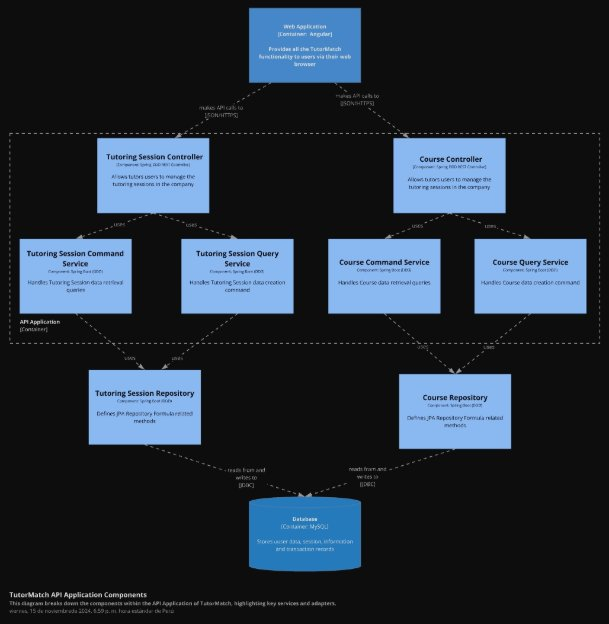
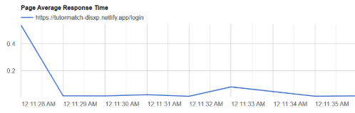

**Universidad Peruana de Ciencias Aplicadas** 

**INFORME DE TRABAJO FINAL** 

Diseño de Experimentos de Ingeniería de Software – NRC: 4453 Carrera de Ingeniería de Software – 7to ciclo 

Docente: Julio Manuel Noriega Melendez 

Nombre del startup: SkillSwapInc 

Nombre del producto: TutorMatch 

|Código |Apellidos y Nombres |
| - | - |
|U202212338 |López Huamán, Rodrigo Adrián |
|U202218167 |Aranda Vallejos, Oscar Gabriel |
|U202219022 |Antonio Fretel, Jeremi Jose |
|U202213646 |Salvador Rodríguez, Rodrigo Jesús |

` `Abril 2025 

**Registro de Versiones del Informe** 

|Versión |Fecha |Autor |Descripción de la modificación |
| - | - | - | :-: |
|1\.1 |12/04/2025 |SkillSwapInc |Capítulo I |
|1\.2 |14/04/2025 |SkillSwapInc |Capítulo II |
|1\.3 |16/04/2025 |SkillSwapInc |Capítulo III |
|1\.4 |18/04/2025 |SkillSwapInc |Capítulo IV |
|1\.5 |22/04/2025 |SkillSwapInc |Capítulo V |
|2\.0 |09/05/2025 |SkillSwapInc |Capítulo VI |
|2\.1 |14/05/2025 |SkillSwapInc |Capítulo VII |
|2\.2 |16/07/2025 |SkillSwapInc |Capítulo VI Capítulo VII Capítulo VIII  |

**Contenido** 

Tabla de contenidos 

Student Outcome 

# Part I: As-Is Software Project

## **Capítulo I: Introducción**

### 1.1. Startup Profile
#### 1.1.1. Descripción de la Startup
#### 1.1.2. Perfiles de integrantes del equipo

### 1.2. Solution Profile
#### 1.2.1. Antecedentes y problemática
#### 1.2.2. Lean UX Process
##### 1.2.2.1. Lean UX Problem Statements
##### 1.2.2.2. Lean UX Assumptions
##### 1.2.2.3. Lean UX Hypothesis Statements
##### 1.2.2.4. Lean UX Canvas

### 1.3. Segmentos objetivo

## **Capítulo II: Requirements & Analysis**

### 2.1. Competidores
#### 2.1.1. Análisis competitivo
#### 2.1.2. Estrategias y tácticas frente a competidores

### 2.2. Entrevistas
#### 2.2.1. Diseño de entrevistas
#### 2.2.2. Registro de entrevistas
#### 2.2.3. Análisis de entrevistas

### 2.3. Needfinding
#### 2.3.1. User Personas
#### 2.3.2. User Task Matrix
#### 2.3.3. User Journey Mapping
#### 2.3.4. Empathy Mapping
#### 2.3.5. As-is Scenario Mapping

### 2.4. Ubiquitous Language

## **Capítulo III: Requirements Specification**

### 3.1. To-Be Scenario Mapping
### 3.2. User Stories
### 3.3. Product Backlog
### 3.4. Impact Mapping

## **Capítulo IV: Product Design**

### 4.1. Style Guidelines
#### 4.1.1. General Style Guidelines
#### 4.1.2. Web Style Guidelines
#### 4.1.3. Mobile Style Guidelines
##### 4.1.3.1. iOS Mobile Style Guidelines
##### 4.1.3.2. Android Mobile Style Guidelines

### 4.2. Information Architecture
#### 4.2.1. Organization Systems
#### 4.2.2. Labeling Systems
#### 4.2.3. SEO Tags and Meta Tags
#### 4.2.4. Searching Systems
#### 4.2.5. Navigation Systems

### 4.3. Landing Page UI Design
#### 4.3.1. Landing Page Wireframe
#### 4.3.2. Landing Page Mock-up

### 4.4. Mobile Applications UX/UI Design
#### 4.4.1. Mobile Applications Wireframes
#### 4.4.2. Mobile Applications Wireflow Diagrams
#### 4.4.3. Mobile Applications Mock-ups
#### 4.4.4. Mobile Applications User Flow Diagrams

### 4.5. Mobile Applications Prototyping
#### 4.5.1. Android Mobile Applications Prototyping
#### 4.5.2. iOS Mobile Applications Prototyping

### 4.6. Web Applications UX/UI Design
#### 4.6.1. Web Applications Wireframes
#### 4.6.2. Web Applications Wireflow Diagrams
#### 4.6.3. Web Applications Mock-ups
#### 4.6.4. Web Applications User Flow Diagrams

### 4.7. Web Applications Prototyping

### 4.8. Domain-Driven Software Architecture
#### 4.8.1. Software Architecture Context Diagram
#### 4.8.2. Software Architecture Container Diagrams
#### 4.8.3. Software Architecture Components Diagrams

### 4.9. Software Object-Oriented Design
#### 4.9.1. Class Diagrams
#### 4.9.2. Class Dictionary

### 4.10. Database Design
#### 4.10.1. Relational/Non-Relational Database Diagram

## **Capítulo V: Product Implementation**

### 5.1. Software Configuration Management
#### 5.1.1. Software Development Environment Configuration
#### 5.1.2. Source Code Management
#### 5.1.3. Source Code Style Guide & Conventions
#### 5.1.4. Software Deployment Configuration

### 5.2. Product Implementation & Deployment
#### 5.2.1. Sprint Backlogs
#### 5.2.2. Implemented Landing Page Evidence
#### 5.2.3. Implemented Frontend-Web Application Evidence
#### 5.2.4. Acuerdo de Servicio - SaaS
#### 5.2.5. Implemented Native-Mobile Application Evidence
#### 5.2.6. Implemented RESTful API and/or Serverless Backend Evidence
#### 5.2.7. RESTful API documentation
#### 5.2.8. Team Collaboration Insights

### 5.3. Video About-the-Product

## **Capítulo VI: Product Verification & Validation**

### 6.1. Testing Suites & Validation
#### 6.1.1. Core Entities Unit Tests
#### 6.1.2. Core Integration Tests
#### 6.1.3. Core Behavior-Driven Development
#### 6.1.4. Core System Tests

### 6.2. Static testing & Verification
#### 6.2.1. Static Code Analysis
##### 6.2.1.1. Coding standard & Code conventions
##### 6.2.1.2. Code Quality & Code Security

### 6.3. Validation Interviews
#### 6.3.1. Diseño de Entrevistas
#### 6.3.2. Registro de Entrevistas
#### 6.3.3. Evaluaciones según heurísticas

### 6.4. Auditoría de Experiencias de Usuario
#### 6.4.1. Auditoría realizada
##### 6.4.1.1. Información del grupo auditado
##### 6.4.1.2. Cronograma de auditoría realizada
##### 6.4.1.3. Contenido de auditoría realizada
#### 6.4.2. Auditoría recibida
##### 6.4.2.1. Información del grupo auditor
##### 6.4.2.2. Cronograma de auditoría recibida
##### 6.4.2.3. Contenido de auditoría recibida
##### 6.4.2.4. Resumen de modificaciones para subsanar hallazgos

## **Capítulo VII: DevOps Practices**

### 7.1. Continuous Integration
#### 7.1.1. Tools and Practices
#### 7.1.2. Build & Test Suite Pipeline Components

### 7.2. Continuous Delivery
#### 7.2.1. Tools and Practices
#### 7.2.2. Stages Deployment Pipeline Components

### 7.3. Continuous deployment
#### 7.3.1. Tools and Practices
#### 7.3.2. Production Deployment Pipeline Components

### 7.4. Continuous Monitoring
#### 7.4.1. Tools and Practices
#### 7.4.2. Monitoring Pipeline Components
#### 7.4.3. Alerting Pipeline Components
#### 7.4.4. Notification Pipeline Components

## **Capítulo VIII: Experiment-Driven Development**

### 8.1. Experiment Planning
#### 8.1.1. As-Is Summary
#### 8.1.2. Raw Material: Assumptions, Knowledge Gaps, Ideas, Claims
#### 8.1.3. Experiment-Ready Questions
#### 8.1.4. Question Backlog
#### 8.1.5. Experiment Cards

### 8.2. Experiment Design
#### 8.2.1. Hypotheses
#### 8.2.2. Measures
#### 8.2.3. Conditions
#### 8.2.4. Scale Calculations and Decisions
#### 8.2.5. Methods Selection
#### 8.2.6. Data Analytics: Goals, KPIs and Metrics Selection
#### 8.2.7. Web and Mobile Tracking Plan

### 8.3. Experimentation
#### 8.3.1. To-Be User Stories

**Student Outcome** 

|Criterio específico |Acciones realizadas |Conclusiones |
| - | - | - |
|Reconoce responsabilidad ética y profesional en situaciones de ingeniería de software |
Emilia Mercedes Duran Santander 

TB1:  

Reconozco mi responsabilidad ética y profesional en situaciones de ingeniería de software, por lo que durante todo el desarrollo del proyecto actué con integridad y respeto hacia los usuarios. En las entrevistas, obtuve su consentimiento informado y cuidé la confidencialidad de sus datos, asegurando una recolección y uso responsable de la información. Además, tomé decisiones técnicas alineadas con principios éticos, priorizando siempre el bienestar de los futuros usuarios. 

Oscar Gabriel Aranda Vallejos 

TB1:  

Identifiqué elementos indispensables para que el diseño móvil del aplicativo respete los requerimientos mínimos de usabilidad y atributos de calidad. Para ello, fue necesario crear prototipos utilizando la herramienta Figma. 

TP:  

Reconocí mi responsabilidad ética y profesional durante todo el ciclo de desarrollo del software, asegurando que cada componente - desde el diseño de producto hasta el frontend, backend, aplicación móvil, product backlog y 
|
A lo largo del proyecto, se demostró un fuerte compromiso con la ética y la responsabilidad profesional en el ámbito de la ingeniería de software. Desde el levantamiento de información hasta el diseño de interfaces y la gestión del código, cada integrante del equipo aplicó principios éticos fundamentales. El respeto por la privacidad de los usuarios, 

la accesibilidad, la coherencia visual y la inclusión tecnológica fueron pilares clave que guiaron nuestras decisiones. Este enfoque no solo fortaleció la calidad del producto, sino también nuestra formación como futuros profesionales comprometidos con una práctica responsable y humana del desarrollo de software. 
|

||
requisitos funcionales - cumpliera con los más altos estándares de integridad. Implementé protocolos para proteger la privacidad del usuario y tomé decisiones técnicas basadas en principios éticos, garantizando que el producto final fuera no solo funcional sino también responsable y confiable para todos los stakeholders involucrados. 

Jeremi Jose Antonio Fretel TB1: 

A lo largo del proyecto, lideré la entrevista clave que fundamentó múltiples entregables. Con estos insights, colaboré en diseñar el To-Be Scenario para visualizar la futura experiencia del usuario, así como en la redacción de User Stories que captaran las necesidades detectadas. También ayudé a desarrollar el Impact Mapping, vinculando metas del negocio con funcionalidades para optimizar prioridades, y participé en la definición del Product Backlog, ordenando tareas según su impacto. Esta experiencia reforzó mis capacidades analíticas y de gestión de requerimientos, además de fomentar el trabajo en equipo alineado. 

TP: 

Mantuve un firme compromiso con la ética profesional en la ingeniería de software, supervisando que todas las correcciones y mejoras realizadas en el 
||
| :- | :- | :- |

||
diseño, frontend, backend, app mobile, product backlog y requisitos funcionales siguieran lineamientos éticos. Establecí medidas para salvaguardar datos sensibles y promoví prácticas de desarrollo transparentes, asegurando que cada aspecto del proyecto priorizara el bienestar del usuario final y cumpliera con regulaciones de privacidad y seguridad establecidas. 

Rodrigo Adrián López Huamán 

TB1:  

Promoví prácticas éticas y profesionales en el diseño de productos digitales al aplicar lineamientos de estilo coherentes y centrados en el usuario dentro de las secciones 4.1, 4.4 y 4.6 del Capítulo IV. Aseguré la accesibilidad, usabilidad y consistencia visual tanto en plataformas móviles como web, desarrollando wireframes, mock-ups y diagramas de flujo de usuario que respetan estándares de diseño universal, priorizando la experiencia del usuario y fomentando la inclusión tecnológica. 

TP: 

Asumí plena conciencia de mi responsabilidad ética al desarrollar el software, verificando meticulosamente que cada ajuste en el diseño, frontend, backend, aplicación móvil, backlog y 
||
| :- | :- | :- |

||
especificaciones funcionales respetara normas profesionales. Implementé controles para garantizar la confidencialidad de la información y tomé decisiones técnicas balanceando innovación con principios morales, creando así un producto tecnológico que fuera éticamente sólido y socialmente responsable. 

Rodrigo Jesús Salvador Rodríguez 

TB1: He realizado en el análisis de entrevistas y en la redacción de la sección 5.1 (Software Configuration Management), desarrollando los puntos 5.1.1 (Software Development Environment Configuration), 5.1.2 (Source Code Management), 5.1.3 (Source Code Style Guide & Conventions) y 5.1.4 (Software Deployment Configuration), enfocándome en estándares, control de versiones y configuración de despliegue para garantizar consistencia y eficiencia en el desarrollo del software. 

TP: 

Adherí estrictamente a principios éticos durante la ejecución del proyecto, asegurando que todas las modificaciones en diseño, interfaz, lógica de negocio, app móvil, backlog y requerimientos cumplieran con estándares profesionales. Establecí protocolos de seguridad de datos y evalué 
||
| :- | :- | :- |

||cada decisión técnica desde una perspectiva moral, buscando siempre equilibrar funcionalidad con responsabilidad social para entregar un producto que beneficiara genuinamente a sus usuarios. ||
| :- | :- | :- |
|
Emite juicios informados considerando el impacto de las 

soluciones de ingeniería de software en contextos globales, 

económicos, ambientales y sociales 
|
Emilia Mercedes Duran Santander 

TB1:  

Emití juicios informados considerando el impacto que puede tener la solución en contextos globales, económicos, sociales y ambientales. Reflexioné sobre cómo esta herramienta puede contribuir a mejorar el acceso a la educación, reducir desigualdades tecnológicas y ofrecer una alternativa digital sostenible. Desde el diseño hasta la implementación, procuré que cada decisión favorezca no solo la funcionalidad, sino también el bien común. 

Oscar Gabriel Aranda Vallejos 

TB1: 

Analicé el impacto del diseño móvil en la experiencia del usuario, evaluando las pantallas necesarias en el proceso de navegación del usuario. Para ello, se tomaron en cuenta los user flows planteados para la versión móvil y se afinaron las rutas principales que tomará el usuario al querer realizar una determinada acción.  

TP: 
|Durante el desarrollo del proyecto, se tomaron decisiones fundamentadas que consideraron activamente el impacto de la solución en distintos contextos. Desde la arquitectura del sistema hasta el diseño de experiencias y la planificación del despliegue, se priorizó la sostenibilidad, la equidad en el acceso a la tecnología y la eficiencia de recursos. Este enfoque reflexivo permitió construir una solución técnicamente sólida y socialmente consciente, resaltando la importancia de pensar más allá del código para generar un impacto positivo a nivel global, económico, ambiental y social. |

||
Al desarrollar el software, evalué cuidadosamente el impacto de nuestras soluciones técnicas en diversos contextos. Cada decisión en diseño, frontend, backend, app móvil, backlog y requisitos funcionales consideró implicaciones globales, económicas y ambientales. Priorizamos tecnologías sostenibles y accesibles, asegurando que el producto generara valor social sin comprometer recursos futuros. 

Jeremi Jose Antonio Fretel TB1:  

Durante el proyecto, lideré una entrevista clave que fundamentó decisiones críticas. Con los insights obtenidos, colaboré en el diseño del *To-Be Scenario* y en la redacción de *User Stories* con enfoque en accesibilidad y valor social. También apoyé en el *Impact Mapping* y la definición del *Product Backlog*, priorizando funcionalidades según su impacto económico y social. Esta experiencia me permitió tomar decisiones informadas, considerando el alcance global y la sostenibilidad de las soluciones propuestas. 

TP: 

Emití juicios técnicos analizando el alcance multidimensional del proyecto. Las correcciones en diseño, frontend, backend, móvil, backlog y 
||
| :- | :- | :- |

||
funcionalidades fueron evaluadas bajo criterios de sostenibilidad, inclusión y eficiencia económica. Implementamos soluciones escalables que reducen la huella digital mientras mejoran la experiencia de usuarios en diversos entornos socioeconómicos. 

Rodrigo Adrián López Huamán 

TB1:  

Analicé el impacto de las decisiones de ingeniería de software en diversos contextos globales, económicos y sociales durante el diseño de la arquitectura y la base de datos en las secciones 4.8 y 4.10. Propuse una arquitectura orientada al dominio, escalable y sostenible, mediante la elaboración de diagramas contextuales, de contenedores y componentes, junto con un modelo de base de datos relacional/no relacional, considerando la eficiencia de recursos y la adaptabilidad de la solución a diferentes entornos tecnológicos. 

TP: 

Cada ajuste en el software (diseño, frontend, backend, app móvil, backlog y requisitos) fue ponderado por su impacto socioambiental. Optamos por arquitecturas eficientes, interfaces inclusivas y flujos de trabajo optimizados que minimizan 
||
| :- | :- | :- |

||
costos operativos y barreras de acceso, contribuyendo a un desarrollo tecnológico más equitativo y consciente. 

Rodrigo Jesús Salvador Rodríguez 

TB1: Al implementar la gestión de configuración de software (5.1), emití juicios informados considerando su impacto global: optimicé recursos económicos mediante entornos estandarizados, reduje riesgos sociales con control de versiones, promoví mantenibilidad con convenciones de código  y minimicé impacto ambiental mediante despliegues eficientes, asegurando soluciones técnicas sostenibles y socialmente responsables. 

TP: 

Las mejoras implementadas en diseño, frontend, backend, aplicación móvil, backlog y especificaciones técnicas fueron guiadas por un análisis de impacto integral. Consideramos efectos económicos (costes de implementación), ambientales (consumo energético) y sociales (accesibilidad), asegurando que el producto final alinee innovación con responsabilidad global. 
||
| :- | :- | :- |
**Capítulo I: Introducción** 

1. Startup Profile 
1. Descripción de la Startup 

TutorMatch es una startup emergente del ámbito educativo tecnológico, orientada a brindar una solución integral para el aprendizaje y reforzamiento académico universitario. A través de su plataforma web, los estudiantes pueden acceder a tutorías en tiempo real, conectándose con tutores especializados en cursos específicos de su carrera, organizados por ciclo y área de conocimiento.  Con un enfoque inicial en los estudiantes de Ingeniería de Software de la UPC. TutorMatch ha sido diseñada como una solución escalable y flexible, capaz de adaptarse a distintas especialidades académicas. Su objetivo es ofrecer una experiencia de aprendizaje personalizada, alineada a las demandas reales del entorno universitario actual. Su propuesta innovadora se fundamenta en la integración de herramientas colaborativas que enriquecen la interacción educativa: chat en tiempo real para consultas inmediatas, videollamadas para sesiones personalizadas y transferencia de materiales de estudio. Esta combinación permite centralizar la experiencia formativa en una única plataforma, promoviendo un entorno dinámico, accesible y eficaz.  

**Misión:** Facilitar la conexión entre estudiantes y tutores universitarios, optimizando la experiencia de aprendizaje mediante el uso de tecnologías colaborativas que permitan acceder de apoyo académico  en  tiempo  real,  de  manera  flexible  y  efectiva.  **Visión:** Convertirse en la principal plataforma universitaria de tutorías académicas en un plazo de cinco años, promoviendo una educación más accesible, personalizada y eficiente mediante el uso de herramientas digitales innovadoras que fortalezcan el rendimiento académico y la autonomía del estudiante. 

2. Perfiles de integrantes del equipo 

|Nombre |Descripción |Conocimientos |
| - | - | - |

|

Emilia Mercedes Duran Santander 
|Soy Emilia Durán, estudiante de Ingeniería de Software en la UPC. Me considero una persona responsable, perseverante y comprometida con mis metas. Me apasiona el desarrollo de software y la posibilidad de crear soluciones tecnológicas que generen un impacto positivo en la sociedad. Siempre estoy dispuesta a aprender y mejorar, y valoro el trabajo en equipo como una oportunidad para crecer tanto profesional como personalmente. |Poseo conocimientos en C++, Java, Python y SQL. Además, tengo experiencia en desarrollo web con tecnologías como HTML, CSS, Angular Material y Vue. Me interesa especialmente el desarrollo backend y el trabajo con bases de datos. He participado en proyectos académicos que me han permitido desarrollar habilidades técnicas, organización y disciplina para cumplir con los objetivos y plazos establecidos. |
| - | :- | :- |
|

Oscar Gabriel Aranda Vallejos 
|Soy Oscar Aranda, estudiante de 7mo ciclo de Ingeniería de Software, tengo 20 años y me considero una persona responsable y perseverante con todos los objetivos que me proponga. Siempre estoy dispuesto a aprender nuevos conocimientos cada día y elegí esta carrera porque me apasiona el desarrollo de software y la posibilidad de crear soluciones que impacten positivamente en la sociedad. |Poseo conocimientos en Unity, C++, Java, Spring Boot y en diseño web con tecnologías como Angular Material y Prime Vue.  |
|

Jeremi Jose Antonio Fretel   
|Soy estudiante de 7mo ciclo de la carrera de Ingeniería de Software en la UPC. Me considero una persona disciplinada y comprometida con mis objetivos académicos. Tengo interés en especializarme en desarrollo backend y bases de datos. |Poseo conocimientos en: C++, Python, Java, HTML/CSS, React y SQL. He desarrollado proyectos académicos principalmente en C++. Soy organizado, metódico y me adapto bien al trabajo en equipo, aportando soluciones técnicas y cumpliendo con los plazos establecidos. |

|

Rodrigo Adrián López Huamán 
|Soy Rodrigo Adrián López Huamán, estudiante de sexto ciclo de Ingeniería de Software con 19 años, me considero un chico responsable y comprometido con mis actividades. Además, de ser una persona creativa y capaz de trabajar en equipo para alcanzar nuestras metas. También tengo habilidades en el manejo de conflictos, lo que me permite resolver situaciones difíciles de manera efectiva. Estoy emocionado de seguir aprendiendo y creciendo en esta carrera. |HTML, CSS, JS, Angular, Vue, React como frameworks, Nest, Spring Boot, .NET, Base de datos MongoDB, PostgreSQL, MySQL. |
| - | :- | :- |
|

Rodrigo Jesús Salvador Rodríguez 
|Mi nombre es Rodrigo Jesus Salvador Rodriguez, tengo 19 años, estudio la carrera de Ingeniería de Software en la Universidad Peruana de Ciencias Aplicadas (UPC). Me considero una persona responsable y puntual en todo tipo de aspectos, esto lo voy a ver reflejado en este proyecto, como miembro de este equipo me comprometo a seguir las indicaciones al pie de la letra, seguir recomendaciones y apoyar siempre a mis compañeros para presentar el mejor proyecto grupal. |HTML, CSS, JS, Angular, Vue+Vite, Python, C#, C++, Spring Boot, .NET, Base de datos MongoDB, MySQL. |

2. Solution Profile 

TutorMatch es una solución tecnológica desarrollada por la startup SkillSwapInc para optimizar el acceso a tutorías académicas en entornos universitarios para los estudiantes de la carrera de Ingeniería de Softwared de UPC. La plataforma permite a los estudiantes buscar y conectar con tutores  capacitados  según  el  curso,  ciclo  o  área  de  estudio,  facilitando  una  experiencia personalizable y flexible. Mediante funcionalidades como chat en tiempo real, videollamadas integradas y transferencia de archivos, TutorMatch centraliza los recursos necesarios para una tutoría efectiva, promoviendo una comunicación fluida entre quienes necesitan apoyo académico y quienes están dispuestos a brindarlo. La información sobre áreas de refuerzo, disponibilidad y horarios  se  actualiza  constantemente,  lo  que  reduce  el  tiempo  de  búsqueda  y  mejora  la organización académica del usuario. Esta funcionalidad mejora significativamente la experiencia de aprendizaje, ofreciendo una herramienta ágil, accesible y adaptada a las necesidades reales del estudiante universitario. TutorMatch representa una solución integral para reforzar el rendimiento académico a través de una plataforma colaborativa, intuitiva y centrada en el aprendizaje entre pares. 

1. Antecedentes y problemática 

En la carrera de Ingeniería de Software, los estudiantes enfrentan una alta exigencia académica desde los primeros ciclos. El dominio de conceptos complejos, el ritmo acelerado del avance de cursos  y  la  necesidad  de  aplicar  conocimientos  técnicos  de  forma  práctica  pueden  generar dificultades para mantener un aprendizaje constante y efectivo. 

En la Universidad Peruana de Ciencias Aplicadas (UPC), es frecuente que los estudiantes busquen apoyo adicional para reforzar lo aprendido en clase. Sin embargo, acceder a tutoríasacadémicas no siempre es sencillo. Los servicios externos pueden ser costosos o poco confiables, mientras que los canales informales, como pedir ayuda a compañeros, suelen depender de la disponibilidad y buena voluntad, sin asegurar continuidad ni seguimiento. 

Esta falta de un sistema estructurado y accesible que permita a los estudiantes encontrar apoyo académico cuando lo necesitan limita sus oportunidades de mejorar su comprensión, afecta su rendimiento y, en muchos casos, genera frustración o desmotivación. A pesar de que la necesidad existe, no hay una herramienta institucional o independiente que responda directamente a esta demanda. 

**TutorMatch** surge como respuesta a este problema: una plataforma digital centrada en facilitar el acceso a tutorías personalizadas entre estudiantes universitarios, organizadas por curso y ciclo, con herramientas que permiten agendar sesiones, comunicarse en tiempo real, y compartir materiales de forma sencilla, rápida y efectiva. 

**Análisis con técnica 5W + 2H – Lean UX**  

- What - ¿Qué problema se desea resolver? 

La dificultad que tienen los estudiantes para acceder a tutorías académicas efectivas en el momento que la necesitan. 

- Who - ¿A quiénes afecta? 

A estudiantes de Ingeniería de Software de la UPC que necesitan reforzar sus conocimientos en cursos  específicos,  especialmente  en  los  primeros  ciclos  donde  la  adaptación  al  entorno universitario  es  más  desafiante.  También afecta a estudiantes con buen rendimiento académico que desean brindar tutorías, pero que no cuentan con una plataforma estructurada para hacerlo de forma ordenada y continua. 

- When - ¿Cuándo ocurre el problema? 

A lo largo de todo el ciclo académico, con mayor intensidad durante las evaluaciones parciales, finales o entregas de trabajos importantes. 

- Where - ¿Dónde ocurre? 

En entornos presenciales y virtuales. Las dificultades se presentan tanto dentro como fuera del aula, especialmente cuando los estudiantes estudian por cuenta propia y no tienen acceso inmediato a apoyo académico.  

- Why - ¿Por qué sucede? 

Porque  no  existe  una  plataforma  que  centralice  y  organice  la  oferta  y  demanda  de  tutorías académicas personalizadas según los cursos y necesidades de los estudiantes. Esto obliga a quienes necesitan apoyo a buscar ayuda por vías informales o ineficientes, y limita a quienes desean ofrecer tutorías la posibilidad de hacerlo de manera estructurada. 

- How - ¿Cómo se plantea la solución? 

A través de TutorMatch, una plataforma web donde los estudiantes pueden buscar tutores por curso y ciclo, comunicarse mediante chat o videollamada y compartir materiales en tiempo real. 

- How Much - ¿Qué tan grave es el problema? 

Una  proporción  significativa  de  estudiantes  de  Ingeniería  de  Software  ha  buscado  apoyo académico adicional en algún momento de su formación, sin encontrar una alternativa organizada, accesible o eficaz. Esta situación evidencia una necesidad constante en el entorno universitario, que hasta ahora no ha sido atendida de forma estructurada. 

2. Lean UX Process 

En esta sección se aplicará el Lean UX Process, el cual orientará el desarrollo de TutorMatch desde una perspectiva centrada en las necesidades reales de los estudiantes. A través de este enfoque, se podrá definir la propuesta de valor del producto, identificar problemas clave mediante design thinking y validar soluciones de forma ágil y continua. 

1. Lean UX Problem Statement 

A continuación, usamos la plantilla de *Business Opportunity Statements* (Gothelf, 2022) para estructurar de forma clara y centrada en el usuario los desafíos que abordará nuestra solución. Esta metodología permite identificar brechas actuales en los productos o servicios existentes y formular cómo nuestro producto las cubrirá de manera eficaz. El objetivo es definir una visión clara del problema,  enfocar  nuestros  esfuerzos  en  segmentos  específicos  de  usuarios,  y  establecer indicadores de éxito para la solución propuesta. 

**Plantilla de Business Opportunity Statement:** 

- El estado actual del [domain] se ha enfocado principalmente en [segments, pain points, etc.]. 
- Lo que los productos/servicios actuales no logran abordar es [this gap]. 
- Nuestro producto/servicio resolverá esta brecha mediante [vision/strategy]. 
- Nuestro enfoque inicial será [this segment]. 
- Sabremos  que  hemos  tenido  éxito  cuando  observemos  [these  behaviors  in  our  target audience]. 

**TutorMatch Lean UX Problem Statements:** 

- Actualmente, el acceso a tutorías académicas dentro de la UPC se da principalmente por canales informales o fuera de la institución, lo que genera una experiencia fragmentada, poco confiable y sin herramientas de comunicación que garanticen una interacción efectiva entre estudiantes. 
- Lo que los productos/servicios actuales no  consiguen resolver es  la  ausencia de una plataforma que permita a los estudiantes recibir apoyo académico personalizado en tiempo real  mediante  canales  digitales  modernos  como  chat  o  videollamadas,  especialmente cuando más lo necesitan. 
- Nuestro producto/servicio abordará esta brecha mediante el desarrollo de una plataforma web enfocada en la conexión directa entre estudiantes, que les permita interactuar de forma rápida,  segura  y  colaborativa  a  través  de  funcionalidades  como  chat  en  tiempo  real, videollamadas y transferencia de archivos. 
- Nuestro enfoque inicial será llegar a los estudiantes de Ingeniería de Software de la UPC en  los  primeros  ciclos,  quienes  suelen  enfrentar  mayores  dificultades  de  adaptación académica y requieren apoyo inmediato y concreto para superar temas específicos de sus cursos. 
- Sabremos que hemos logrado el éxito cuando observemos un uso frecuente de TutorMatch como medio de apoyo académico entre estudiantes, evaluaciones positivas sobre la utilidad de las herramientas de comunicación integradas, y una mejora en la comprensión de los temas abordados durante las sesiones de tutoría. 
2. Lean UX Assumptions 

**Users:** 

- Estudiantes universitarios que necesitan apoyo académico para reforzar su aprendizaje en temas específicos de su carrera. 
- Estudiantes universitarios con buen rendimiento académico, interesados en brindar tutorías colaborativas a sus compañeros, de forma estructurada y accesible. 

**User Outcomes:** 

**Segmento de Estudiantes que necesitan apoyo académico:** 

- Acceder a una plataforma donde puedan resolver dudas puntuales mediante chat en tiempo real o videollamada con otros estudiantes. 
- Compartir archivos de ejercicios, materiales o tareas para recibir orientación directa. 
- Mejorar la comprensión de temas específicos gracias a interacciones personalizadas y en tiempo oportuno. 

**Segmento de Estudiantes que brindan apoyo académico:** 

- Utilizar un entorno estructurado para ofrecer tutorías de manera segura y sencilla. 
- Aprovechar  herramientas  integradas  para  comunicarse  y  colaborar  sin  depender  de aplicaciones externas. 
- Reforzar su propio conocimiento al explicar conceptos y apoyar a sus compañeros. 

**Suposiciones de Negocio:** 

- Existe una necesidad creciente entre estudiantes universitarios de acceder a tutorías rápidas, flexibles y centradas en sus cursos específicos. 
- Los medios actuales (grupos informales, redes sociales, mensajería no académica) no están diseñados para una tutoría estructurada ni ofrecen garantías de calidad o continuidad. 
- Una plataforma centrada en la interacción entre pares puede convertirse en una solución efectiva, constante y alineada con la dinámica real del entorno universitario. 
- Los usuarios valorarán la simplicidad, rapidez y accesibilidad que ofrece TutorMatch mediante funciones enfocadas exclusivamente en la comunicación académica directa. 

**Suposiciones de Usuario: ¿Quién usa nuestra plataforma?** 

Estudiantes universitarios que buscan o brindan apoyo académico, conectándose entre sí de forma directa, sin depender de soluciones informales o externas. 

**¿Cómo se integra nuestro producto en la rutina diaria?** 

TutorMatch se convierte en una herramienta complementaria a la vida académica del estudiante, útil especialmente en momentos de repaso, preparación para evaluaciones o entrega de trabajos, facilitando el contacto inmediato entre pares. 

**¿Qué problema resuelve nuestro producto?** 

La falta de una plataforma estructurada que permita acceder y ofrecer tutorías académicas entre estudiantes, mediante canales modernos como chat, videollamadas y compartición de materiales. 

**¿Qué imagen queremos proyectar con nuestro producto?** 

Ser reconocidos como una plataforma académica moderna, confiable y centrada en el estudiante, que fomenta el aprendizaje colaborativo, ágil y de fácil acceso. 

**¿Cuál es el objetivo principal de nuestra aplicación?** 

Facilitar  la  conexión  entre  estudiantes  que  necesitan  refuerzo  académico  y  quienes  pueden brindarlo,  mediante  una  experiencia  digital  centrada  en  la  inmediatez,  la  accesibilidad  y  la colaboración educativa. 

**¿Qué funcionalidades son clave en nuestra aplicación?** 

Chat en tiempo real, videollamadas integradas y transferencia de archivos académicos, todo dentro de una única plataforma web que centraliza la experiencia de tutoría. 

3. Lean UX Hypothesis Statements 

Para formular las Hypothesis Statements, hemos seguido el formato de Lean UX: [We believe that], [This will achieve], y [We will have demonstrated this when]. 

Hypothesis 1: 

- Creemos que si los estudiantes pueden acceder a tutorías mediante una plataforma que les permita comunicarse de inmediato con tutores disponibles según su curso y ciclo, 
- lograremos que al menos el 50% de ellos inicie una sesión dentro de las primeras 24 horas de haber ingresado por primera vez. 
- Sabremos  que  hemos  tenido  éxito  cuando  más  de  la  mitad  de  los  nuevos  registros conviertan su primer contacto en una tutoría efectiva en los tres primeros días. 

Hypothesis 2: 

- Creemos que si los tutores tienen un espacio claro para gestionar sus horarios y responder mensajes en tiempo real, 
- lograremos que más del 60% mantenga sesiones activas al menos una vez por semana durante el ciclo académico. 
- Sabremos que hemos tenido éxito cuando la mayoría de tutores mantengan una tasa de respuesta menor a 12 horas y una frecuencia estable de atención semanal. 

Hypothesis 3: 

- Creemos que si organizamos la información de búsqueda por nombre del curso, ciclo y nivel de dificultad, 
- lograremos que al menos el 75% de los estudiantes encuentre un tutor relevante en menos de tres intentos. 
- Sabremos que hemos tenido éxito cuando el tiempo promedio de búsqueda activa no supere los 5 minutos en más de dos tercios de los casos. 

Hypothesis 4: 

- Creemos que si se implementa un sistema de valoración posterior a cada sesión, 
- lograremos que los estudiantes elijan a sus tutores con mayor confianza y se genere un historial confiable para nuevos usuarios. 
- Sabremos que hemos tenido éxito cuando el 80% de las sesiones realizadas estén a cargo de tutores con una calificación promedio superior a 4.0/5. 

Hypothesis 5: 

- Creemos que si el sistema permite compartir materiales fácilmente durante  la tutoría (apuntes, ejercicios, capturas), 
- lograremos que los estudiantes comprendan mejor los temas tratados y aumente la duración media de las sesiones por interés del propio usuario. 
- Sabremos que hemos tenido éxito cuando al menos el 40% de las sesiones superen los 30 minutos y contengan intercambio de archivos dentro del entorno de la plataforma. 
4. Lean UX Canvas 

*Fuente: Elaboración Propia*  

Link del Figma:[ https://www.figma.com/board/J3cuWVK8sGljEKH7i06Z0G/Lean-UX-Canvas- -v2---Community-?node-id=0-1&t=DoS33Y7YUNwFdIWM-1 ](https://www.figma.com/board/J3cuWVK8sGljEKH7i06Z0G/Lean-UX-Canvas--v2---Community-?node-id=0-1&t=DoS33Y7YUNwFdIWM-1)

3. Segmentos objetivo 
1. **Estudiantes de Ingeniería de Software que buscan apoyo académico** 
- **Descripción:** Este segmento está conformado por estudiantes universitarios que presentan dificultades para entender temas específicos en cursos de su carrera, sobre todo durante los primeros ciclos. Su objetivo principal es encontrar un refuerzo académico personalizado que les permita mejorar su rendimiento y superar los desafíos de adaptación al entorno universitario. 
- **Sexo:** Masculino y femenino. 
- **Edades:** Entre 17 y 23 años. 
- **Satisfacción  de  Necesidades:**  TutorMatch  les  permite  conectarse  directamente  con estudiantes capacitados que pueden ofrecer orientación puntual en los temas que más les cuestan. A través de herramientas como chat, videollamadas y transferencia de archivos, los usuarios acceden a un entorno de aprendizaje inmediato, accesible y centrado en sus necesidades reales. 
2. **Estudiantes con alto rendimiento académico que desean brindar tutorías** 
- **Descripción:** Este grupo está compuesto por estudiantes que destacan en ciertos cursos de la carrera y desean compartir sus conocimientos con sus compañeros. Además de apoyar a otros, buscan reforzar su propia comprensión de los temas y desarrollar habilidades de enseñanza que puedan ser útiles en su vida profesional. 

  **Sexo:** Masculino y femenino. 

  **Edades:** Entre 19 y 26 años. 

- **Satisfacción de Necesidades:** TutorMatch les ofrece un espacio confiable, ordenado y eficiente para ofrecer tutorías dentro del contexto universitario. La plataforma les permite gestionar sus sesiones, mantener una comunicación directa con los estudiantes que solicitan ayuda y recibir retroalimentación que valore su esfuerzo como tutores, todo sin recurrir a canales informales o herramientas externas. 

**Capítulo II: Requirements & Analysis** 

1. Competidores 

Para entender el posicionamiento de TutorMatch dentro del ecosistema digital de plataformas educativas, es necesario identificar a sus principales competidores. A través de este análisis, se puede reconocer qué tipo de soluciones ya existen, qué necesidades están siendo cubiertas y cuáles son las oportunidades que TutorMatch puede aprovechar para diferenciarse. 

- Superprof: Es una plataforma en línea que conecta a estudiantes con profesores particulares en múltiples áreas, como matemáticas, idiomas, música y deportes. La plataforma permite a los usuarios encontrar tutores, ver sus perfiles, y reservar clases en modalidad presencial 
  - virtual.  Su  principal  fortaleza  es  la  gran  variedad  de  disciplinas  disponibles  y  la posibilidad de elegir tutores según nivel, ubicación y presupuesto. 
- Udemy: Es una plataforma global de aprendizaje en línea que ofrece miles de cursos pregrabados en temas que van desde programación y diseño, hasta desarrollo personal e idiomas. Los usuarios pueden acceder a los contenidos en cualquier momento y aprender a  su  propio  ritmo.  Su  ventaja  competitiva  radica  en  la  enorme  variedad  de  cursos disponibles, el acceso de por vida a los contenidos adquiridos y la facilidad de uso desde cualquier dispositivo. 
- Preply: es una plataforma  especializada en  el  aprendizaje de idiomas, que conecta a estudiantes  con  tutores  nativos  certificados.  Ofrece  clases  individuales  con  horarios flexibles a través de videollamadas, adaptándose al ritmo y nivel de cada estudiante. Además, cuenta con funciones avanzadas como calendario integrado y filtros inteligentes para encontrar al tutor ideal según idioma, precio, nacionalidad y objetivos. 
1. Análisis competitivo 

A continuación, se presentará la tabla de competidores para analizar cada punto específico de algunas plataformas educativas relevantes a nivel global. Este análisis nos permitirá identificar oportunidades  y  diferenciar  a  TutorMatch  en  el  mercado  de  tutorías  académicas.  Con  ello, podremos adaptar nuestra propuesta a las verdaderas necesidades de nuestro segmento objetivo. 

<table><tr><th colspan="6" valign="top">Competitive Analysis Landscape </th></tr>
<tr><td colspan="2" rowspan="2" valign="top">¿Por qué llevar a cabo este análisis? </td><td colspan="4" valign="top">Escriba en el recuadro la pregunta que busca responder o el objetivo de este análisis. </td></tr>
<tr><td colspan="4" valign="top">Este análisis permite <b>visualizar</b> y <b>analizar</b> a la competencia donde nosotros podremos usar las <b>decadencias</b> de nuestra competencia a nuestro favor. Añadiendo que podremos visualizar nuestra <b>posición</b> respecto a los demás. </td></tr>
<tr><td colspan="2"></td><td colspan="1" valign="top">
TutorMatch 

</td><td colspan="1" valign="top">
Superprof 

</td><td colspan="1">
Udemy 

</td><td colspan="1">
Preply

</td></tr>
<tr><td colspan="1" rowspan="2" valign="top">Perfil </td><td colspan="1" valign="top">Overview </td><td colspan="1"><b>TutorMatch</b> es una plataforma en línea dirigido a estudiantes y/o personas interesadas en aprender o reforzar conocimientos. </td><td colspan="1" valign="top"><b>Superprof</b> es una plataforma en línea que conecta a estudiantes con profesores particulares. </td><td colspan="1" valign="top"><b>Udemy</b> es una plataforma de aprendizaje en línea. </td><td colspan="1" valign="top"><b>Preply</b> es una plataforma en línea que permite aprender idiomas y cursos diversos </td></tr>
<tr><td colspan="1" valign="top">Ventaja competitiva ¿Qué valor ofrece a los clientes? </td><td colspan="1">
Presenta una plataforma digital que integra chat directo entre tutores y estudiantes, almacenamient

o de archivos, y videoconferen cias. 

Adaptabilidad a costos tanto de tutores y estudiantes. 
</td><td colspan="1" valign="top">
Amplia base de datos de tutores en múltiples áreas (académicas, artísticas, deportivas) 

Modelo que permite clases presenciales 

o en línea. 
</td><td colspan="1">
Gigantesco catálogo de cursos pregrabados en prácticament e todas las áreas (tecnología, negocios, diseño, idioma, etc.) 

Acceso de por vida a los cursos y posibilidad 
</td><td colspan="1" valign="top">
Especializado principalmente en clases de idiomas con tutores nativos y certificados. 

Enfoque en lecciones 1 a 1 con horarios flexibles y plataforma integrada de videoconferen cia. 
</td></tr>
</table>

<table><tr><th colspan="1"></th><th colspan="1"></th><th colspan="1"></th><th colspan="1"></th><th colspan="1">de aprender a su propio ritmo. </th><th colspan="1"></th></tr>
<tr><td colspan="1" rowspan="2" valign="top">Perfil de Marketing </td><td colspan="1" valign="top">Mercado Objetivo </td><td colspan="1">
Enfocado en estudiantes de cualquier nivel y profesionales, y público en general.  

Instituciones educativas que podrían recomendar TutorMatch para servicios de tutoría complementari a. 
</td><td colspan="1" valign="top">Estudiantes y profesionales que buscan clases particulares de diversos temas (idiomas, aprendizaje, etc) principalment e en Europa y América Latina. </td><td colspan="1" valign="top">
Personas que buscan formación en línea asincrónica. 

Aprender habilidades o certificacione s rápidas. 
</td><td colspan="1" valign="top">Personas de todo el mundo interesadas en aprender o perfeccionar idiomas, aunque cubre otras asignaturas en menor medida. </td></tr>
<tr><td colspan="1" valign="top">Estrategias de marketing </td><td colspan="1">
Promoción en redes sociales, blogs educativos, foros profesionales, etc. 

Mostrar casos de éxito y testimonios, historias de éxito y experiencias en redes. 

Alianzas con instituciones educativas. 
</td><td colspan="1">
Fuerte posicionamie nto SEO (abarca múltiples categorías de enseñanza). 

Campañas de redes sociales y Google Ads orientadas. 

Énfasis en testimonios y reseñas de alumnos para ganar credibilidad. 
</td><td colspan="1" valign="top">
Fuertes campañas de publicidad digital (Google Ads, Facebook, Youtube) y marketing de afiliados. 

Enfoque en promociones agresivas (descuentos) para captar clientes. 
</td><td colspan="1" valign="top">
Posicionamien to SEO alrededor de palabras clave con el aprendizaje de idiomas. 

Colaboracione s con blogs e influencers enfocados en estudios de idiomas. 
</td></tr>
<tr><td colspan="1" valign="top">Perfil de Producto </td><td colspan="1" valign="top">Productos & Servicios </td><td colspan="1" valign="top">Conexión entre tutores y alumnos con un buscador para encontrar tutores según materia y nivel. </td><td colspan="1" valign="top">Plataforma que conecta tutores con estudiantes; ofrece clases individuales y flexibles. </td><td colspan="1" valign="top">
Catálogo de cursos en video bajo demanda. 

Herramientas interactivas: cuestionarios, 
</td><td colspan="1" valign="top">Plataforma de tutoría (principalment e idiomas, pero también otras materias). </td></tr>
</table>

<table><tr><th colspan="1" rowspan="3"></th><th colspan="1"></th><th colspan="1">
Sistemas integrados como chat en tiempo real, videollamadas, y almacenamient

o de archivos para compartir apuntes, ejercicios, presentaciones , etc. 
</th><th colspan="1"></th><th colspan="1" valign="top">
foros de discusión. 

También ofrece Udemy for Business (capacitación corporativa). 
</th><th colspan="1" valign="top">Clases individuales en línea; sistemas de reserva y calendario integrado. </th></tr>
<tr><td colspan="1" valign="top">Precios & Costos </td><td colspan="1" valign="top">
El tutor define sus tarifas y puede ofrecer modalidades de pago por hora o paquetes de sesiones. 

Paquetes para usuarios frecuentes, descuento por referidos o planes especiales para instituciones. 
</td><td colspan="1" valign="top">
Cada tutor fija su precio por hora. 

Superprof cobra al estudiante una suscripción o cuota para contactar tutores. 
</td><td colspan="1" valign="top">
Precios variables por uso (entre 10 y 200 USD), con frecuentes ofertas. 

Udemy se queda con un porcentaje de cada venta; los instructores reciben el restante. 
</td><td colspan="1" valign="top">
Los tutores establecen tarifas por hora; la plataforma cobra una comisión a los tutores. 

El alumno paga las clases por adelantado. 
</td></tr>
<tr><td colspan="1">Canales de distribución (Web y/o Móvil) </td><td colspan="1" valign="top">Plataforma web </td><td colspan="1" valign="top">Principalmen te sitio web </td><td colspan="1">Sitio web y aplicación móvil (iOS y Android) </td><td colspan="1" valign="top">Sitio web con aula virtual propia </td></tr>
<tr><td colspan="1" valign="top">Análisis SWOT </td><td colspan="1" valign="top">Fortalezas </td><td colspan="1" valign="top">
Amplio alcance al dirigirse a un público heterogéneo. 

Integración de chat, videollamadas y almacenamient

o de archivos. 
</td><td colspan="1" valign="top">
Gran presencia internacional y un amplio abanico de tutores. 

Posibilidad de filtrar y elegir al tutor según presupuesto y 
</td><td colspan="1">
Marca altamente reconocida a nivel mundial. 

Amplia variedad de cursos y temas; modelo escalable y global. 
</td><td colspan="1">
Especializació n en enseñanza de idiomas con una amplia oferta de tutores nativos. 

Plataforma sencilla de usar y con herramientas 
</td></tr>
</table>

<table><tr><th colspan="1" rowspan="4"></th><th colspan="1"></th><th colspan="1" valign="top">Modelo de feedback. </th><th colspan="1" valign="top">nivel requerido. </th><th colspan="1"></th><th colspan="1" valign="top">integradas para las clases en línea. </th></tr>
<tr><td colspan="1" valign="top">Debilidades </td><td colspan="1" valign="top">
Competencia con plataformas establecidas. 

Dependencia de la calidad y cantidad de tutores. Retención de usuarios. 
</td><td colspan="1" valign="top">
Estructura de pagos/confusi ón en la suscripción. 

La calidad o experiencia de los tutores varía, no siempre hay un control estricto. 
</td><td colspan="1" valign="top">
Variabilidad en la calidad de los cursos (no todos son de alta calidad). 

Competencia muy fuerte entre instructores, lo que puede llevar a saturación de temas. 
</td><td colspan="1">
Menor variedad de materias (aunque ha ido creciendo, sigue asociándose principalmente con idiomas). 

La comisión percibida por la plataforma puede ser alta para algunos tutores. 
</td></tr>
<tr><td colspan="1" valign="top">Oportunidades </td><td colspan="1" valign="top">
Convenios para tutorías formales, acreditaciones académicas o descuentos a grupos de estudiantes. 

Ofrecer cursos 

o materiales complementari os. 
</td><td colspan="1" valign="top">Expandirse a más regiones; integrar nuevas herramientas. </td><td colspan="1">
Potenciar la capacitación corporativa y alianzas con grandes empresas. 

Incluir más formatos de aprendizaje (clases en vivo, mentorías personalizada s). 
</td><td colspan="1" valign="top">Expansión a otras áreas de aprendizaje (refuerzo, materias universitarias, etc.) </td></tr>
<tr><td colspan="1" valign="top">Amenazas </td><td colspan="1">
Nuevas startups enfocadas en tutorías especializadas. 

Seguridad y confianza: garantizar la protección de datos, pagos seguros, idoneidad. 
</td><td colspan="1" valign="top">Aparición de nuevas plataformas de tutoría más económicas o gratuitas. </td><td colspan="1" valign="top">
Crecimiento de competidores con modelos más flexibles 

o gratuitos (por ejemplo, YouTube). 
</td><td colspan="1" valign="top">
Fuerte competencia con otras plataformas de idiomas (Duolingo) 

Cambios en la demanda o en la economía. 
</td></tr>
</table>

2. Estrategias y tácticas frente a competidores 

A  continuación,  se  presenta  la  Matriz  FODA  y  C.A.M.E.  de  TutorMatch,  que  nos  permite identificar  nuestras  principales  fortalezas,  debilidades,  oportunidades  y  amenazas,  así  como 

proponer estrategias que nos ayuden a destacar frente a la competencia ya analizada. 

|MATRIZ FODA y C.A.M.E |Oportunidades: Mayor interés por plataformas educativas y tutorías personalizadas |Amenazas: Alta competencia en el mercado de aprendizaje online |
| - | :- | - |
|**Fortalezas:** Plataforma adaptada a necesidades reales de estudiantes universitarios. Funcionalidades integradas como chat, videollamadas y gestión de archivos. |Aprovechar el crecimiento de la demanda ofreciendo una experiencia personalizada y de bajo costo, enfocada en cursos específicos de universidad. |Desarrollar una propuesta de valor clara y diferenciada que destaque el enfoque de tutoría entre pares y la conexión directa por carrera o curso. |
|**Debilidades:** Aún no cuenta con una gran base de tutores ni una comunidad consolidada. Proyecto en fase inicial. |Aumentar la visibilidad con campañas en redes sociales y alianzas con universidades que validen la propuesta de valor de la plataforma. |Implementar estrategias de fidelización y confianza para retener a usuarios frente a otras plataformas más posicionadas. |

2. Entrevistas 

Esta sección recopila información a partir de entrevistas realizadas a estudiantes y tutores, con el objetivo de entender sus necesidades y expectativas respecto al uso de una plataforma de tutorías académicas. 

2\.2.1 Diseño de entrevistas  

Incluye la elaboración de preguntas demográficas, principales y complementarias dirigidas a cada uno de los segmentos objetivos, considerando sus características personales, académicas y motivaciones. Esto permitirá construir perfiles claros que guíen el desarrollo del producto. 

**Segmento objetivo #1: Estudiantes que requieren ayuda académica en cursos de Ingeniería de Software** 

Preguntas demográficas: 

- ¿Cuál es su nombre? 
- ¿Qué edad tiene? 
- ¿De qué sede eres? 
- ¿En qué ciclo de la carrera te encuentras? 

Preguntas principales: 

- ¿Cuáles son los cursos en los que necesitas más ayuda? 
- ¿Con qué frecuencia sueles buscar apoyo académico externo? 
- ¿Qué métodos de estudio sueles utilizar cuando tienes dificultades con un curso? 
- ¿Qué te gustaría mejorar en tu comprensión de los temas académicos? 
- ¿Qué esperas ver en una plataforma de tutorías? 
- ¿Qué te gustaría que la aplicación incluyera para mejorar tu experiencia de aprendizaje? 
- ¿Te sentirías cómodo utilizando una plataforma en línea para encontrar tutores? 
- ¿Qué tan importante te parece poder elegir un tutor especializado en tu curso específico? 
- ¿Qué tan importante es para ti la retroalimentación o las calificaciones de los tutores al seleccionar uno? 
- ¿Cuántas horas a la semana estás dispuesto a dedicar a tutorías? 

Preguntas complementarias: 

- ¿Qué te motiva a recomendar un tutor a otros compañeros de clase? 
- ¿Qué tipo de tutorías prefieres (presencial o virtual)? 
- ¿Qué otras funcionalidades te gustaría que la aplicación de tutorías incluyera para hacer el proceso más eficiente o atractivo? 
- ¿Cómo crees que la plataforma podría ayudarte a organizar mejor tu tiempo de estudio? 
- ¿Qué te gustaría mejorar en el proceso de agendar sesiones de tutoría? 

**Segmento objetivo #2: Estudiantes con habilidades destacadas que buscan ofrecer tutorías** Preguntas demográficas: 

- ¿Cuál es su nombre? 
- ¿Qué edad tiene? 
- ¿De qué sede eres? 
- ¿En qué ciclo de la carrera te encuentras? 

Preguntas principales: 

- ¿En qué cursos te especializas para ofrecer tutorías? 
- ¿Cuántas horas a la semana estarías disponible para ofrecer tutorías? 
- ¿Has ofrecido tutorías a otros estudiantes antes? Si es así, ¿cómo ha sido tu experiencia? 
- ¿Qué te motiva a ofrecer tutorías a otros estudiantes? 
- ¿Qué esperas ver en una plataforma de tutorías para facilitar tu trabajo como tutor? 
- ¿Qué te gustaría que la aplicación incluyera para hacer más fácil la gestión de tus tutorías? 
- ¿Qué tan cómodo te sientes gestionando tus horarios de tutorías en una plataforma en línea? 
- ¿Qué características te gustaría ver en una plataforma para facilitar la oferta de tus servicios de tutoría? 
- ¿Qué te parece más importante al elegir a qué estudiantes ofrecer tutorías? 
- ¿Qué valoras más en el proceso de retroalimentación de tus alumnos? 

Preguntas complementarias: 

- ¿Cómo prefieres realizar las sesiones de tutoría (presencial, virtual, grupal, individual)? 
- ¿Qué tan importante te parece recibir una compensación económica o académica por tus tutorías? 
- ¿Qué otras funcionalidades o herramientas te gustaría que la plataforma incluyera para mejorar la calidad de tus tutorías? 
- ¿Te gustaría tener acceso a herramientas adicionales para mejorar la calidad de tus tutorías? 
- ¿Qué te motivaría a recomendar la plataforma a otros tutores o estudiantes? 
- ¿Qué crees que se podría mejorar en el proceso de gestionar tus horarios y ofertas de tutoría en línea? 
2. Registro de entrevistas  Entrevistas al segmento objetivo -1 

|Entrevista 1 ||
| - | :- |
|Nombre del entrevistado/a |Sergio André Gómez |
|Edad |20 |
|Sexo |Masculino |
|Lugar de residencia |Lima, Perú |
|Entrevistador |Oscar Gabriel Aranda Vallejos |
|Timming |0:04 – 6:39 |

[https://upcedupe- my.sharepoint.com/:v:/g/personal/u202218167_upc_edu_pe/EfykKHeKXPJFhhJCUadyaY4Bib DWQfeqbil3VEZO3eblOA?e=UjNMAh&nav=eyJyZWZlcnJhbEluZm8iOnsicmVmZXJyYWxB cHAiOiJTdHJlYW1XZWJBcHAiLCJyZWZlcnJhbFZpZXciOiJTaGFyZURpYWxvZy1MaW5rI iwicmVmZXJyYWxBcHBQbGF0Zm9ybSI6IldlYiIsInJlZmVycmFsTW9kZSI6InZpZXcifX0%3 D ](https://upcedupe-my.sharepoint.com/:v:/g/personal/u202218167_upc_edu_pe/EfykKHeKXPJFhhJCUadyaY4BibDWQfeqbil3VEZO3eblOA?e=UjNMAh&nav=eyJyZWZlcnJhbEluZm8iOnsicmVmZXJyYWxBcHAiOiJTdHJlYW1XZWJBcHAiLCJyZWZlcnJhbFZpZXciOiJTaGFyZURpYWxvZy1MaW5rIiwicmVmZXJyYWxBcHBQbGF0Zm9ybSI6IldlYiIsInJlZmVycmFsTW9kZSI6InZpZXcifX0%3D) 

Resumen de la entrevista:  

Sergio es un estudiante con interés en poder llevar tutorías para cursos de ciclos intermedios. Ha decidido utilizar el apoyo de compañeros y amigos para resolver las dudas que surjan. Además, comenta que extraña la inclusión de tutorías para los cursos de matemáticas y que actualmente, en cursos como finanzas, ya no existen. Por lo tanto, una plataforma que centralice y facilite el acceso a tutorías académicas podría ser de gran ayuda para Sergio y otros estudiantes en situaciones similares. 

|Entrevistado N°2 ||
| - | :- |
|Nombre:  |Salvatore Pazzaglia |
|Edad: |27 |
|Sexo: |Masculino |
|Ocupación: |Desarrollador frontend |
|Entrevistador |Emilia Duran |
|Timming |6:40 – 15:22 |

[https://upcedupe- my.sharepoint.com/:v:/g/personal/u202218167_upc_edu_pe/EfykKHeKXPJFhhJCUadyaY4Bib DWQfeqbil3VEZO3eblOA?e=UjNMAh&nav=eyJyZWZlcnJhbEluZm8iOnsicmVmZXJyYWxB cHAiOiJTdHJlYW1XZWJBcHAiLCJyZWZlcnJhbFZpZXciOiJTaGFyZURpYWxvZy1MaW5rI iwicmVmZXJyYWxBcHBQbGF0Zm9ybSI6IldlYiIsInJlZmVycmFsTW9kZSI6InZpZXcifX0%3 D ](https://upcedupe-my.sharepoint.com/:v:/g/personal/u202218167_upc_edu_pe/EfykKHeKXPJFhhJCUadyaY4BibDWQfeqbil3VEZO3eblOA?e=UjNMAh&nav=eyJyZWZlcnJhbEluZm8iOnsicmVmZXJyYWxBcHAiOiJTdHJlYW1XZWJBcHAiLCJyZWZlcnJhbFZpZXciOiJTaGFyZURpYWxvZy1MaW5rIiwicmVmZXJyYWxBcHBQbGF0Zm9ybSI6IldlYiIsInJlZmVycmFsTW9kZSI6InZpZXcifX0%3D) 

Resumen de la entrevista:  

Salvatore Pazzaglia es estudiante con interés en fortalecer sus habilidades en desarrollo frontend, aunque ya cuenta con cierta base en backend adquirida durante su carrera. Ha recibido apoyo académico anteriormente y busca una plataforma responsive que le facilite coordinar horarios y resolver dudas de manera eficiente. Prefiere las tutorías virtuales por su flexibilidad y comodidad, y valora especialmente que la plataforma permita una retroalimentación clara con el tutor, además de contar con un sistema interactivo que enriquezca el aprendizaje. 

|Entrevista 3 ||
| - | :- |
|Nombre del entrevistado/a |Alonso Vargas |
|Edad |19 |

|Sexo |Masculino |
| - | - |
|Lugar de residencia |Lima, Perú |
|Entrevistador |Rodrigo Salvador |
|Timming |15:23 – 21:53 |

[https://upcedupe- my.sharepoint.com/:v:/g/personal/u202218167_upc_edu_pe/EfykKHeKXPJFhhJCUadyaY4Bib DWQfeqbil3VEZO3eblOA?e=UjNMAh&nav=eyJyZWZlcnJhbEluZm8iOnsicmVmZXJyYWxB cHAiOiJTdHJlYW1XZWJBcHAiLCJyZWZlcnJhbFZpZXciOiJTaGFyZURpYWxvZy1MaW5rI iwicmVmZXJyYWxBcHBQbGF0Zm9ybSI6IldlYiIsInJlZmVycmFsTW9kZSI6InZpZXcifX0%3 D ](https://upcedupe-my.sharepoint.com/:v:/g/personal/u202218167_upc_edu_pe/EfykKHeKXPJFhhJCUadyaY4BibDWQfeqbil3VEZO3eblOA?e=UjNMAh&nav=eyJyZWZlcnJhbEluZm8iOnsicmVmZXJyYWxBcHAiOiJTdHJlYW1XZWJBcHAiLCJyZWZlcnJhbFZpZXciOiJTaGFyZURpYWxvZy1MaW5rIiwicmVmZXJyYWxBcHBQbGF0Zm9ybSI6IldlYiIsInJlZmVycmFsTW9kZSI6InZpZXcifX0%3D) 

Resumen de la entrevista:  

Alonso Vargas es un estudiante de la Universidad Peruana de Ciencias Aplicadas de la sede de Monterrico, actualmente estudiado en el 5to ciclo de la carrera de Ing. De Software. En su experiencia cuenta, que las matemáticas no son su fuerte y en cursos como Cálculo, Física y estadística necesita más práctica y reforzar esos temas, además de contar con ciertas dificultades en el curso de Desarrollo de Aplicaciones Open Source, porque es un curso que es determinante para la carrera y necesita reforzar mejor sus conocimientos. Espera que la aplicación de tutorias le sea fácil de usar y que pueda seleccionar horarios personalizados que no afecten en su horario. 

Entrevistas al segmento objetivo - 2 

|Entrevista 1 ||
| - | :- |
|Nombre del entrevistado/a |Francis Sánchez  |
|Edad |19 |
|Sexo |Masculino |
|Lugar de residencia |Lima, Perú |
|Entrevistador |Rodrigo López Huamán |
|Timming |21:58 – 29:54 |

[https://upcedupe- my.sharepoint.com/:v:/g/personal/u202218167_upc_edu_pe/EfykKHeKXPJFhhJCUadyaY4Bib DWQfeqbil3VEZO3eblOA?e=UjNMAh&nav=eyJyZWZlcnJhbEluZm8iOnsicmVmZXJyYWxB cHAiOiJTdHJlYW1XZWJBcHAiLCJyZWZlcnJhbFZpZXciOiJTaGFyZURpYWxvZy1MaW5rI iwicmVmZXJyYWxBcHBQbGF0Zm9ybSI6IldlYiIsInJlZmVycmFsTW9kZSI6InZpZXcifX0%3 D ](https://upcedupe-my.sharepoint.com/:v:/g/personal/u202218167_upc_edu_pe/EfykKHeKXPJFhhJCUadyaY4BibDWQfeqbil3VEZO3eblOA?e=UjNMAh&nav=eyJyZWZlcnJhbEluZm8iOnsicmVmZXJyYWxBcHAiOiJTdHJlYW1XZWJBcHAiLCJyZWZlcnJhbFZpZXciOiJTaGFyZURpYWxvZy1MaW5rIiwicmVmZXJyYWxBcHBQbGF0Zm9ybSI6IldlYiIsInJlZmVycmFsTW9kZSI6InZpZXcifX0%3D) 

Resumen de la entrevista:  

Francis Sanchez, de 19 años, estudiante de Ingeniería de Software, ofrece entre 5 y 10 horas semanales de tutoría en cursos como "Aplicaciones para Dispositivos Móviles" y "Complejidad Algorítmica." Prefiere sesiones virtuales, valora herramientas para gestionar horarios y recibir retroalimentación, y sugiere mejoras como un sistema de archivos y herramientas interactivas. 

|Entrevistado N°2 ||
| - | :- |
|Nombre:  |Diego Valdivia |

|Edad: |20 |
| - | - |
|Sexo: |Masculino |
|Ocupación: |Practicante como desarrollador |
|Entrevistador |Jeremi Antonio |
|Timming |29:55 – 35:35 |

[https://upcedupe- my.sharepoint.com/:v:/g/personal/u202218167_upc_edu_pe/EfykKHeKXPJFhhJCUadyaY4Bib DWQfeqbil3VEZO3eblOA?e=UjNMAh&nav=eyJyZWZlcnJhbEluZm8iOnsicmVmZXJyYWxB cHAiOiJTdHJlYW1XZWJBcHAiLCJyZWZlcnJhbFZpZXciOiJTaGFyZURpYWxvZy1MaW5rI iwicmVmZXJyYWxBcHBQbGF0Zm9ybSI6IldlYiIsInJlZmVycmFsTW9kZSI6InZpZXcifX0%3 D ](https://upcedupe-my.sharepoint.com/:v:/g/personal/u202218167_upc_edu_pe/EfykKHeKXPJFhhJCUadyaY4BibDWQfeqbil3VEZO3eblOA?e=UjNMAh&nav=eyJyZWZlcnJhbEluZm8iOnsicmVmZXJyYWxBcHAiOiJTdHJlYW1XZWJBcHAiLCJyZWZlcnJhbFZpZXciOiJTaGFyZURpYWxvZy1MaW5rIiwicmVmZXJyYWxBcHBQbGF0Zm9ybSI6IldlYiIsInJlZmVycmFsTW9kZSI6InZpZXcifX0%3D) 

Resumen de la entrevista:  

Diego Valdivia de 20 años y practicante como desarrollador, ha brindado tutorías previamente y se siente motivado a seguir ayudando. Está dispuesto a dedicar varias horas semanales y se especializa en cursos de programación. Prefiere sesiones virtuales y considera clave una plataforma que le permita gestionar horarios fácilmente, recibir retroalimentación y acceder a herramientas que mejoren la calidad de sus tutorías. Valora una compensación justa y sugiere incluir funciones como filtros para elegir estudiantes, notificaciones, y recursos adicionales. 

|Entrevista 3 ||
| - | :- |
|Nombre del entrevistado/a |Brayan Gamboa  |
|Edad |20 |

|Sexo |Masculino |
| - | - |
|Lugar de residencia |Lima, Perú |
|Entrevistador |Rodrigo López Huamán |
|Timming |35:36 – 42:17 |

[https://upcedupe- my.sharepoint.com/:v:/g/personal/u202218167_upc_edu_pe/EfykKHeKXPJFhhJCUadyaY4Bib DWQfeqbil3VEZO3eblOA?e=UjNMAh&nav=eyJyZWZlcnJhbEluZm8iOnsicmVmZXJyYWxB cHAiOiJTdHJlYW1XZWJBcHAiLCJyZWZlcnJhbFZpZXciOiJTaGFyZURpYWxvZy1MaW5rI iwicmVmZXJyYWxBcHBQbGF0Zm9ybSI6IldlYiIsInJlZmVycmFsTW9kZSI6InZpZXcifX0%3 D ](https://upcedupe-my.sharepoint.com/:v:/g/personal/u202218167_upc_edu_pe/EfykKHeKXPJFhhJCUadyaY4BibDWQfeqbil3VEZO3eblOA?e=UjNMAh&nav=eyJyZWZlcnJhbEluZm8iOnsicmVmZXJyYWxBcHAiOiJTdHJlYW1XZWJBcHAiLCJyZWZlcnJhbFZpZXciOiJTaGFyZURpYWxvZy1MaW5rIiwicmVmZXJyYWxBcHBQbGF0Zm9ybSI6IldlYiIsInJlZmVycmFsTW9kZSI6InZpZXcifX0%3D) 

Resumen de la entrevista: 

Brayan Gamboa, estudiante de Ingeniería de Software en la sede San Isidro, se especializa en desarrollo de software, algoritmos,  estructuras de  datos y bases de datos. Tiene  experiencia positiva como tutor y busca una plataforma intuitiva que facilite la gestión de horarios y el seguimiento del progreso estudiantil. Prefiere las tutorías virtuales y valora la integración de mensajería, recursos compartidos y pizarras interactivas. También considera importante recibir compensación económica y sugiere herramientas como simuladores para mejorar la calidad de las tutorías. 

3. Análisis de entrevistas 

De acuerdo con la información recopilada de las entrevistas, realizamos el siguiente análisis de hallazgos por segmento: 

**Segmento objetivo #1: Estudiantes que requieren ayuda académica Hallazgos:** 

1. **Necesidad de reforzamiento académico en cursos específicos**  
- Sergio identifica una carencia de tutorías en cursos fundamentales como matemáticas y finanzas, destacando una falta de continuidad en el servicio.  
- Alonso expresa dificultad con cursos técnicos y de base matemática (Cálculo, Física, Estadística), así como en asignaturas clave de su carrera (Desarrollo de Aplicaciones Open Source). 
2. **Preferencia por una plataforma accesible, centralizada y flexible:** 
- Los tres estudiantes coinciden en la necesidad de una plataforma que centralice el acceso a tutorías académicas y que facilite la gestión de dudas, horarios y disponibilidad. 
- Alonso destaca la importancia de poder seleccionar horarios personalizados, lo que muestra la necesidad de adaptabilidad a los horarios del estudiante.** 
3. **Valoración del apoyo entre pares y sistema colaborativo:** 
- Sergio ha optado por apoyarse en compañeros y amigos, lo que muestra que hay un interés por el aprendizaje colaborativo, incluso en ausencia de tutorías formales. 
4. **Importancia de una experiencia digital moderna e interactiva:** 
- Salvatore valora que la plataforma sea responsive, lo cual resalta la necesidad de diseños amigables y compatibles para diferentes tamaños y dispositivos. 

**Segmento objetivo #2: Estudiantes que ofrecen tutorías académicas Hallazgos:** 

1. **Preferencia clara por sesiones virtuales:** 
- Los tres entrevistados (Francis, Diego y Brayan) prefieren la modalidad virtual por su flexibilidad y alcance.** 
- Esto destaca la necesidad de una plataforma totalmente funcional online, con buena experiencia de usuario. 
2. N**ecesidad de herramientas de gestión y organización:** 
- Todos coinciden en la importancia de gestionar horarios fácilmente, con funciones como 

  calendarios y disponibilidad semanal. 

3. **Valoración y retroalimentación:** 
- Tanto Francis como Diego desean recibir retroalimentación sobre sus tutorías, lo cual puede mejorar la calidad del servicio y ayudar al tutor a crecer profesionalmente. 
- Un sistema de calificación de tutores o una sección de comentarios puede ser muy útil. 

**Conclusiones de ambos segmentos:** 

Los resultados del segmento 1 (Estudiantes que requieren ayuda académica) reflejan una necesidad urgente de contar con una plataforma accesible, flexible y centralizada que les permita acceder fácilmente a tutorías personalizadas en cursos clave como matemáticas, finanzas, física, cálculo y programación. Se valora mucho la posibilidad de seleccionar horarios que se adapten a sus tiempos, así  como  el  aprendizaje  colaborativo  y  el  uso  de  herramientas  interactivas  que  faciliten  la comprensión de temas complejos. Además, la facilidad de uso y una experiencia amigable e intuitiva son aspectos fundamentales para este tipo de usuario. 

En el segmento 2 (Estudiantes que ofrecen tutorías académicas), los tutores resaltan la importancia de contar con funciones que les permitan gestionar horarios, recibir retroalimentación de sus sesiones, y utilizar herramientas interactivas como pizarras, simuladores y sistemas de mensajería. Además, consideran esencial que la plataforma incluya recursos compartidos y un sistema que permita hacer seguimiento del progreso del estudiante. También se destaca la expectativa de una compensación económica adecuada por el servicio brindado. 

Ambos segmentos coinciden en que la plataforma debe ofrecer: 

- Una interfaz intuitiva y fácil de usar. 
- Flexibilidad para coordinar horarios de manera personalizada. 
- Preferencia por tutorías virtuales. 
- Un sistema de retroalimentación que ayude a mejorar la calidad de las tutorías. 

Estas coincidencias muestran que existe una oportunidad clara para diseñar una plataforma integral que beneficie tanto a estudiantes que buscan apoyo como a quienes desean brindar tutorías, fomentando una comunidad educativa colaborativa y sostenible.** 

**Entrevista completa** 

**Enlace de las entrevistas:**  

[https://upcedupe- my.sharepoint.com/:v:/g/personal/u202218167_upc_edu_pe/EfykKHeKXPJFhhJCUadyaY4Bib DWQfeqbil3VEZO3eblOA?e=UjNMAh&nav=eyJyZWZlcnJhbEluZm8iOnsicmVmZXJyYWxB cHAiOiJTdHJlYW1XZWJBcHAiLCJyZWZlcnJhbFZpZXciOiJTaGFyZURpYWxvZy1MaW5rI iwicmVmZXJyYWxBcHBQbGF0Zm9ybSI6IldlYiIsInJlZmVycmFsTW9kZSI6InZpZXcifX0%3 D ](https://upcedupe-my.sharepoint.com/:v:/g/personal/u202218167_upc_edu_pe/EfykKHeKXPJFhhJCUadyaY4BibDWQfeqbil3VEZO3eblOA?e=UjNMAh&nav=eyJyZWZlcnJhbEluZm8iOnsicmVmZXJyYWxBcHAiOiJTdHJlYW1XZWJBcHAiLCJyZWZlcnJhbFZpZXciOiJTaGFyZURpYWxvZy1MaW5rIiwicmVmZXJyYWxBcHBQbGF0Zm9ybSI6IldlYiIsInJlZmVycmFsTW9kZSI6InZpZXcifX0%3D) 

3. Needfinding 

En esta sección se presentan los artefactos generados a partir del proceso de recopilación de información realizado con los segmentos objetivos de TutorMatch. Este proceso concluye con la creación de los User Personas, la User Task Matrix, los User Journey Maps, el Empathy Mapping y el As-Is Scenario Mapping, todos enfocados en entender las necesidades y expectativas dentro del contexto de tutorías universitarias. 

1. User Personas: 

**User Persona para Estudiantes que requieren tutorías** 

La User Persona de Abimael Quispe representa a estudiantes que tienen interés en reforzar sus conocimientos, pero enfrentan dificultades para encontrar tutorías que se adapten a sus horarios. Busca  una  solución  confiable  que  le  permita  aprender  programación  de  forma  accesible  y organizada. 

**User Persona para Estudiantes que ofrecen tutorías** 

La User Persona de Becky Portones representa a estudiantes con alto rendimiento que desean compartir sus conocimientos mediante tutorías virtuales. Busca una plataforma que le permita organizar sus sesiones, ganar experiencia como mentora y generar un ingreso adicional. 

2. User Task Matrix 

En el User Task Matrix hemos identificado las actividades que realizan nuestros dos segmentos objetivos y hemos evaluado la importancia y frecuencia de cada una de estas tareas dentro del contexto de la plataforma TutorMatch. 

**Indicadores de Importancia** 

- High 
- Medium 
- Low 

Indicadores de Frecuencia 

- Always 
- Sometimes 
- Rarely 
- Never 

|**TASK** |**Tutor(a) FREQUE NCY** |**Tutor(a) IMPORTA NCE** |**Alumno(a) FREQUEN CY** |**Alumno(a) IMPORTA NCE** |
| - | :-: | :-: | :-: | :-: |
|Log in en la plataforma con su usuario UPC |Always |High |Always |High |
|Crear perfil |Always |High |Always |High |
|Gestionar disponibilidad de horarios |Always |High |Always |High |

|Actualizar perfil |Sometimes |Medium |Sometimes |Medium |
| :- | - | - | - | - |
|Recibir notificaciones |Sometimes |Medium |Sometimes |High |
|Visualizar reseñas |Always |High |Always |High |
|Confirmar sesiones reservadas |Always |High |Always |High |
|Pagos en línea |Always |High |Always |High |
|Buscar tutores en base a horarios disponibles |Never |Low |Always |High |
|Reservar sesiones |Never |Low |Always |High |
|Realizar reseñas |Never |Low |Always |High |
|Cancelación de sesión |Rarely |Medium |Sometimes |Medium |

3. Empathy Maps 

A continuación se pueden apreciar los Empathy Mapping de los segmentos objetivos. 

**Segmento  objetivo:  Estudiantes  que  requieren  tutorías** Este "Empathy Map" representa a estudiantes que desean aprender más sobre cursos complejos como programación. Expresan frustración por no encontrar tutores con horarios flexibles ni una guía clara de uso. Buscan una plataforma intuitiva que les permita acceder a ayuda personalizada y organizar su tiempo eficientemente. 

**Segmento objetivo: Estudiantes que ofrecen tutorías** 

Este "Empathy Map" representa a estudiantes que desean enseñar y compartir conocimientos. Se sienten limitados por la falta de herramientas para ofrecer sus tutorías y captar alumnos. Valoran una plataforma funcional donde puedan gestionar sus horarios, comunicarse con estudiantes y generar ingresos adicionales. 

4. As-Is Scenario Mapping 

El  As-Is  nos  proporciona  un  análisis  visual  de  los  escenarios  actuales  para  identificar oportunidades de mejora en la experiencia del usuario. 

**Segmento  Estudiantes  que  necesitan  tutorías**  El "As-is Scenario Mapping" para **Estudiantes que requieren apoyo académico** resalta los desafíos y momentos clave que enfrentan al buscar ayuda en cursos complejos. Se identifican los puntos de fricción en la búsqueda de tutorías, permitiendo mejorar la accesibilidad, planificación y experiencia con tutores dentro de la plataforma TutorMatch. 

**Segmento  Estudiantes  con  alto  rendimiento  que  ofrecen  tutorías** El "As-is Scenario Mapping" para **Estudiantes con alto rendimiento que brindan tutorías** permite identificar las necesidades de quienes desean compartir su conocimiento, desde la gestión de su tiempo hasta la calidad de la experiencia que ofrecen. Este análisis visual facilita mejoras en la interfaz, comunicación y seguimiento dentro de la plataforma. 

4. Ubiquitous Lenguage 

En esta sección se expone el Ubiquitous Lenguage, una metodología que promueve una comunicación clara y eficiente entre los miembros del equipo de desarrollo y los stakeholders, utilizando un vocabulario común. Este enfoque se basa en un conjunto de términos y conceptos compartidos que se utilizan de manera coherente durante todo el proceso de desarrollo del software. A continuación, se describen los principales términos clave aplicados en TutorMatch: 

- Estudiante (Student): Usuario que busca apoyo académico en cursos específicos y emplea la plataforma para contactar con tutores que puedan ayudarle a mejorar su desempeño académico. 
- Tutor (Tutor): Alumno de ciclos avanzados que ofrece tutorías en determinadas materias, ya sea como parte de su crecimiento profesional o a cambio de una compensación. 
- Sesión de Tutoría (Tutoring Session): Reunión agendada entre un tutor y un estudiante, que puede realizarse de forma presencial o virtual, con el propósito de brindar apoyo académico en un curso concreto. 
- Plan de Suscripción (Subscription Plan): Diferentes niveles de acceso disponibles para los tutores, que determinan las herramientas y la visibilidad dentro de la plataforma. Los planes incluyen las opciones Básico, Estándar y Premium. 
- Perfil (Profile): Conjunto de datos del tutor mostrados en la plataforma, que incluye su experiencia, calificaciones y reseñas, con el fin de ayudar a los estudiantes a tomar decisiones informadas. 
- Búsqueda y Filtrado (Search and Filter): Funcionalidades que permiten a los estudiantes localizar y seleccionar tutores según carrera, ciclo y curso, así como revisar sus calificaciones y comentarios. 
- Plataforma de Pagos (Payment Platform): Sistema integrado que permite realizar pagos seguros, así como gestionar facturas y transacciones dentro de la plataforma. 
- Experiencia de Usuario (User Experience): Diseño pensado para ofrecer una navegación clara y accesible desde distintos dispositivos, garantizando una interacción fluida para todos los usuarios. 
- Seguridad (Security): Conjunto de mecanismos aplicados para proteger la información personal y financiera de los usuarios, como el cifrado de datos y las copias de seguridad automáticas. 

**Capítulo III: Requirements Specification** 

1. To-Be Scenario Mapping 

**To Be Scenario Mapping para Estudiantes que requieren ayuda académica** 

Destaca la experiencia optimizada del estudiante, desde el registro y la búsqueda de tutorías hasta la sesión y retroalimentación final. Se muestra una secuencia fluida y clara que permite al alumno encontrar fácilmente apoyo académico, gestionar pagos y evaluar al tutor de forma sencilla, asegurando una experiencia efectiva y motivadora. 

**To Be Scenario Mapping para Estudiantes que desean brindar tutorías** 

Presenta una experiencia organizada y eficiente para los tutores, abarcando desde su registro inicial hasta la evaluación de sus tutorías. Cada paso permite publicar sus servicios, coordinar horarios, recibir pagos y mejorar continuamente con base en la retroalimentación, fomentando un entorno profesional y de desarrollo continuo dentro de la plataforma. 

2. User Stories 

Las User Stories permiten describir funciones del sistema desde la perspectiva del usuario. En TutorMatch, se usan para detallar lo que  estudiantes y tutores necesitan lograr dentro de la plataforma, facilitando el desarrollo ágil y enfocado en sus objetivos reales. A continuación, se presentan ejemplos. 

- **EPICS** 

Las epics definidas para el proyecto **TutorMatch** están diseñadas para abordar las necesidades clave de los usuarios y del equipo de desarrollo. Estas epics cubren funcionalidades críticas para la plataforma de tutorías académicas, asegurando que tanto los estudiantes como los tutores puedan interactuar eficientemente con el sistema. Desde la experiencia del visitante en la landing page hasta la gestión técnica del backend, frontend y servicios web, las epics proporcionan una guía estructurada para el desarrollo de características esenciales, garantizando una implementación exitosa y alineada con los objetivos del proyecto. 

|**Epic ID** |**Título** |**Descripción** |
| :- | - | - |
|EP01 |Registro y Autenticación de Usuarios |Como usuario, quiero registrarme y acceder a la plataforma de forma segura para utilizar los servicios disponibles según mi rol (estudiante o tutor). |
|EP02 |Gestión de Perfil de Usuario |Como usuario, quiero gestionar mi perfil para mantener actualizada mi información personal y académica.|
|EP03 |Creación y Gestión de Tutorías |Como tutor, quiero crear y gestionar mis tutorías en la plataforma para que los estudiantes puedan verlas.|
|EP04 |Visualización de Tutorías |Como estudiante, quiero ver las tutorías disponibles para encontrar ayuda académica.|
|EP05 |Solicitud de Tutorías |Como estudiante, quiero solicitar tutorías que se ajusten a mis necesidades académicas.|

- **User Stories** 

Las historias de usuario para el proyecto **TutorMatch** están orientadas a mejorar la experiencia del usuario final y facilitar las tareas del equipo de desarrollo. Estas historias cubren múltiples aspectos de la plataforma, incluyendo la landing page, la integración y mejora del backend, el desarrollo de interfaces de usuario eficientes en el frontend, y la implementación de servicios robustos a través de web services. Cada historia está diseñada para ser fácilmente comprensible y directamente aplicable, con criterios de aceptación específicos que guían el desarrollo y aseguran que las funcionalidades implementadas satisfagan los requisitos del negocio y las expectativas del usuario final. 

**Relacionad Epic Título**  **Descripción**  **Criterios de aceptación**  **o con (Epic** 

**/  ID)** 

|**Stor**|||||
| - | :- | :- | :- | :- |
|**y ID** |||||
||||||
|||||**Escenario 1: Creación de Publicación** |
|US0 1 |
Publicació n de 

Tutorías por los Tutores 
|Como tutor, quiero poder crear una publicación de tutoría que incluya el nombre del curso, una breve descripción, costo, disponibilidad, automáticamente una foto representativa de lo que se aprenderá en la tutoría, y la calificación del curso, para atraer estudiantes interesados en mis servicios.||**de Tutoría:** Dado que el tutor está en la página de publicación. Cuando completa los campos requeridos y envía la publicación. Entonces se debe crear una nueva entrada de tutoría en la plataforma con la información proporcionada. **Escenario 2: Visualización de Publicación de Tutoría en Búsquedas:** Dado que el tutor ha publicado la tutoría. Cuando un estudiante busca tutorías. Entonces la nueva publicación debe aparecer en los resultados de búsqueda con toda la |
|||||información ingresada. |
||||||
|||||**Escenario 1: Registro Exitoso:** Dado |
|||||que un usuario no registrado está en la |
|||||página de registro. Cuando completa |
|||||todos los campos requeridos |
|||||correctamente y envía el formulario. |
|||Como nuevo usuario, quiero ||Entonces se crea una cuenta nueva y |
|US0|Registro de |registrarme proporcionando ||recibe confirmación de registro exitoso. |
|2 |Usuario |información básica para crear ||**Escenario 2: Validación de Datos:** |
|||una cuenta en la plataforma.||Dado que un usuario está completando |
|||||el formulario de registro. Cuando ingresa |
|||||datos inválidos (email mal formateado, |
|||||contraseña débil). Entonces el sistema |
|||||muestra mensajes de error específicos y |
|||||no permite completar el registro. |
||||||
|US0 3 |Inicio de Sesión |Como usuario registrado, quiero iniciar sesión con mi ||**Escenario 1: Inicio de Sesión Exitoso:** Dado que un usuario registrado está en la página de inicio de sesión. Cuando |
|||||ingresa credenciales correctas. |

EP03 

EP01 

EP01 

|||correo y contraseña para acceder a mi cuenta. |Entonces accede a su cuenta y es dirigido al dashboard. **Escenario 2: Credenciales Incorrectas:** Dado que un usuario está en la página de inicio de sesión. Cuando ingresa credenciales incorrectas. Entonces recibe un mensaje de error y no puede acceder. |
| :- | :- | :- | :- |
|US04|Selección de Rol|Como usuario, quiero poder seleccionar mi rol (estudiante o tutor) durante el registro para acceder a las funcionalidades correspondientes.|**Escenario 1: Selección de Rol:** Dado que un usuario está completando el registro. Cuando selecciona su rol como "Estudiante" o "Tutor". Entonces esta información se guarda y determina las funcionalidades disponibles. **Escenario 2: Cambio de Rol:** Dado que un usuario ya registrado desea cambiar su rol. Cuando accede a la configuración de perfil y modifica su rol. Entonces su perfil se actualiza con el nuevo rol y sus permisos correspondientes.|
|US05|Recuperación de Contraseña|Como usuario, quiero poder recuperar mi contraseña mediante un enlace enviado a mi correo para acceder a mi cuenta si la olvido.|**Escenario 1: Solicitud de Recuperación:** Dado que un usuario olvidó su contraseña. Cuando solicita recuperación proporcionando su correo registrado. Entonces recibe un email con instrucciones. **Escenario 2: Restablecimiento de Contraseña:** Dado que un usuario recibió el correo de recuperación. Cuando hace clic en el enlace y establece una nueva contraseña. Entonces puede iniciar sesión con la nueva contraseña.|
|US06|Completar Perfil|Como usuario, quiero completar mi perfil con información personal, académica y una foto para que otros usuarios me conozcan mejor.|**Escenario 1: Edición de Perfil:** Dado que un usuario está en la sección de perfil. Cuando completa y guarda su información personal y foto. Entonces estos datos se actualizan y son visibles para otros usuarios. **Escenario 2: Visualización de Perfil:** Dado que un usuario ha completado su perfil. Cuando otro usuario visita su perfil. Entonces puede ver toda la información pública compartida.|

` `EP01 

` `EP01 

` `EP02 

|US07|
Definir Áreas de 

Conocimient

o
|Como tutor, quiero añadir mis áreas de conocimiento y experiencia a mi perfil para que los estudiantes conozcan mis habilidades.|**Escenario 1: Agregar Áreas de Conocimiento:** Dado que un tutor está editando su perfil. Cuando selecciona y guarda sus áreas de especialización. Entonces estas áreas aparecen en su perfil y se consideran en los filtros de búsqueda. **Escenario 2: Visualización de Especialidades:** Dado que un tutor ha definido sus áreas de conocimiento. Cuando un estudiante visita su perfil. Entonces puede ver claramente las especialidades del tutor.|
| - | :-: | :- | :- |
|US08|Crear Tutoría|Como tutor, quiero crear una nueva tutoría especificando materia, horario y descripción para ofrecerla a los estudiantes.|**Escenario 1: Creación Exitosa:** Dado que un tutor está en la sección de creación de tutorías. Cuando completa todos los campos requeridos y publica la tutoría. Entonces la tutoría queda disponible para ser vista por estudiantes. **Escenario 2: Validación de Datos:** Dado que un tutor está creando una tutoría. Cuando ingresa datos inválidos o deja campos obligatorios en blanco. Entonces recibe alertas de error y no puede publicar hasta corregir.|
|US09|Listar Tutorías Creadas|Como tutor, quiero ver el listado de todas mis tutorías creadas para llevar un control de ellas.|**Escenario 1: Visualización de Listado:** Dado que un tutor ha creado varias tutorías. Cuando accede a la sección "Mis Tutorías". Entonces ve un listado organizado con todas sus publicaciones activas. **Escenario 2: Acciones Sobre el Listado:** Dado que un tutor está viendo su lista de tutorías. Cuando selecciona una tutoría específica. Entonces puede acceder a opciones para editarla o eliminarla.|
|US10|Editar Tutoría|Como tutor, quiero editar los detalles de mis tutorías para mantenerlas actualizadas.|**Escenario 1: Actualización de Información:** Dado que un tutor selecciona "Editar" en una de sus tutorías. Cuando modifica la información y guarda los cambios. Entonces la tutoría se actualiza con los nuevos datos. **Escenario 2: Cancelación de Edición:** Dado que un tutor está editando una tutoría. Cuando decide cancelar sin guardar los cambios. Entonces la tutoría mantiene su información original.|

` `EP02 

` `EP03 

` `EP03 

` `EP03 

|US11|Eliminar Tutoría|Como tutor, quiero eliminar tutorías que ya no voy a ofrecer para mantener mi catálogo actualizado.|**Escenario 1: Eliminación Exitosa:** Dado que un tutor selecciona "Eliminar" en una de sus tutorías. Cuando confirma la eliminación. Entonces la tutoría ya no aparece en su listado ni en búsquedas. **Escenario 2: Confirmación de Eliminación:** Dado que un tutor intenta eliminar una tutoría. Cuando el sistema solicita confirmación. Entonces el tutor debe confirmar antes de que se complete la eliminación.|
| - | :- | :- | :- |
|US12|Explorar Tutorías|Como estudiante, quiero ver un listado general de tutorías disponibles para encontrar las que me interesen.|**Escenario 1: Visualización del Catálogo:** Dado que un estudiante accede a la sección de tutorías disponibles. Cuando la página carga. Entonces ve un listado de todas las tutorías activas con información básica. **Escenario 2: Paginación:** Dado que hay más tutorías de las que caben en una página. Cuando el estudiante navega entre páginas. Entonces puede visualizar todas las tutorías distribuidas en múltiples páginas.|
|US13|Ver Detalles de Tutoría|Como estudiante, quiero ver los detalles completos de una tutoría específica para evaluar si cumple con mis necesidades.|**Escenario 1: Acceso a Detalles:** Dado que un estudiante está explorando tutorías. Cuando hace clic en una tutoría específica. Entonces accede a una página con todos los detalles de esa tutoría. **Escenario 2: Visualización del Perfil del Tutor:** Dado que un estudiante está viendo los detalles de una tutoría. Cuando hace clic en el nombre o foto del tutor. Entonces puede acceder al perfil completo del tutor.|
|US14|Solicitar Tutoría|Como estudiante, quiero solicitar una tutoría específica para recibir ayuda académica.|**Escenario 1: Envío de Solicitud:** Dado que un estudiante está viendo los detalles de una tutoría. Cuando hace clic en "Solicitar" y confirma su interés. Entonces se envía una notificación al tutor con su solicitud. **Escenario 2: Confirmación de Solicitud:** Dado que un estudiante ha enviado una solicitud. Cuando el sistema procesa la solicitud. Entonces recibe una confirmación de que su solicitud ha sido enviada.|

` `EP03 

` `EP04 

` `EP04 

` `EP05 

|US15|
Ver Estado de 

Solicitudes
|Como estudiante, quiero ver el estado de mis solicitudes de tutoría para saber si han sido aceptadas o rechazadas.|**Escenario 1: Visualización de Estados:** Dado que un estudiante ha enviado varias solicitudes. Cuando accede a la sección "Mis Solicitudes". Entonces ve todas sus solicitudes con su estado actual (pendiente, aceptada, rechazada). **Escenario 2: Filtrado por Estado:** Dado que un estudiante está viendo sus solicitudes. Cuando aplica un filtro por estado. Entonces ve solo las solicitudes que corresponden al estado seleccionado.|
| - | :-: | :- | :- |
|US16|Cancelar Solicitud|Como estudiante, quiero cancelar una solicitud de tutoría si cambio de opinión.|**Escenario 1: Cancelación Exitosa:** Dado que un estudiante tiene solicitudes pendientes. Cuando selecciona "Cancelar" en una de ellas y confirma. Entonces la solicitud se elimina y ya no aparece como pendiente para el tutor. **Escenario 2: Restricción de Cancelación:** Dado que un estudiante tiene una solicitud ya aceptada. Cuando intenta cancelarla muy cerca de la fecha agendada. Entonces recibe una notificación explicando las políticas de cancelación.|
|US17|Ver Solicitudes Recibidas|Como tutor, quiero ver todas las solicitudes de tutoría que he recibido para gestionarlas.|**Escenario 1: Listado de Solicitudes:** Dado que un tutor ha recibido solicitudes de tutoría. Cuando accede a la sección "Solicitudes Recibidas". Entonces ve un listado organizado con todas las solicitudes pendientes. **Escenario 2: Visualización de Detalles:** Dado que un tutor está viendo sus solicitudes. Cuando hace clic en una solicitud específica. Entonces puede ver todos los detalles de la solicitud, incluyendo información del estudiante.|
|US18|Gestionar Solicitudes|Como tutor, quiero aceptar o rechazar solicitudes de tutoría para administrar mi disponibilidad.|**Escenario 1: Aceptación de Solicitud:** Dado que un tutor está revisando sus solicitudes. Cuando hace clic en "Aceptar" para una solicitud específica. Entonces la solicitud cambia a estado "Aceptada" y se notifica al estudiante. **Escenario 2: Rechazo de Solicitud:** Dado que un tutor está revisando sus solicitudes. Cuando |

` `EP05 

` `EP05 

` `EP05 

` `EP05 

||||hace clic en "Rechazar" para una solicitud específica. Entonces la solicitud cambia a estado "Rechazada" y se notifica al estudiante.|
| :- | :- | :- | :- |
|US19|Calificar Tutoría|Como estudiante, quiero calificar y dejar una reseña después de una tutoría para compartir mi experiencia.|**Escenario 1: Envío de Calificación:** Dado que un estudiante ha completado una tutoría. Cuando asigna una puntuación y escribe una reseña. Entonces la calificación se registra y aparece en el perfil del tutor. **Escenario 2: Edición de Calificación:** Dado que un estudiante ya ha calificado una tutoría. Cuando decide modificar su calificación dentro del período permitido. Entonces su calificación anterior se actualiza con la nueva.|
|US20|Ver Calificaciones|Como usuario, quiero ver las calificaciones y reseñas de otros usuarios para tomar mejores decisiones.|**Escenario 1: Visualización en Perfil:** Dado que un estudiante visita el perfil de un tutor. Cuando revisa la sección de calificaciones. Entonces puede ver todas las reseñas dejadas por otros estudiantes. **Escenario 2: Filtrado de Reseñas:** Dado que un usuario está viendo calificaciones. Cuando filtra reseñas por puntuación. Entonces ve solo las reseñas que corresponden al filtro aplicado.|
|US21|Recibir Notificacione s|Como usuario, quiero recibir notificaciones en la plataforma cuando ocurran eventos relevantes para mí.|**Escenario 1: Notificación de Solicitud:** Dado que un tutor ha recibido una nueva solicitud. Cuando accede a la plataforma. Entonces ve una notificación indicando la nueva solicitud. **Escenario 2: Notificación de Aceptación:** Dado que una solicitud de un estudiante fue aceptada. Cuando el estudiante accede a la plataforma. Entonces ve una notificación indicando la aceptación de su solicitud.|
|US22|Enviar Mensajes|Como usuario, quiero enviar mensajes a otros usuarios para comunicarme sobre detalles de las tutorías.|**Escenario 1: Envío de Mensaje:** Dado que un usuario está en el perfil de otro usuario. Cuando hace clic en "Enviar mensaje" y escribe su contenido. Entonces el mensaje se envía y aparece en la conversación. **Escenario 2: Notificación de Mensaje:** Dado que un usuario |

` `EP04 

` `EP05 

` `EP05 

` `EP05 

||||ha recibido un nuevo mensaje. Cuando accede a la plataforma. Entonces ve una notificación indicando el nuevo mensaje.|
| :- | :- | :- | :- |
|US23|Ver Historial de Mensajes|Como usuario, quiero ver mi historial de mensajes para dar seguimiento a mis conversaciones.|**Escenario 1: Acceso al Historial:** Dado que un usuario ha tenido conversaciones previas. Cuando accede a la sección "Mensajes". Entonces ve un listado de todas sus conversaciones organizadas cronológicamente. **Escenario 2: Visualización de Conversación:** Dado que un usuario está en la sección de mensajes. Cuando selecciona una conversación específica. Entonces ve todos los mensajes intercambiados en esa conversación.|
|US24|Ver Calendario|Como usuario, quiero ver mis tutorías programadas en un formato de calendario para organizar mejor mi tiempo.|**Escenario 1: Visualización Mensual:** Dado que un usuario tiene tutorías programadas. Cuando accede a la vista de calendario. Entonces ve todas sus tutorías marcadas en las fechas correspondientes. **Escenario 2: Visualización Diaria/Semanal:** Dado que un usuario está viendo el calendario. Cuando cambia a vista diaria o semanal. Entonces ve los detalles de sus tutorías organizados por hora en el formato seleccionado.|
|US25|Editar Información de Perfil|Como usuario, quiero editar mi información de perfil para mantenerla actualizada.|**Escenario 1: Actualización de Datos:** Dado que un usuario está en su perfil. Cuando hace clic en "Editar perfil", modifica datos y guarda. Entonces su perfil se actualiza con la nueva información. **Escenario 2: Cambio de Foto:** Dado que un usuario quiere cambiar su foto de perfil. Cuando selecciona una nueva imagen y guarda. Entonces su foto de perfil se actualiza en toda la plataforma.|

` `EP03 

` `EP04 

EP02 

3. Product Backlog 

El **Product Backlog** es una lista priorizada que agrupa todas las características, funcionalidades, mejoras y correcciones que se planea desarrollar para un producto de software. Esta lista se construye y actualiza a lo largo del ciclo de vida del proyecto, y funciona como guía para el equipo de desarrollo, indicando en qué deben enfocarse a continuación. A continuación, se presenta el Product Backlog correspondiente al proyecto **TutorMatch**: 

|**# Orde n** |**User Story ID** |**Título** |**Descripción** |
| :- | - | - | - |
|1 |US02 |Registro de usuarios |Como nuevo usuario, quiero poder registrarme en la plataforma proporcionando información básica para crear una cuenta y acceder a los servicios de TutorMatch.|
|2 |US03 |Login de usuarios |Como usuario registrado, quiero poder iniciar sesión con mis credenciales para acceder a mi cuenta y utilizar la plataforma. |
|3 |US04 |Crear perfil |Como nuevo usuario, quiero completar mi perfil con información personal, académica y una foto para que otros usuarios me conozcan mejor.|
|4 |US05 |Editar perfil |Como usuario, quiero poder modificar la información de mi perfil para mantenerlo actualizado cuando sea necesario. |
|5 |US06 |Eliminar cuenta |Como usuario, quiero poder eliminar mi cuenta cuando ya no desee utilizar la plataforma para proteger mi privacidad. |
|6 |US07 |Añadir tutoría |Como tutor, quiero crear nuevas tutorías especificando todos los detalles necesarios para ofrecerlas a los estudiantes. |
|||||**Story Points (1/2/3/5/8)** |
| :- | :- | :- | :- | :- |
|||||3 |
|||||2 |
|||||3 |
|||||2 |
|||||3 |
|||||5 |

|7 |US08 |Editar tutoría |Como tutor, quiero poder modificar los detalles de mis tutorías para mantenerlas actualizadas.|
| - | - | - | :- |
|8 |US09 |Eliminar tutoría |Como tutor, quiero eliminar tutorías que ya no desee ofrecer para mantener mi catálogo actualizado.|
|9 |US10 |Visualizar tutorías disponibles |Como estudiante, quiero poder ver todas las tutorías disponibles para encontrar las que se ajusten a mis necesidades. |
|10 |US11 |Ver detalles de tutoría |Como estudiante, quiero ver la información completa de una tutoría para decidir si es adecuada para mí.|
|11 |US12 |Solicitar tutoría |Como estudiante, quiero poder enviar una solicitud para una tutoría específica para recibir ayuda académica.|
|12 |US22 |Visualizar calendario de tutorías |Como usuario, quiero ver mis tutorías programadas en un formato de calendario para organizar mejor mi tiempo.|
|13 |US23 |Aceptar términos y condiciones |Como nuevo usuario, quiero poder leer y aceptar los términos y condiciones para utilizar la plataforma de manera legal. |
|14 |US24 |Contactar soporte técnico |Como usuario, quiero poder comunicarme con el soporte técnico cuando tenga problemas con la plataforma.|
|15 |US25 |Seleccionar rol de usuario |
Como nuevo usuario, quiero poder elegir mi rol (estudiante 

o tutor) durante el registro para acceder a las funcionalidades correspondientes.
|
|||||3 |
| :- | :- | :- | :- | - |
|||||2 |
|||||3 |
|||||2 |
|||||3 |
|||||5 |
|||||1 |
|||||3 |
|||||2 |

4. Impact Map 

**Descripción del Impact Map: Estudiantes que necesitan tutorías** 

Este Impact Map busca aumentar el registro y retención de estudiantes que necesitan apoyo académico. Se enfoca en facilitar la búsqueda de tutorías, mejorar la experiencia de registro, y fomentar  la  confianza  en  los  tutores  mediante  recomendaciones,  filtros  personalizados  y recordatorios automáticos. 

**Descripción del Impact Map: Estudiantes que ofrecen tutorías** 

Este Impact Map está orientado a captar tutores y facilitar la gestión de sus servicios. Se enfoca en visibilizar los beneficios de suscripción, simplificar el registro y publicación de tutorías, y ofrecer incentivos para mantener su participación activa en la plataforma. 

**Capítulo IV: Product Design** 

1. Style Guidelines. 
1. General Style Guidelines. 

El diseño de TutorMatch está orientado a lograr un equilibrio entre profesionalismo y facilidad de uso, ya que está pensado para estudiantes universitarios de Ingeniería de Software de la UPC. 

Branding 

TutorMatch aspira a construir una identidad visual que transmita confianza y evidencie su compromiso con el ámbito académico. La marca debe proyectar una imagen moderna y profesional, resaltando su enfoque en el aprendizaje colaborativo. Para ello, se utilizarán logotipos, íconos y demás elementos gráficos de forma coherente en todas las interfaces y materiales promocionales, fortaleciendo así su presencia visual de manera clara y efectiva. 

Typography 

La elección tipográfica prioriza fuentes sans-serif como Roboto debido a su estilo moderno, sencillo y fácil de leer. Estas tipografías son especialmente adecuadas para entornos web, donde la claridad visual es esencial. Se establecerán jerarquías claras mediante variaciones de tamaño y peso para distinguir títulos, subtítulos y contenido principal, mejorando así la legibilidad y la experiencia de navegación del usuario. 

Colors 

El esquema de colores de TutorMatch ha sido diseñado cuidadosamente para transmitir una imagen de profesionalismo y dinamismo. La paleta incluye los siguientes tonos principales: 

- EF496D (RGB 239, 73, 109): Un rojo vibrante que se usará en botones principales, acciones relevantes y elementos interactivos clave como los llamados a la acción (CTAs). 
- EFA40A (RGB 239, 164, 10): Un tono anaranjado utilizado como color de acento para resaltar íconos y elementos secundarios dentro de la plataforma. 
- 2C242C (RGB 44, 36, 44): Un color oscuro y elegante, ideal para fondos o secciones que requieren una apariencia más sobria y minimalista. 
- 70111E (RGB 112, 17, 30): Rojo oscuro profundo que se emplea en encabezados, bordes u otros elementos que deben destacar de manera discreta. 
- 313131 (RGB 49, 49, 49): Un gris oscuro que sirve como color de fondo principal, generando una base neutra que permite resaltar los demás colores. 
- E33744 (RGB 227, 55, 68): Una variante más suave del rojo principal, utilizada en versiones alternativas de botones y componentes interactivos, manteniendo coherencia 

  visual y variedad en el diseño. 

Este esquema de colores ofrece un equilibrio entre dinamismo y solidez, guiando la atención del usuario hacia los elementos más importantes sin generar una sobrecarga visual. 

Espaciado (Spacing) 

Uno de los pilares del diseño en TutorMatch es la correcta aplicación del espaciado. Al mantener espacios generosos entre los distintos elementos, la interfaz se mantiene limpia, ordenada y fácil de recorrer. Cada botón, sección o bloque de texto contará con márgenes y rellenos bien definidos, lo que no solo mejora la estética, sino también la legibilidad y la navegación intuitiva para el usuario. 

Tono de Comunicación y Lenguaje 

TutorMatch adopta un tono de comunicación que equilibra lo formal y lo casual, siendo respetuoso y entusiasta a la vez. Aunque se reconoce el contexto académico de la plataforma, se busca una voz cercana y accesible para los estudiantes. El mensaje debe transmitir motivación por el aprendizaje, sin dejar de ser cordial y alentador. Este tono se refleja tanto en los textos como en el diseño visual, generando una experiencia cálida y estimulante, sin perder profesionalismo. 

2. Web Style Guidelines. 

La guía de estilo web de TutorMatch establece los principios visuales y de interacción que permiten una experiencia coherente, atractiva y fluida en interfaces adaptables a diferentes dispositivos. Está diseñada para orientar a diseñadores y desarrolladores en la creación de una plataforma responsiva y uniforme. 

Colores 

- Fondo general: Se mantiene un fondo oscuro uniforme (#1E1E1E) en el cuerpo del sitio y sus secciones. 
- Textos: El contenido textual principal se presenta en blanco (#ffffff) para garantizar una lectura clara sobre el fondo oscuro. 
- Elementos destacados: Se utilizan colores llamativos como el rojo (#FA002D y #BC012C) en botones y banners para captar la atención del usuario. 

Tipografía 

- Fuente principal: La fuente sans-serif "Roboto" se emplea en todo el sitio, logrando una apariencia moderna y uniforme. 
- Jerarquía tipográfica: 
- Títulos: Con tamaños grandes para destacarse claramente. 
- Texto normal: Más reducido y jerárquicamente organizado para facilitar la lectura. 

Interacción 

- Efectos de hover y transiciones: Se implementan animaciones suaves (ease-in-out de 0.3 a 0.5 segundos) en botones, imágenes y enlaces, mejorando la interacción. 
- Botones interactivos: Al pasar el cursor, los botones cambian de color o fondo para señalar acciones posibles. 
- Ampliación visual: Imágenes en botones y logotipos aumentan ligeramente su tamaño al hacer hover, lo que mejora su visibilidad. 

Diseño Responsivo 

- Estructura en rejilla: Se aplica un sistema de grid flexible (como grid-template-columns con repeat(auto-fit, minmax(...))) para mantener el orden del contenido en todo tipo de dispositivos. 
- Adaptación a móviles: Gracias a media queries, los elementos ajustan su forma y distribución, incluyendo menús tipo hamburguesa y adaptaciones de espaciado. 
- Navbar adaptable: La barra de navegación es fija y se ajusta a pantallas pequeñas mediante menús colapsables que conservan la funcionalidad. 

Estilo de Componentes 

- Barra de navegación: Se mantiene fija en la parte superior, con un fondo semitransparente y efecto de desenfoque que aporta elegancia. 
- Banners: Incluyen imágenes centradas como fondo para resaltar secciones clave. 
- Secciones del contenido: Se estructuran mediante contenedores (containerH, containerM) que mantienen un ancho máximo del 90% y se centran automáticamente. 

Accesibilidad 

- Contraste visual: El uso de texto claro sobre fondos oscuros garantiza buena visibilidad y mejora la experiencia de personas con dificultades visuales. 
3. Mobile Style Guidelines. 

Las directrices de estilo para dispositivos móviles aseguran que la experiencia de TutorMatch sea fluida, accesible y visualmente coherente en smartphones y tablets. Estas guías se basan en principios de diseño adaptativo, priorizando la legibilidad, usabilidad y estética en entornos móviles, respetando las convenciones específicas de cada sistema operativo. 

1. iOS Mobile Style Guidelines. 

TutorMatch en iOS se alinea con los principios de Human Interface Guidelines de Apple, brindando una experiencia nativa, intuitiva y visualmente atractiva. 

Diseño General 

- Estética clara y minimalista con uso predominante del fondo oscuro (#1E1E1E) y contraste alto. 
- Espaciado generoso y márgenes seguros (Safe Area Insets) para evitar superposición con la barra de estado, navegación y gestos del sistema. 

Tipografía 

- Uso de Roboto como fuente principal (manteniendo coherencia de marca). 
- Tamaños adaptables (UIFontMetrics) según accesibilidad del usuario. 
- Jerarquías claras para encabezados, subtítulos y textos informativos. 

Componentes 

- Botones de acción con bordes suaves (border-radius de 12px) y efectos de tacto visual (haptic feedback) al presionar. 
- Transiciones suaves (ease-in-out 0.3s) en navegación, botones y pantallas modales. 
- Navegación estilo tab bar inferior en apps nativas. 

Interacción 

- Soporte para Dark Mode nativo. 
- Gestos de deslizamiento horizontal para volver atrás o cerrar modales. 
- Animaciones fluidas y consistentes con la estética iOS. 
2. Android Mobile Style Guidelines. 

TutorMatch en Android sigue las recomendaciones de Material Design de Google, buscando funcionalidad y familiaridad para los usuarios de este ecosistema. 

Diseño General 

- Uso de fondo oscuro consistente (#1E1E1E) y componentes con sombras sutiles. 
- Distribución de contenido en columnas responsivas y diseño modular basado en contenedores (ConstraintLayout, MaterialCardView). 

Tipografía 

- Fuente Roboto como tipografía principal, compatible y optimizada para Android. 
- Escalado tipográfico automático con sp (scale-independent pixels) para soporte de accesibilidad. 

Componentes 

- Botones con colores vibrantes (#FA002D, #E33744) y estados visuales para normal, presionado y desactivado. 
- Navegación por bottom navigation bar o navigation drawer dependiendo del flujo de la app. 
- Elevación visual en elementos interactivos como tarjetas, botones flotantes (FAB), y menús. 

Interacción 

- Transiciones suaves utilizando animaciones nativas de Android (MotionLayout, TransitionManager). 
- Soporte completo para Dark Theme y personalización por parte del sistema. 
- Compatibilidad con dispositivos de diferentes resoluciones, asegurando legibilidad en pantallas de baja y alta densidad (hdpi, xhdpi, xxhdpi, xxxhdpi). 
2. Information Architecture. 
1. Organization Systems. 

Los Sistemas de Organización definen cómo se agrupa y estructura la información dentro de la plataforma, afectando directamente la experiencia y la interacción del usuario. En TutorMatch, hemos implementado tres tipos de organización para optimizar la navegación y facilitar el acceso a la información más relevante de manera intuitiva: 

1. Jerarquía Visual:  Este sistema organiza el contenido de mayor a menor importancia, asegurando que los elementos más relevantes sean fácilmente accesibles. En la página de inicio de TutorMatch, las secciones clave, como la búsqueda de tutores y los cursos más solicitados, se presentan de manera destacada en la parte superior o en áreas prominentes de la interfaz. Las informaciones secundarias, como detalles adicionales o enlaces a otras secciones, se colocan en ubicaciones menos visibles para mantener el enfoque en lo principal. 
1. Organización Secuencial:  Este enfoque guía al usuario a través de un proceso paso a paso. Lo utilizamos cuando el usuario debe seguir un conjunto de acciones en orden lógico. Por ejemplo, al buscar un tutor, programar una sesión y realizar un pago, cada uno de estos pasos se presenta de manera clara y estructurada para que el usuario sepa exactamente qué hacer a continuación. Esto reduce la confusión y mejora la eficiencia del proceso. 
1. Organización Matricial: 

   ` `Ideal para situaciones en las que hay múltiples opciones disponibles, este sistema permite filtrar y clasificar la información según criterios específicos. En la búsqueda de tutores de TutorMatch, los usuarios pueden aplicar filtros como especialidad, nivel de curso, o disponibilidad, lo que facilita la búsqueda de opciones más precisas y reduce la sobrecarga de información, permitiendo a los usuarios encontrar exactamente lo que necesitan de manera más rápida y eficiente. 

2. Labeling Systems. 

Los Sistemas de Etiquetado en TutorMatch consisten en las etiquetas o palabras clave utilizadas para identificar y clasificar diferentes tipos de información dentro de la plataforma. La claridad y simplicidad son esenciales para asegurar que los usuarios puedan navegar sin confusión, lo que implica usar etiquetas concisas y comprensibles. A continuación, algunos ejemplos de cómo se implementan: 

- Etiquetas en los Perfiles de Tutores: 
- "Disponible": Esta etiqueta se utiliza para indicar si un tutor está disponible para ser contactado o programar una sesión en tiempo real. 
- "Especialidad": Cada tutor tiene asignada una etiqueta que refleja su área de experiencia o el curso en el que se especializa, como "Complejidad Algorítmica", "Sistemas Opertavios", o "Estructuras de datos". 
- Etiquetas en los Cursos: 
- Para simplificar la búsqueda y organización de los cursos, se utilizan etiquetas descriptivas que representan el contenido de manera clara y precisa, como: 
- "Complejidad Algorítmica" 
- "Estructuras de Datos" 

En lugar de describir extensamente los cursos, estas etiquetas permiten a los estudiantes encontrar rápidamente lo que buscan, sin tener que leer descripciones largas. 

3. SEO Tags and Meta Tags 

Las SEO Tags y Meta Tags son esenciales para mejorar la visibilidad de nuestro sitio en los motores de búsqueda y atraer a los usuarios que buscan tutorías o cursos específicos. Estas etiquetas aseguran que TutorMatch sea fácilmente accesible a través de plataformas como Google. A continuación, detallamos algunos ejemplos de las etiquetas que implementamos: 

- Título (Title Tag): 
- "Encuentra Tutores en UPC | TutorMatch" 
- Este título es claro y atractivo, destacando tanto el propósito de la plataforma como su relación con la UPC, lo que ayuda a los usuarios a identificar rápidamente el servicio. 
- Meta Descripción: 
- "Conéctate con estudiantes de Ingeniería de Software en UPC que ofrecen tutorías en cursos clave como algoritmos y estructuras de datos." 
- La meta descripción es una breve introducción a lo que ofrece el sitio, diseñada para atraer clics desde los resultados de búsqueda. Es clara, concisa y contiene información relevante sobre los servicios de la plataforma. 
- Palabras Clave (Keywords): 
- "TutorMatch, tutores UPC, ayuda en ingeniería de software, tutorías en algoritmos, tutorías en estructuras de datos" 
- Utilizamos palabras clave relevantes que los usuarios podrían buscar al buscar tutorías o ayuda en cursos específicos. Estas palabras clave ayudan a que TutorMatch se posicione en los resultados de búsqueda para esos términos. 
- Autor: 
- "Equipo de TutorMatch" 
- Incluir el autor del sitio ayuda a establecer autoridad y credibilidad, mostrando que el contenido está respaldado por un equipo dedicado y profesional. 

Estas etiquetas son fundamentales para optimizar el sitio en términos de SEO, mejorando su posicionamiento y haciendo que los usuarios puedan encontrar TutorMatch de manera más eficiente. 

4. Searching Systems. 

Los Sistemas de Navegación determinan cómo los usuarios interactúan y se mueven por la plataforma para alcanzar sus objetivos de manera eficiente. El diseño de la navegación en TutorMatch se centra en la simplicidad y la accesibilidad: 

- Barra de Navegación Principal: 
- Esta barra se ubica en la parte superior de la pantalla y ofrece enlaces directos a las secciones más importantes de la plataforma, 
- Los usuarios pueden acceder fácilmente a cualquier parte del sitio en cualquier momento a través de esta barra, lo que mejora la fluidez y la experiencia general de navegación. 
- Navegación Móvil: 
- Para los usuarios de dispositivos móviles, hemos implementado un menú tipo "hamburguesa", que se despliega cuando es necesario. Este diseño optimiza el espacio en la pantalla sin sacrificar la accesibilidad, asegurando que la navegación sea igualmente efectiva en dispositivos pequeños. 
5. Navigation Systems. 

Los Sistemas de Búsqueda permiten a los usuarios encontrar lo que necesitan de forma rápida y precisa, facilitando la navegación de la plataforma. Hemos implementado un sistema robusto y fácil de usar que incluye: 

- Barra de Búsqueda Global: 
- Esta barra de búsqueda está disponible en toda la plataforma y permite a los usuarios escribir directamente lo que buscan, como el nombre de un tutor o un curso específico, como "Base de Datos". Su ubicación accesible en todas las páginas facilita la búsqueda en cualquier momento. 
- Filtros de Búsqueda: 
- Después de realizar una búsqueda, los usuarios pueden afinar los resultados mediante filtros que incluyen opciones como: 
- Especialidad del tutor 
- Calificación del tutor 
- Disponibilidad de horarios 
- Estos filtros permiten a los usuarios encontrar rápidamente los resultados más relevantes según sus necesidades. 
- Resultados Claros: 
- Los resultados de búsqueda se presentan en un formato claro y comprensible, destacando información clave, como: 
- Nombre del tutor 
- Especialización 
- Calificación del tutor 
- Este formato sencillo y accesible permite a los usuarios tomar decisiones rápidas y bien informadas sobre qué tutor elegir. 
3. Landing Page UI Design. 
1. Landing Page Wireframe. 

2. Landing Page Mock-up. 

4. Mobile Applications UX/UI Design. 

El diseño UX/UI de la aplicación móvil busca ofrecer una experiencia intuitiva, funcional y atractiva para el usuario, asegurando una navegación sencilla y eficiente. Por ello, a través de prototipos y mockups de alta fidelidad, se han definido las pantallas, flujos de navegación y elementos visuales que garantizarán una interacción fluida y coherente con los objetivos del aplicativo. 

1. Mobile Applications Wireframes. 

En esta sección desarrollamos los wireframes para definir una versión inicial en el diseño del aplicativo móvil.[ https://www.figma.com/design/u1CLy39Kg9DlyplFzrtbFS/Tutormatch- Mobile-Design?node-id=0-1&t=pjbFTC6Upbm6hJ3e-1 ](https://www.figma.com/design/u1CLy39Kg9DlyplFzrtbFS/Tutormatch-Mobile-Design?node-id=0-1&t=pjbFTC6Upbm6hJ3e-1) 

2. Mobile Applications Wireflow Diagrams. 

En este apartado se realiza una representacion visual de la navegacion de los usuarios en dispositivos móviles. 

[https://lucid.app/lucidchart/c20bf8c9-568d-4ea8-befe-f575de6d73df/edit?viewport_loc=- 9029%2C-379%2C11123%2C5029%2C0_0&invitationId=inv_669e04e7-0772-41cd-b4b1- 665cc1fedaea ](https://lucid.app/lucidchart/c20bf8c9-568d-4ea8-befe-f575de6d73df/edit?viewport_loc=-9029%2C-379%2C11123%2C5029%2C0_0&invitationId=inv_669e04e7-0772-41cd-b4b1-665cc1fedaea) 

User Goal: Crear Usuario 

User Goal: Unirse a un curso de tutorías 

User Goal: Crear curso 

3. Mobile Applications Mock-ups. 

En esta sección desarrollamos los Mock-ups del aplicativo móvil, los cuales permiten ofrecer un mayor nivel de detalle en comparación a los Wireframes. [https://www.figma.com/design/u1CLy39Kg9DlyplFzrtbFS/Tutormatch-Mobile-Design?node- id=19-135&t=pjbFTC6Upbm6hJ3e-1 ](https://www.figma.com/design/u1CLy39Kg9DlyplFzrtbFS/Tutormatch-Mobile-Design?node-id=19-135&t=pjbFTC6Upbm6hJ3e-1) 

4. Mobile Applications User Flow Diagrams. 

Los diagramas de flujo de usuario (user flow diagrams) permiten visualizar de manera clara el recorrido que realiza un usuario dentro de la aplicación móvil para completar una determinada tarea.[ https://lucid.app/lucidchart/0a2f1a00-156e-4138-b3fb-bfce48512406/edit?viewport_loc=- 5728%2C-1075%2C11191%2C5060%2C0_0&invitationId=inv_7a8d9a45-dcf7-4796-b07f- 2f9852387b2d ](https://lucid.app/lucidchart/0a2f1a00-156e-4138-b3fb-bfce48512406/edit?viewport_loc=-5728%2C-1075%2C11191%2C5060%2C0_0&invitationId=inv_7a8d9a45-dcf7-4796-b07f-2f9852387b2d) 

User Goal: Crear cuenta 

El usuario ingresa directamente con su correo y contraseña si ya dispone de una cuenta; caso contrario, tendrá que registrarse. 

User Goal: Unirse a curso 

El usuario registrado estudiante como estudiante selecciona un curso para ver la información sobre las tutorías que este presenta y si el estudiante desea unirse se dirigirá al botón “Request Tutoring” para solicitar su inscripción. 

User Goal: Crear curso 

El proceso está diseñado para permitir a los tutores crear cursos de manera eficiente en la menor cantidad de pasos posibles, evitando saturar la aplicación móvil con múltiples pantallas. 

5. Mobile Applications Prototyping. 

En esta sección se presentan los prototipos para versiones iOS y Android de la aplicación móvil. [https://www.figma.com/design/u1CLy39Kg9DlyplFzrtbFS/Tutormatch-Mobile-Design?node- id=6-106&t=G2i8SO4KP5IJ5Bpt-1 ](https://www.figma.com/design/u1CLy39Kg9DlyplFzrtbFS/Tutormatch-Mobile-Design?node-id=6-106&t=G2i8SO4KP5IJ5Bpt-1) 

1. Android Mobile Applications Prototyping. 

La siguiente presentación de prototipos se divide, tomando como base los User Flow Diagramas y los User Goals, en 3 secciones. En primer lugar, se presenta la serie de pasos que el usuario seguirá para crear un cuenta y registrarse en la aplicación. En segundo lugar, se presentan los pasos que seguirá un tutor para crear un nuevo curso de tutorías o acceder a uno ya creado para editar sus datos. Por último, se presentan los pasos que seguirá un estudiante para solicitar la inscripción a un curso de tutorías. 

[https://upcedupe- my.sharepoint.com/:v:/g/personal/u202218167_upc_edu_pe/EU7RXDUvRBJHoVGwHWBjo20 Br25p15TC3O_KxYzb1oASjw?e=mbl5uX&nav=eyJyZWZlcnJhbEluZm8iOnsicmVmZXJyYW xBcHAiOiJTdHJlYW1XZWJBcHAiLCJyZWZlcnJhbFZpZXciOiJTaGFyZURpYWxvZy1MaW 5rIiwicmVmZXJyYWxBcHBQbGF0Zm9ybSI6IldlYiIsInJlZmVycmFsTW9kZSI6InZpZXcifX0 %3D ](https://upcedupe-my.sharepoint.com/:v:/g/personal/u202218167_upc_edu_pe/EU7RXDUvRBJHoVGwHWBjo20Br25p15TC3O_KxYzb1oASjw?e=mbl5uX&nav=eyJyZWZlcnJhbEluZm8iOnsicmVmZXJyYWxBcHAiOiJTdHJlYW1XZWJBcHAiLCJyZWZlcnJhbFZpZXciOiJTaGFyZURpYWxvZy1MaW5rIiwicmVmZXJyYWxBcHBQbGF0Zm9ybSI6IldlYiIsInJlZmVycmFsTW9kZSI6InZpZXcifX0%3D) 

2. iOS Mobile Applications Prototyping. 

La siguiente presentación de prototipos representa los mismos escenarios que la versión de Android explicada anteriormente, teniendo como única diferencia las dimensiones de la pantalla y determinados elementos. 

[https://upcedupe- my.sharepoint.com/:v:/g/personal/u202218167_upc_edu_pe/Ed8SbHmYEL5Nrvp9mf- IikcBjP2zhXe9KYRXzqv1vNBbGA?e=hI5fDW&nav=eyJyZWZlcnJhbEluZm8iOnsicmVmZXJ yYWxBcHAiOiJTdHJlYW1XZWJBcHAiLCJyZWZlcnJhbFZpZXciOiJTaGFyZURpYWxvZy1 MaW5rIiwicmVmZXJyYWxBcHBQbGF0Zm9ybSI6IldlYiIsInJlZmVycmFsTW9kZSI6InZpZX cifX0%3D ](https://upcedupe-my.sharepoint.com/:v:/g/personal/u202218167_upc_edu_pe/Ed8SbHmYEL5Nrvp9mf-IikcBjP2zhXe9KYRXzqv1vNBbGA?e=hI5fDW&nav=eyJyZWZlcnJhbEluZm8iOnsicmVmZXJyYWxBcHAiOiJTdHJlYW1XZWJBcHAiLCJyZWZlcnJhbFZpZXciOiJTaGFyZURpYWxvZy1MaW5rIiwicmVmZXJyYWxBcHBQbGF0Zm9ybSI6IldlYiIsInJlZmVycmFsTW9kZSI6InZpZXcifX0%3D)

6. Web Applications UX/UI Design. 

A continuación, se presentan los mosaicos y diseños que serán utilizados como guía para el desarrollo de la aplicación web. 

1. Web Applications Wireframes. 

Las vistas iniciales a la aplicación web se desarrollaron en el siguiente enlace: [https://www.figma.com/design/Kt1QYCPfNt4kGlT2hrw2Lk/TutorMatch?node-id=0- 1&t=CzF5SqsyvLSmfIkK-1 ](https://www.figma.com/design/Kt1QYCPfNt4kGlT2hrw2Lk/TutorMatch?node-id=0-1&t=CzF5SqsyvLSmfIkK-1)

Segmento Alumno 

![ref1]

![ref2]

Segmento Tutor: 

![ref3]

![ref4]

2. Web Applications Wireflow Diagrams. 

A continuación, se expresa la representación visual de la navegación de los usuarios. [https://lucid.app/lucidchart/f27f1597-02ac-46fd-8a5a-64edcb56468d/edit?viewport_loc=- 348%2C-5%2C2219%2C1039%2C0_0&invitationId=inv_b833b9f1-f24b-41fa-a6f1- 8d165ab346cd ](https://lucid.app/lucidchart/f27f1597-02ac-46fd-8a5a-64edcb56468d/edit?viewport_loc=-348%2C-5%2C2219%2C1039%2C0_0&invitationId=inv_b833b9f1-f24b-41fa-a6f1-8d165ab346cd) 

User Goal: Crear Usuario 

User Goal: Unirse a curso 

User Goal: Crear curso 

3. Web Applications Mock-ups. 

![ref5]

![ref6]

4. Web Applications User Flow Diagrams. 

Los diagramas de flujo presentados permiten visualizar de manera clara el recorrido que realiza un usuario dentro de la aplicación web para cumplir determinados objetivos. [https://lucid.app/lucidchart/1e0fa7b1-71ed-4100-b6a2- d1c2a80980e2/edit?viewport_loc=284%2C682%2C4960%2C2216%2C0_0&invitationId=inv_c 51626df-9142-48c9-9a36-8c01f80ce266 ](https://lucid.app/lucidchart/1e0fa7b1-71ed-4100-b6a2-d1c2a80980e2/edit?viewport_loc=284%2C682%2C4960%2C2216%2C0_0&invitationId=inv_c51626df-9142-48c9-9a36-8c01f80ce266)

User Goal: Crear Cuenta 

Explicación: Este flujo ideal muestra cómo un nuevo usuario puede registrarse de manera rápida y sencilla en TutorMatch. Todo funciona como se espera, sin ningún obstáculo o error que interrumpa el proceso. 

User Goal: Unirse a curso 

Explicación: Un usuario registrado en TutorMatch puede explorar una variedad de cursos, filtrarlos por sus intereses y seleccionar el que más le convenga. Una vez elegido el curso, puede inscribirse fácilmente completando un formulario de registro. 

User Goal: Crear curso 

Explicación: El proceso está diseñado para ser intuitivo y permitir a los tutores crear cursos de manera eficiente. La plataforma ofrece herramientas y guías para facilitar este proceso y asegurar la calidad de los cursos. 

7. Web Applications Prototyping. 

A continuación presentamos los prototipos designados para la landing page y aplicación web.  

[https://upcedupe- my.sharepoint.com/:v:/g/personal/u202218167_upc_edu_pe/EdKCNuLoVaJPgNwY6rKfAYsBC DvIGjBZ8C5A3tpnHlLHSQ?e=BS9mX9&nav=eyJyZWZlcnJhbEluZm8iOnsicmVmZXJyYWx BcHAiOiJTdHJlYW1XZWJBcHAiLCJyZWZlcnJhbFZpZXciOiJTaGFyZURpYWxvZy1MaW5 rIiwicmVmZXJyYWxBcHBQbGF0Zm9ybSI6IldlYiIsInJlZmVycmFsTW9kZSI6InZpZXcifX0 %3D ](https://upcedupe-my.sharepoint.com/:v:/g/personal/u202218167_upc_edu_pe/EdKCNuLoVaJPgNwY6rKfAYsBCDvIGjBZ8C5A3tpnHlLHSQ?e=BS9mX9&nav=eyJyZWZlcnJhbEluZm8iOnsicmVmZXJyYWxBcHAiOiJTdHJlYW1XZWJBcHAiLCJyZWZlcnJhbFZpZXciOiJTaGFyZURpYWxvZy1MaW5rIiwicmVmZXJyYWxBcHBQbGF0Zm9ybSI6IldlYiIsInJlZmVycmFsTW9kZSI6InZpZXcifX0%3D) 

![ref5]

![ref6]

8. Domain-Driven Software Architecture. 
1. Software Architecture Context Diagram. 

El diagrama de contexto proporciona una perspectiva general de las interacciones entre la plataforma TutorMatch y sus distintos usuarios. Representa las conexiones clave con los perfiles que acceden al sistema, como estudiantes y tutores, así como posibles vínculos con servicios o sistemas externos. 

2. Software Architecture Container Diagrams. 

El diagrama de contenedores muestra una vista de las relaciones entre la página principal de TutorMatch, la aplicación web, el gateway de API y los contextos delimitados que forman parte de la arquitectura del sistema TutorMatch. 

3. Software Architecture Components Diagrams. 

9. Software Object-Oriented Design. 
1. Class Diagrams. 

2. Class Dictionary. 
1. Clase Tutor 

|**Atributo** |**Tipo de variable** |**Descripción** |
| - | - | - |
|idTutor |int |Identificador único del tutor. |
|name |String |Nombre del tutor. |
|surname |String |Apellido del tutor. |
|email |String |Correo electrónico del tutor. |
|password |String |Contraseña del tutor para autenticación. |
|avatar |String |Imagen de perfil del tutor. |
|gender |String |Género del tutor. |
|cycle |String |Ciclo académico del tutor. |

2. Clase Learner 

|Atributo |Tipo de variable |Descripción |
| - | - | - |
|idLearner |int |Identificador único del aprendiz. |
|name |String |Nombre del aprendiz. |
|surname |String |Apellido del aprendiz. |
|email |String |Correo electrónico del aprendiz, utilizado para autenticación. |
|password |String |Contraseña del aprendiz para autenticación. |
|avatar |String |Imagen de perfil del aprendiz. |
|gender |String |Género del aprendiz. |
|cycle |String |Ciclo académico del aprendiz.  |

3. Clase Course 

|**Atributo** |**Tipo de variable** |**Descripción** |
| - | - | - |
|idCourse |int |Identificador único del curso. |
|name |String |Nombre del curso. |
|cycle |String |Ciclo académico en el que se imparte el curso. |
|description |String |Descripción del curso. |

4. Clase Post 

|**Atributo** |**Tipo de variable** |**Descripción** |
| - | - | - |
|idPost |int |Identificador único de la publicación. |
|title |String |Título de la publicación. |
|description |String |
Descripción de la publicación 

o servicio ofrecido. 
|
|price |decimal |Costo del servicio/tutoría ofrecido en la publicación. |
|image |String |Imagen relacionada a la publicación. |
|idTutor |int |Identificador del tutor asociado a la publicación. |
|idCourse |int |Identificador del curso relacionado a la publicación. |
|idRating |int |Identificador de la calificación asociada. |

5. Clase Review 

|**Atributo** |**Tipo de variable** |**Descripción** |
| - | - | - |
|idReview |int |Identificador único de la reseña. |
|comment |String |Comentario escrito en la reseña. |
|idRating |int |Identificador de la calificación asignada. |
|idLearner |int |Identificador del aprendiz que realiza la reseña. |
|idPost |int |Identificador de la publicación asociada a la reseña. |

6. Clase Rating 

|**Atributo** |**Tipo de variable** |**Descripción** |
| - | - | - |
|idRating |int |Identificador único de la calificación. |
|value |decimal |Valor de la calificación. |

7. Clase Contract 

|**Atributo** |**Tipo de variable** |**Descripción** |
| - | - | - |
|idContract |int |Identificador único del contrato. |
|idSubscription |int |Identificador de la suscripción asociada. |
|startDate |Date |Fecha de inicio del contrato. |
|endDate |Date |Fecha de finalización del contrato. |
|state |String |Estado del contrato. |
|idTutor |int |Identificador del tutor asociado al contrato. |

8. Clase Schedule 

|**Atributo** |**Tipo de variable** |**Descripción** |
| - | - | - |
|idSchedule |int |Identificador único del horario. |
|startHour |DateTime |Hora de inicio de la disponibilidad. |
|endHour |DateTime |Hora de finalización de la disponibilidad. |
|idWeekDay |int |Identificador del día de la semana. |

9. Clase Calendar 

|**Atributo** |**Tipo de variable** |**Descripción** |
| - | - | - |
|idCalendar |int |Identificador único del calendario. |
|idTutor |int |Identificador del tutor asociado al calendario. |

10. Clase WeekDay 

|**Atributo** |**Tipo de variable** |**Descripción** |
| - | - | - |
|idWeekDay |int |Identificador único del día de la semana. |
|name |String |Nombre del día de la semana. |

11. Clase Subscription 

|**Atributo** |**Tipo de variable** |**Descripción** |
| - | - | - |
|idSubscription |int |Identificador único de la suscripción. |
|name |String |Nombre de la suscripción. |
|price |decimal |Precio de la suscripción. |

12. Clase Payment 

|**Atributo** |**Tipo de variable** |**Descripción** |
| - | - | - |
|idPayment |int |Identificador único del pago. |
|amount |decimal |Monto total del pago. |
|paymentDate |Date |Fecha y hora en que se realizó el pago. |
|status |String |Estado del pago. |
|idContract |int |Identificador del contrato asociado al pago. |

10. Database Design. 

4\.10.1. Relational/Non-Relational Database Diagram 

Capítulo V: Product Implementation 

1. Software Configuration Management. 

Esta sección define las pautas y acuerdos que garantizarán la uniformidad durante todo el ciclo de vida del proyecto. Abarca las subsecciones Source Code Management, Development 

1. Software Development Environment Configuration. 

En esta sección se detallan las herramientas empleadas por el equipo para el desarrollo del proyecto, junto con sus funciones y enlaces de consulta. 

1. Product UX/UI Design 
- Figma: Plataforma para el diseño y prototipado de interfaces, compatible con dispositivos móviles y escritorio. 
2. Software Development 
- WebStorm: IDE especializado en desarrollo web, elegido por su compatibilidad con Vue.js y otros frameworks. 
- HTML5: Base para la estructuración del contenido web. 
- CSS: Responsable del estilo y presentación visual de la aplicación. 
- JavaScript: Implementa la lógica e interactividad del frontend. 
- Vertabelo: Herramienta de modelado de bases de datos mediante diagramas entidad- relación (ERD). 
- Structurizr: Crea diagramas C4 para visualizar la arquitectura del sistema. 
- TypeScript: Extensión tipada de JavaScript, utilizada para mejorar la robustez del código en Angular. 
- Angular: Framework para el desarrollo de aplicaciones SPA (Single Page Applications). 
3. Software Testing 

   Gherkin: Lenguaje para definir criterios de aceptación en formato legible, facilitando la comunicación entre equipos técnicos y no técnicos. 

4. Software Deployment 
- Netlify: Utilizado para el despliegue de la landing page, permitiendo que el sitio web esté disponible públicamente. La plataforma ofrece una solución de hosting gratuita y fácil de usar directamente desde el repositorio de GitHub, lo que facilita la actualización continua del sitio con integración continua y despliegue automático. Además, Netlify proporciona características adicionales como funciones serverless, formularios integrados, y certificados SSL automáticos. Ruta de referencia:[ https://netlify.com ](https://netlify.com/) 
- Azure Static Web Apps: S Utilizado para el despliegue y hosting de aplicaciones web estáticas, facilitando la integración continua y la entrega continua (CI/CD) directamente desde los repositorios de código. 

  Ruta de referencia:[ https://learn.microsoft.com/es-mx/azure/static-web-apps/ ](https://learn.microsoft.com/es-mx/azure/static-web-apps/) 

5. Software Documentation 
- GitHub: Utilizado como plataforma de documentación para mantener la información técnica del proyecto organizada y accesible. 
2. Source Code Management. 

En nuestro proyecto, utilizamos GitHub como plataforma para gestionar el código fuente, manteniendo los siguientes repositorios: 

- Organización:[ https://github.com/orgs/SkillSwap-UPC/repositories ](https://github.com/orgs/SkillSwap-UPC/repositories) 
- Landing page:[ https://github.com/SkillSwap-UPC/tutormatch-landing  ](https://github.com/SkillSwap-UPC/tutormatch-landing)
- Report:[ https://github.com/SkillSwap-UPC/TutorMatch-Report ](https://github.com/SkillSwap-UPC/TutorMatch-Report) 
- Frontend App:[ https://github.com/SkillSwap-UPC/tutormatch-frontendApp ](https://github.com/SkillSwap-UPC/tutormatch-frontendApp) 
- Backend:[ https://github.com/SkillSwap-UPC/tutormatch-backend  ](https://github.com/SkillSwap-UPC/tutormatch-backend)
- Acceptance Tests:[ https://github.com/SkillSwap-UPC/TutorMatch-acceptance-tests ](https://github.com/SkillSwap-UPC/TutorMatch-acceptance-tests) 
- Mobile Frontend:[ https://github.com/SkillSwap-UPC/tutormatch-mobile ](https://github.com/SkillSwap-UPC/tutormatch-mobile) 

GitFlow Workflow 

Flujo de trabajo GitFlow: El flujo de trabajo a utilizar para el desarrollo del proyecto fue el planteado por Vincent Driessen en "A successful Git branching model" 

Estructura de branches (Ramas): 

- Master branch (Rama principal): Constituirá el eje central del proyecto, albergando exclusivamente versiones estables y definitivas del producto. Los cambios solo se incorporarán tras superar rigurosas pruebas en otras ramas de desarrollo. 
- Develop branch (Rama de desarrollo): Servirá como núcleo para la evolución continua del proyecto, donde convergerán todas las contribuciones del equipo durante el proceso de desarrollo. 
- Feature branches (Ramas de funcionalidad): Cada funcionalidad específica contará con una rama independiente. Al completarse su desarrollo, se integrará a la rama principal de desarrollo. La nomenclatura seguirá el formato "feature/descripción-funcionalidad" para garantizar claridad y unicidad. 
- Release branches (Ramas de lanzamiento): Estas bifurcaciones representarán versiones candidatas de la rama develop, preparadas para su eventual incorporación a master. Su identificación se basará en el Versionamiento Semántico estándar. 
- Hotfix branches (Ramas de corrección): Se implementarán para resolver de manera ágil errores críticos detectados en producción que afecten directamente la funcionalidad del sistema. 

**Versionamiento Semántico:** El control de versiones aplicará estrictamente los principios del Versionamiento Semántico 2.0.0 (SemVer) 

**Convenciones de Commits:** Los mensajes de confirmación seguirán las directrices de Conventional Commits, inspiradas en Angular Commit Guidelines. La estructura básica será: 

**git commit -m "<type>[optional scope]:<title>" -m"<description">** 

Para los mensajes de commits, seguimos el estándar de Conventional Commits, utilizando las siguientes etiquetas: 

- add: Para añadir nuevas funcionalidades. 
- feat: Para nuevas características. 
- fix: Para corrección de errores. 
- doc: Para documentación. 
3. Source Code Style Guide & Conventions. 

En TutorMatch, seguiremos las siguientes buenas prácticas y convenciones para mantener un código limpio, consistente y fácil de mantener en todos los lenguajes utilizados. 

**HTML:** 

1. Estructura Semántica: 
- Se utilizan etiquetas semánticas para estructurar el contenido, como <header>, <section>, <nav>, <footer>, y <h1>, lo que mejora la accesibilidad y optimización SEO. 
2. Nombres de Clases: 
- Las clases siguen la convención camelCase (primera palabra en minúscula y las subsecuentes con capitalización), como containerH, boxH, membership-banner-price, y membership-card. 
3. Atributos en Elementos: 
- Elementos como <a> utilizan style="--i:0;", lo que indica el uso de variables CSS personalizadas, combinadas con animaciones que dependen de --i. 
4. Imágenes y Recursos: 
- Las imágenes se optimizan con el formato webp, mejorando la velocidad de carga (assets/images/logo/logoWhite.webp). 

**CSS:** 

1. Resets de CSS: 
- Se aplica un reset de márgenes y padding para asegurar consistencia entre navegadores: 

{ margin: 0;  

padding: 0;  

box-sizing: border-box; } 

2. Convención de Nombres de Clases: 
- Los nombres de clases son descriptivos y reflejan el propósito de cada elemento, como .header, .navbar, .banner, .about-box. 
3. Uso de Pseudo-clases: 
- Se utilizan pseudo-clases como :hover y :checked para manejar interacciones: 

#check:checked~.navbar {     height: 20.5rem; 

} 

4. Grid Layouts: 
   1. Se usa display: grid para la disposición de elementos, junto con grid-template- columns: repeat(auto-fit, minmax(20rem, 1fr));, lo que hace el diseño adaptable a pantallas de diferentes tamaños. 
5. Media Queries: 
   1. Se incluyen media queries para dispositivos pequeños, asegurando una buena experiencia en móviles: 

      @media (max-width: 768px) { 

          .icons { 

      `        `display: inline-flex; 

      `    `} 

      } 

6\.  Variables CSS Personalizadas: 

1. Se utilizan variables como --i en las animaciones para crear retrasos controlados por CSS, haciendo que los elementos de la barra de navegación aparezcan secuencialmente. 
7. Transiciones: 
   1. Se implementan transiciones suaves en varios elementos para mejorar la interacción con el usuario: 

      .img-logo:hover { 

      `    `transform: scale(1.25); 

      `    `transition: transform 0.5s ease-in-out; 

      } 

4. Software Deployment Configuration. 
1. Primero, creamos un nuevo repositorio en GitHub. Después, subimos los archivos del proyecto a ese repositorio. 
1. Una vez que se haya subido todo, nos dirigimos a Netlify (netlify.com) y nos registramos 
   1. iniciamos sesión. 
1. En el dashboard de Netlify, hacemos clic en "Add new site" y seleccionamos "Import an existing project". 
1. Elegimos "Deploy with GitHub" para conectar nuestra cuenta de GitHub con Netlify. 
1. Seleccionamos el repositorio que acabamos de crear con nuestro proyecto. 
1. Configuramos las opciones de despliegue:  
1. Rama a desplegar (normalmente "main") 
1. Directorio base (si el proyecto está en una subcarpeta) 
1. Comando de construcción (si es necesario, como "npm run build") 
1. Directorio de publicación (generalmente "dist", "build" o "public") 
1. Hacemos clic en "Deploy site" y Netlify comenzará el proceso de despliegue. 
1. Una vez completado, Netlify generará automáticamente una URL para tu sitio (algo como "random-name.netlify.app"). 
1. Opcionalmente, podemos configurar un dominio personalizado desde la sección "Domain 

   settings". 

2. Product Implementation & Deployment. 
1. Sprint Backlogs. 

|**Sprint #**  |**Sprint 1**  |||||||
| - | - | :- | :- | :- | :- | :- | :- |
|User Story  |Work-item / Task  |||||||
|ID  |Title  |Id  |Title  |Description  |Estimation(hour s)  |Assigned To  |
Status (To -

do/in-

Process/To -

Review/Don e)  
|
|US 02 |Registro de usuarios |T1  |Incorporaci ón de nuevos usuarios |Creación de nuevas cuentas en la plataforma. |3  |
López Huamán

, Rodrigo Adrián  
|Done  |
|US 03 |Login de usuarios |T2  |Ingreso correcto de cuentas existentes |Acceso seguro a cuentas existentes |5  |Aranda Vallejos, Oscar Gabriel  |Done  |

|US 04 |Crear perfil |T3  |Configuraci ón de información personal |Configuraci ón de información personal y académica |8  |Antonio Fretel, Jeremi Jose  |Done  |
| - | - | - | :- | :- | - | :- | - |
|US 05 |Editar perfil |T4  |Actualizació n de datos personales |Actualizació n de datos del usuario |5  |Salvador Rodrígue z, Rodrigo Jesús  |Done  |
|US 06 |Eliminar cuenta |T5  |Desactivaci ón permanente de cuentas |Desactivaci ón permanente de la cuenta creada de algún usuario |8  |
López Huamán

, Rodrigo Adrián  
|Done  |
|US 07 |Añadir tutoría |T6  |Publicar servicio |Creación de nuevas ofertas de tutoría por los profesores. |5  |Aranda Vallejos, Oscar Gabriel  |Done  |
|US 08 |Editar tutoría |T7  |Modificar servicio |Actualizació n de la información de tutorías existentes |4 |Antonio Fretel, Jeremi Jose  |Done  |
|US 09 |Eliminar tutoría |T8  |Retirar servicio |Eliminación de tutorías que ya no se ofrecen |3 |Salvador Rodrígue z, Rodrigo Jesús  |Done  |

|US 10 |Visualizar tutorías disponibl es |T9  |Explorar catálogo |Visualizació n de todas las tutorías disponibles |2 |
López Huamán

, Rodrigo Adrián  
|Done  |
| - | :- | - | - | :- | - | :- | - |
|US 11 |Ver detalles de tutoría |T1 0  |Consultar información |Acceso a detalles completos de una tutoría específica |5 |Aranda Vallejos, Oscar Gabriel  |Done  |
|US 12 |Solicitar tutoría |T1 1  |Reservar clase |Proceso para solicitar una sesión con un tutor |4 |Antonio Fretel, Jeremi Jose  |Done  |
|US 22 |
Visualizar calendari

o de tutorías 
|T1 2  |Gestionar agenda |Visualizació n de tutorías programada s en formato calendario |3 |Salvador Rodrígue z, Rodrigo Jesús  |Done  |
|US 23 |Aceptar términos y condicion es |T1 3  |Confirmar políticas |Aceptación de términos legales para usar la plataforma |4 |
López Huamán

, Rodrigo Adrián  
|Done  |
|US 24 |Contactar soporte técnico |T1 4  |Obtener ayuda |Comunicaci ón con el equipo de soporte técnico |3 |Aranda Vallejos, Oscar Gabriel  |Done  |
|US 25 |Seleccion ar rol de usuario |T1 5  |Definir tipo de usuario |Elección entre perfil de |4 |Antonio Fretel, Jeremi Jose  |Done |

|||||estudiante o tutor ||||
| :- | :- | :- | :- | :- | :- | :- | :- |
2. Implemented Landing Page Evidence 

Deploy:[ https://tutormatch-tb1-landing.netlify.app/ ](https://tutormatch-tb1-landing.netlify.app/) 

Repositorio:[ https://github.com/SkillSwap-UPC/tutormatch-landing ](https://github.com/SkillSwap-UPC/tutormatch-landing) Evidencias de la implementación de la Landing Page: 

3. Implemented Frontend-Web Application Evidence 

Deploy:[ https://tutormatch-disxp.netlify.app/login ](https://tutormatch-disxp.netlify.app/login) 

Repositorio:[ https://github.com/SkillSwap-UPC/tutormatch-frontendApp ](https://github.com/SkillSwap-UPC/tutormatch-frontendApp) 

5\.2.4 Acuerdo de Servicio 

**Acuerdo de Servicio SaaS (SaaS Agreement) – TutorMatch** 

Este Acuerdo de Servicio SaaS ("Acuerdo") regula el uso de la plataforma **TutorMatch**, una solución basada en la web que conecta estudiantes con tutores calificados para brindar apoyo académico. Este documento define los derechos, obligaciones y restricciones aplicables a todos los usuarios, y se integra públicamente como parte de los **Términos y Condiciones** del sitio web, en cumplimiento de los principios de transparencia, accesibilidad y normativas legales vigentes. 

1. **Aceptación del Acuerdo** 

Al registrarse o utilizar la plataforma TutorMatch, el usuario acepta los términos de este Acuerdo. Si no está de acuerdo, debe abstenerse de utilizar los servicios. 

2. **Alcance del Servicio SaaS** 

TutorMatch proporciona acceso a una plataforma en línea (Software como Servicio) que facilita la conexión entre estudiantes y tutores. El servicio se limita a la provisión tecnológica de dicho entorno, sin participación directa en el contenido de las tutorías ni en los acuerdos entre usuarios. 

3. **Usuarios Elegibles** 

El uso de TutorMatch está limitado a: 

- Estudiantes inscritos en la **Universidad Peruana de Ciencias Aplicadas (UPC)**. 
- Usuarios menores de edad con autorización de sus padres o tutores legales. 
- Personas que aceptan proporcionar información veraz durante el registro y mantenerla actualizada. 
4. **Registro y Cuentas** 
- Las cuentas son personales e intransferibles. 
- Los usuarios deben proteger sus credenciales de acceso y notificar cualquier uso no autorizado. 
- TutorMatch se reserva el derecho de verificar la identidad de los usuarios, especialmente de los Tutores. 
5. **Servicios Ofrecidos** 
- Los **Tutores** pueden publicar, ofrecer y gestionar sesiones de tutoría dentro de la plataforma. 
- Los **Estudiantes** pueden solicitar dichos servicios, conforme a los horarios establecidos. 
- La calidad del contenido proporcionado por los Tutores es de su exclusiva responsabilidad. 
6. **Exclusión de Intermediación Financiera** 
- **TutorMatch no gestiona ni intermedia pagos.** 
- Las tarifas, métodos de pago y acuerdos económicos deben ser establecidos directamente entre Tutor y Estudiante. 
- TutorMatch no se responsabiliza por conflictos, incumplimientos de pago o disputas derivadas de estas transacciones. 
7. **Uso Aceptable de la Plataforma** Se prohíbe el uso de TutorMatch para: 
- Actividades ilegales, fraudulentas o no éticas. 
- Acoso, discriminación o comportamiento ofensivo. 
- Publicación de contenido inapropiado. 
- Interferencia técnica con el funcionamiento de la plataforma. 
8. **Propiedad Intelectual** 
- Todo el contenido del sitio web, incluyendo software y diseño, es propiedad de TutorMatch o sus licenciantes. 
- Los materiales educativos proporcionados por los Tutores siguen siendo de su propiedad, pero conceden a TutorMatch una licencia limitada para su difusión en la plataforma. 
- Está prohibida la reproducción o distribución del contenido sin autorización expresa. 
9. **Privacidad y Protección de Datos** 

TutorMatch procesa datos personales conforme a su **Política de Privacidad**, respetando la legislación aplicable. Los usuarios tienen derecho a acceder, rectificar o eliminar su información, y deben actuar con responsabilidad al compartir datos personales. 

10. **Comunicación entre Usuarios** 
- TutorMatch habilita canales iniciales de contacto (como correo o WhatsApp) entre Estudiantes y Tutores. 
- No supervisa ni almacena las comunicaciones externas. 
- Se recomienda mantener registros verificables de todos los acuerdos realizados. 
11. **Suspensión y Terminación** 
- Los usuarios pueden cancelar sus cuentas en cualquier momento. 
- TutorMatch puede suspender o eliminar cuentas por violaciones a este Acuerdo sin previo aviso. 
- Algunas obligaciones legales y contractuales persistirán tras la terminación de la cuenta. 
12. **Modificaciones al Acuerdo** 

TutorMatch puede modificar este Acuerdo en cualquier momento. Los cambios importantes serán notificados a los usuarios. El uso continuado de la plataforma implica aceptación de los nuevos términos. 

13. **Limitación de Responsabilidad** 

TutorMatch actúa únicamente como proveedor tecnológico. No garantiza: 

- Resultados académicos. 
- La veracidad o competencia de los Tutores. 
- Disponibilidad continua del servicio. 
- Seguridad en acuerdos económicos entre usuarios. 

  ` `El uso del servicio es bajo riesgo exclusivo del usuario. 

14. **Legislación Aplicable y Jurisdicción** 

Este Acuerdo se rige por las leyes de la **República del Perú**. Cualquier disputa será resuelta ante los tribunales competentes de **Lima, Perú**. 

5. Implemented Native-Mobile Application Evidence Repositorio:[ https://github.com/SkillSwap-UPC/tutormatch-mobile ](https://github.com/SkillSwap-UPC/tutormatch-mobile) 

   

6. Implemented RESTful API and/or Serverless Backend Evidence Repositorio:[ https://github.com/SkillSwap-UPC/tutormatch-backend ](https://github.com/SkillSwap-UPC/tutormatch-backend) 

Evidencias de la implementación de la Api:[ https://tutormatch- backend.onrender.com/swagger-ui/ ](https://tutormatch-backend.onrender.com/swagger-ui/)

7. RESTful API documentation 

|**Bounded Context** |Profiles ||
| :- | - | :- |
|**Entity** |**Endpoint URL** |**Swagger** |
|Profiles |/api/v1/profiles ||

|**Bounded Context** |Tutorings ||
| :- | - | :- |
|**Entity** |**Endpoint URL** |**Swagger** |
|Tutoring |/api/v1/tutorings ||

|**Bounded Context** |Auth ||
| :- | - | :- |
|**Entity** |**Endpoint URL** |**Swagger** |
|Auth |/api/v1/auth ||
` `![ref7]

|**Bounded Context** |Courses ||
| :- | - | :- |
|**Entity** |**Endpoint URL** |**Swagger** |
|Courses |/api/v1/courses ||
|**Bounded Context** |Semesters ||
|**Entity** |**Endpoint URL** |**Swagger** |
|Semesters |/api/v1/semesters ||

|**Bounded Context** |Tutorings-sessions |
| :- | - |

**Entity  Endpoint URL  Swagger **

Tutoring  /api/v1/tutorings- ![ref8]Sessions  sessions  

**Bounded**  Tutorings-sessions 

**Context** 

**Entity  Endpoint URL  Swagger** 

Tutoring  /api/v1/tutorings- ![ref8]Sessions  sessions  

**Bounded**  Storage  **Context**  

**Entity  Endpoint URL  Swagger** Storage  /api/v1/storage 

` `![ref7]

5\.2.7. Team Collaboration Insights 

3. Video About-the-Product. 

[https://upcedupe-my.sharepoint.com/:v:/g/personal/u202218167_upc_edu_pe/EVGH- qB3IBtOjdzAxMbMWk8BAiqmHiV-jV9QftMVww6ptQ?e=yjijB6 ](https://upcedupe-my.sharepoint.com/:v:/g/personal/u202218167_upc_edu_pe/EVGH-qB3IBtOjdzAxMbMWk8BAiqmHiV-jV9QftMVww6ptQ?e=yjijB6)

Capítulo VI: Product Verification & Validation 6.1. Testing Suites & Validation 

1. Core Entities Unit Tests 

A continuación, te presento las pruebas unitarias para 5 funcionalidades principales de tu Product Backlog, enfocándome específicamente en las funciones exactas que realizan cada operación: 

E01 - US02: Registro de usuario 

E02 - US03: Login de usuario 

E03 - US04: Crear perfil 

E04 - US07: Añadir tutoría 

E05 - US10: Visualizar tutorías disponibles 

2. Core Integration Tests 

En esta apartado, se describe cómo se llevaron a cabo las pruebas de integración para verificar que los distintos módulos o componentes del sistema operen adecuadamente al interactuar entre sí. Esto abarca la validación de la comunicación entre el frontend y el backend, así como las interacciones entre servicios o APIs. 

User bounded context (Authentication & User Management) **User bounded context (Authentication & User Management)** 

*import* { *describe*, *it*, *expect*, *beforeEach*, *afterEach*, *vi* } *from* '*vitest*'; *import* { *render*, *screen*, *fireEvent*, *waitFor* } *from* '*@testing-library/react*'; *import* { *AuthService* } *from* '*../../../public/services/authService*'; 

*import* { *UserService* } *from* '*../../../user/services/UserService*'; 

*import* { *AuthProvider* } *from* '*../../../user/hooks/useAuth*'; 

*import* LoginPage *from* '*../../../public/pages/Login*'; 

*import* RegisterPage *from* '*../../../public/pages/Register*'; 

*import* { *BrowserRouter* } *from* '*react-router-dom*'; 

// *Mock de los servicios* 

vi.*mock*('*../../../public/services/authService*'); vi.*mock*('*../../../user/services/UserService*'); 

*describe*('*User Authentication Integration Tests*', () *=>* { 

`  `*beforeEach*(() *=>* { 

`    `vi.*clearAllMocks*(); 

`  `}); 

`  `*afterEach*(() *=>* { 

`    `vi.*resetAllMocks*(); 

`  `}); 

`  `*describe*('*Login\_GivenValidCredentials\_ShouldAuthenticateUser*', () *=>* {     *it*('*should authenticate user and redirect to dashboard*', *async* () *=>* { 

`      `// *Arrange* 

`      `*const* mockUser = { 

`        `*id*: '*user-123*', 

`        `*email*: ['*U20123456@upc.edu.pe*'](mailto:U20123456@upc.edu.pe), 

`        `*role*: '*STUDENT*' 

`      `}; 

`      `// *Mock de la respuesta del servicio de autenticación*       (AuthService.login *as* *any*).*mockResolvedValue*({ 

`        `*success*: *true*, 

`        `*user*: mockUser, 

`        `*token*: '*fake-token-123*' 

`      `}); 

`      `*render*( 

`        `<*BrowserRouter*> 

`          `<*AuthProvider*> 

`            `*<*LoginPage /*>* 

`          `*<*/AuthProvider*>* 

`        `*<*/BrowserRouter*>* 

`      `); 

`      `// *Act* 

`      `fireEvent.*change*(screen.*getByLabelText*(/*Correo electrónico*/*i*), {         *target*: { *value*: ['*U20123456@upc.edu.pe*'](mailto:U20123456@upc.edu.pe) } 

`      `}); 

`      `fireEvent.*change*(screen.*getByLabelText*(/*Contraseña*/*i*), {         *target*: { *value*: '*Password123!*' } 

`      `}); 

`      `fireEvent.*click*(screen.*getByRole*('*button*', { *name*:* /*Iniciar sesión*/*i* }));       // *Assert* 

`      `*await* *waitFor*(() *=>* { 

`        `*expect*(AuthService.login).*toHaveBeenCalledWith*({ 

`          `*email*: ['*U20123456@upc.edu.pe*'](mailto:U20123456@upc.edu.pe), 

`          `*password*: '*Password123!*' 

`        `}); 

`      `}); 

`      `*await* *waitFor*(() *=>* { 

`        `// *Verificar que localStorage tiene el token* 

`        `*expect*(localStorage.*getItem*('*auth\_token*')).*toBe*('*fake-token-123*'); 

`      `}); 

`    `}); 

`  `}); 

`  `*describe*('*Register\_GivenValidUserData\_ShouldCreateUserAndProfile*', () *=>* {     *it*('*should register user and create profile*', *async* () *=>* { 

`      `// *Arrange* 

`      `*const* newUser = { 

`        `*email*: ['*U20654321@upc.edu.pe*'](mailto:U20654321@upc.edu.pe), 

`        `*password*: '*Password123!*',         *firstName*: '*Jane*', 

`        `*lastName*: '*Doe*', 

`        `*role*: '*STUDENT*' 

`      `}; 

`      `(AuthService.register *as* *any*).*mockResolvedValue*({         *success*: *true*, 

`        `*user*: { *id*: '*new-user-123*', *...*newUser }, 

`        `*token*: '*new-user-token*' 

`      `}); 

`      `(UserService.createProfile *as* *any*).*mockResolvedValue*({ 

`        `*success*: *true*, 

`        `*profile*: { *userId*: '*new-user-123*', *...*newUser } 

`      `}); 

`      `*render*( 

`        `<*BrowserRouter*> 

`          `<*AuthProvider*> 

`            `*<*RegisterPage /*>* 

`          `*<*/AuthProvider*>* 

`        `*<*/BrowserRouter*>* 

`      `); 

`      `// *Act* 

`      `fireEvent.*change*(screen.*getByLabelText*(/*Correo electrónico*/*i*), {         *target*: { *value*: newUser.email } 

`      `}); 

`      `fireEvent.*change*(screen.*getByLabelText*(/*Contraseña*/*i*), {         *target*: { *value*: newUser.password } 

`      `}); 

`      `fireEvent.*change*(screen.*getByLabelText*(/*Nombre*/*i*), {         *target*: { *value*: newUser.firstName } 

`      `}); 

`      `fireEvent.*change*(screen.*getByLabelText*(/*Apellido*/*i*), {         *target*: { *value*: newUser.lastName } 

`      `}); 

`      `fireEvent.*click*(screen.*getByLabelText*(/*Estudiante*/*i*)); 

`      `fireEvent.*click*(screen.*getByRole*('*button*', { *name*:* /*Registrarse*/*i* })); 

`      `// *Assert* 

`      `*await* *waitFor*(() *=>* { 

`        `*expect*(AuthService.register).*toHaveBeenCalledWith*(expect.*objectContaining*({           *email*: newUser.email, 

`          `*password*: newUser.password, 

`          `*role*: '*STUDENT*' 

`        `})); 

`      `}); 

`      `*await* *waitFor*(() *=>* { 

`        `*expect*(UserService.createProfile).*toHaveBeenCalled*();       }); 

`    `}); 

`  `}); 

}); 

Tutoring bounded context 

*import* { *describe*, *it*, *expect*, *beforeEach*, *afterEach*, *vi* } *from* '*vitest*'; 

*import* { *render*, *screen*, *fireEvent*, *waitFor* } *from* '*@testing-library/react*'; 

*import* { *TutoringService* } *from* '*../../../tutoring/services/TutoringService*'; 

*import* { *CourseService* } *from* '*../../../course/services/CourseService*'; 

*import* { *AuthProvider* } *from* '*../../../user/hooks/useAuth*'; 

*import* CreateTutoringModal *from* '*../../../dashboard/components/CreateTutoringModal*'; *import* TutoringsListPage *from* '*../../../tutoring/pages/TutoringsList*'; 

*import* { *BrowserRouter* } *from* '*react-router-dom*'; 

// *Mock de los servicios* 

vi.*mock*('*../../../tutoring/services/TutoringService*'); vi.*mock*('*../../../course/services/CourseService*'); 

vi.*mock*('*../../../user/hooks/useAuth*', () *=>* ({ 

`  `*useAuth*: () *=>* ({ 

`    `*user*: { *id*: '*tutor-123*', *role*: '*TUTOR*' }, 

`    `*isAuthenticated*: *true* 

`  `}), 

`  `*AuthProvider*: ({ *children* }*:* { *children: React*.*ReactNode* }) *=>* <>{children}*<*/*>* })); 

*describe*('*Tutoring Integration Tests*', () *=>* { 

`  `*beforeEach*(() *=>* { 

`    `vi.*clearAllMocks*(); 

`  `}); 

`  `*afterEach*(() *=>* { 

`    `vi.*resetAllMocks*(); 

`  `}); 

`  `*describe*('*CreateTutoring\_GivenValidData\_ShouldCreateNewTutoring*', () *=>* { 

`    `*it*('*should create a new tutoring when form is submitted*', *async* () *=>* { 

`      `// *Arrange* 

`      `*const* courses = [ 

`        `{ *id*: '*course-1*', *name*: '*Calculus I*', *semesterId*: '*sem-1*' }, 

`        `{ *id*: '*course-2*', *name*: '*Linear Algebra*', *semesterId*: '*sem-1*' } 

`      `]; 

`      `*const* newTutoring = { 

`        `*title*: '*Help with Calculus*', 

`        `*description*: '*I can help you understand derivatives and integrals*',         *courseId*: '*course-1*', 

`        `*price*: 50, 

`        `*availability*: [ 

`          `{ *day*: '*Monday*', *startTime*: '*14:00*', *endTime*: '*16:00*' } 

`        `] 

`      `}; 

`      `(CourseService.getCourses *as* *any*).*mockResolvedValue*({         *success*: *true*, 

`        `courses 

`      `}); 

`      `(TutoringService.createTutoring *as* *any*).*mockResolvedValue*({ 

`        `*success*: *true*, 

`        `*tutoring*: { *id*: '*tutoring-123*', *tutorId*: '*tutor-123*', *...*newTutoring }       }); 

`      `// *Mock para los props necesarios del modal* 

`      `*const* mockProps = { 

`        `*isOpen*: *true*, 

`        `*onClose*: vi.*fn*(), 

`        `*onSuccess*: vi.*fn*() 

`      `}; 

`      `*render*( 

`        `<*BrowserRouter*> 

`          `*<*CreateTutoringModal {*...*mockProps} /*>* 

`        `*<*/BrowserRouter*>* 

`      `); 

`      `// *Act* 

`      `*await* *waitFor*(() *=>* { 

`        `*expect*(CourseService.getCourses).*toHaveBeenCalled*();       }); 

`      `fireEvent.*change*(screen.*getByLabelText*(/*Título*/*i*), {         *target*: { *value*: newTutoring.title } 

`      `}); 

`      `fireEvent.*change*(screen.*getByLabelText*(/*Descripción*/*i*), {         *target*: { *value*: newTutoring.description } 

`      `}); 

`      `fireEvent.*change*(screen.*getByLabelText*(/*Curso*/*i*), {         *target*: { *value*: newTutoring.courseId } 

`      `}); 

`      `fireEvent.*change*(screen.*getByLabelText*(/*Precio*/*i*), {         *target*: { *value*: newTutoring.price } 

`      `}); 

`      `// *Simulamos la selección de disponibilidad* 

`      `fireEvent.*click*(screen.*getByText*(/*Agregar disponibilidad*/*i*)); 

`      `fireEvent.*click*(screen.*getByRole*('*button*', { *name*:* /*Guardar*/*i* }));       // *Assert* 

`      `*await* *waitFor*(() *=>* { 

`        `*expect*(TutoringService.createTutoring).*toHaveBeenCalledWith*(           '*tutor-123*',  

`          `expect.*objectContaining*({ 

`            `*title*: newTutoring.title, 

`            `*description*: newTutoring.description,             *courseId*: newTutoring.courseId, 

`            `*price*: newTutoring.price 

`          `}) 

`        `); 

`      `}); 

`      `*await* *waitFor*(() *=>* { 

`        `*expect*(mockProps.onSuccess).*toHaveBeenCalled*(); 

`      `}); 

`    `}); 

`  `}); 

`  `*describe*('*ListTutorings\_GivenAvailableTutorings\_ShouldDisplayList*', () *=>* {     *it*('*should display list of available tutorings*', *async* () *=>* { 

`      `// *Arrange* 

`      `*const* tutorings = [ 

`        `{ 

`          `*id*: '*tutoring-1*', 

`          `*title*: '*Calculus Help*', 

`          `*description*: '*Derivatives and integrals made easy*', 

`          `*price*: 45, 

`          `*courseId*: '*course-1*', 

`          `*courseName*: '*Calculus I*', 

`          `*tutorId*: '*tutor-456*', 

`          `*tutorName*: '*John Smith*' 

`        `}, 

`        `{ 

`          `*id*: '*tutoring-2*', 

`          `*title*: '*Programming Basics*', 

`          `*description*: '*Learn Java fundamentals*', 

`          `*price*: 60, 

`          `*courseId*: '*course-3*', 

`          `*courseName*: '*Programming 101*', 

`          `*tutorId*: '*tutor-789*', 

`          `*tutorName*: '*Alice Johnson*' 

`        `} 

`      `]; 

`      `(TutoringService.getAvailableTutorings *as* *any*).*mockResolvedValue*({ 

`        `*success*: *true*, 

`        `tutorings 

`      `}); 

`      `*render*( 

`        `<*BrowserRouter*> 

`          `*<*TutoringsListPage /*>* 

`        `*<*/BrowserRouter*>* 

`      `); 

`      `// *Assert* 

`      `*await* *waitFor*(() *=>* { 

`        `*expect*(TutoringService.getAvailableTutorings).*toHaveBeenCalled*();       }); 

`      `*await* *waitFor*(() *=>* { 

`        `*expect*(screen.*getByText*('*Calculus Help*')).*toBeInTheDocument*(); 

`        `*expect*(screen.*getByText*('*Programming Basics*')).*toBeInTheDocument*();         *expect*(screen.*getByText*('*$45*')).*toBeInTheDocument*(); 

`        `*expect*(screen.*getByText*('*$60*')).*toBeInTheDocument*(); 

`      `}); 

`    `}); 

`  `}); 

}); 

Course bounded context 

*import* { *describe*, *it*, *expect*, *beforeEach*, *vi* } *from* '*vitest*'; 

*import* { *render*, *screen*, *waitFor* } *from* '*@testing-library/react*'; 

*import* { *CourseService* } *from* '*../../../course/services/CourseService*'; 

*import* { *SemesterProvider* } *from* '*../../../course/context/SemesterContext*'; // *Asumiendo que existe este provider* 

*import* CourseListPage *from* '*../../../course/pages/CourseList*'; // *Asumiendo que existe esta página* 

// *Mock de los servicios* 

vi.*mock*('*../../../course/services/CourseService*'); 

*describe*('*Course Integration Tests*', () *=>* { 

`  `*beforeEach*(() *=>* { 

`    `vi.*clearAllMocks*(); 

`  `}); 

`  `*describe*('*ListCourses\_GivenAvailableCourses\_ShouldDisplayCoursesByCurrentSemester*', () *=>* { 

`    `*it*('*should fetch and display courses for the current semester*', *async* () *=>* { 

`      `// *Arrange* 

`      `*const* semesters = [ 

`        `{ *id*: '*sem-1*', *name*: '*2023-1*', *isActive*: *true* }, 

`        `{ *id*: '*sem-2*', *name*: '*2023-2*', *isActive*: *false* } 

`      `]; 

`      `*const* courses = [ 

`        `{ *id*: '*c-1*', *name*: '*Calculus I*', *code*: '*MAT101*', *semesterId*: '*sem-1*' },         { *id*: '*c-2*', *name*: '*Physics I*', *code*: '*PHY101*', *semesterId*: '*sem-1*' }, 

`        `{ *id*: '*c-3*', *name*: '*Programming*', *code*: '*CS101*', *semesterId*: '*sem-1*' }       ]; 

`      `(CourseService.getSemesters *as* *any*).*mockResolvedValue*({         *success*: *true*, 

`        `semesters 

`      `}); 

`      `(CourseService.getCoursesBySemester *as* *any*).*mockResolvedValue*({         *success*: *true*, 

`        `courses 

`      `}); 

`      `// *Render con un provider de semestre simulado* 

`      `*render*( 

`        `<*SemesterProvider*> 

`          `*<*CourseListPage /*>* 

`        `*<*/SemesterProvider*>* 

`      `); 

`      `// *Assert* 

`      `*await* *waitFor*(() *=>* { 

`        `*expect*(CourseService.getSemesters).*toHaveBeenCalled*(); 

`      `}); 

`      `*await* *waitFor*(() *=>* { 

`        `*expect*(CourseService.getCoursesBySemester).*toHaveBeenCalledWith*('*sem-1*');       }); 

`      `*await* *waitFor*(() *=>* { 

`        `*expect*(screen.*getByText*('*Calculus I*')).*toBeInTheDocument*(); 

`        `*expect*(screen.*getByText*('*Physics I*')).*toBeInTheDocument*(); 

`        `*expect*(screen.*getByText*('*Programming*')).*toBeInTheDocument*();         *expect*(screen.*getByText*('*MAT101*')).*toBeInTheDocument*(); 

`      `}); 

`    `}); 

`  `}); }); 

Schedule bounded context 

*import* { *describe*, *it*, *expect*, *beforeEach*, *vi* } *from* '*vitest*'; 

*import* { *render*, *screen*, *waitFor* } *from* '*@testing-library/react*'; 

*import* { *TutoringService* } *from* '*../../../tutoring/services/TutoringService*'; 

*import* { *ScheduleService* } *from* '*../../../schedule/services/ScheduleService*'; // *Asumiendo que existe este servicio* 

*import* CalendarView *from* '*../../../schedule/components/CalendarView*'; // *Asumiendo que existe este componente* 

*import* { *AuthProvider* } *from* '*../../../user/hooks/useAuth*'; 

*import* { *BrowserRouter* } *from* '*react-router-dom*'; 

// *Mock de los servicios* 

vi.*mock*('*../../../tutoring/services/TutoringService*'); vi.*mock*('*../../../schedule/services/ScheduleService*'); 

vi.*mock*('*../../../user/hooks/useAuth*', () *=>* ({ 

`  `*useAuth*: () *=>* ({ 

`    `*user*: { *id*: '*student-123*', *role*: '*STUDENT*' }, 

`    `*isAuthenticated*: *true* 

`  `}), 

`  `*AuthProvider*: ({ *children* }*:* { *children: React*.*ReactNode* }) *=>* <>{children}*<*/*>* 

})); 

*describe*('*Schedule Integration Tests*', () *=>* { 

`  `*beforeEach*(() *=>* { 

`    `vi.*clearAllMocks*(); 

`  `}); 

*describe*('*ViewSchedule\_GivenUserWithTutorings\_ShouldDisplayCalendarWithScheduledTutori ngs*', () *=>* { 

`    `*it*('*should fetch and display tutoring appointments in calendar*', *async* () *=>* {       // *Arrange* 

`      `*const* scheduledTutorings = [ 

`        `{ 

`          `*id*: '*appointment-1*', 

`          `*tutoringId*: '*tutoring-1*', 

`          `*tutoringTitle*: '*Calculus Help*', 

`          `*date*: '*2023-05-20*', 

`          `*startTime*: '*14:00*', 

`          `*endTime*: '*15:00*', 

`          `*status*: '*CONFIRMED*' 

`        `}, 

`        `{ 

`          `*id*: '*appointment-2*', 

`          `*tutoringId*: '*tutoring-2*', 

`          `*tutoringTitle*: '*Programming Help*', 

`          `*date*: '*2023-05-22*', 

`          `*startTime*: '*10:00*', 

`          `*endTime*: '*11:30*', 

`          `*status*: '*CONFIRMED*' 

`        `} 

`      `]; 

`      `(ScheduleService.getUserSchedule *as* *any*).*mockResolvedValue*({ 

`        `*success*: *true*, 

`        `*appointments*: scheduledTutorings 

`      `}); 

`      `*render*( 

`        `<*BrowserRouter*> 

`          `*<*CalendarView /*>* 

`        `*<*/BrowserRouter*>* 

`      `); 

`      `// *Assert* 

`      `*await* *waitFor*(() *=>* { 

`        `*expect*(ScheduleService.getUserSchedule).*toHaveBeenCalledWith*('*student-123*');       }); 

`      `*await* *waitFor*(() *=>* { 

`        `// *Verificar que los eventos aparecen en el calendario* 

`        `// *Esto dependerá del componente de calendario que uses* 

`        `*expect*(screen.*getByText*('*Calculus Help*')).*toBeInTheDocument*(); 

`        `*expect*(screen.*getByText*('*Programming Help*')).*toBeInTheDocument*();       }); 

`    `}); 

`  `}); 

}); 

Support bounded context 

*import* { *describe*, *it*, *expect*, *beforeEach*, *vi* } *from* '*vitest*'; 

*import* { *render*, *screen*, *fireEvent*, *waitFor* } *from* '*@testing-library/react*'; 

*import* { *SupportService* } *from* '*../../../support/services/SupportService*'; // *Asumiendo que existe este servicio* 

*import* ContactSupportPage *from* '*../../../support/pages/ContactSupport*'; // *Asumiendo que existe esta página* 

*import* { *AuthProvider* } *from* '*../../../user/hooks/useAuth*'; 

*import* { *BrowserRouter* } *from* '*react-router-dom*'; 

// *Mock de los servicios* 

vi.*mock*('*../../../support/services/SupportService*'); 

vi.*mock*('*../../../user/hooks/useAuth*', () *=>* ({ 

`  `*useAuth*: () *=>* ({ 

`    `*user*: { *id*: '*user-123*', *email*: ['*user@example.com*'](mailto:user@example.com) }, 

`    `*isAuthenticated*: *true* 

`  `}), 

`  `*AuthProvider*: ({ *children* }*:* { *children: React*.*ReactNode* }) *=>* <>{children}*<*/*>* 

})); 

*describe*('*Support Integration Tests*', () *=>* { 

`  `*beforeEach*(() *=>* { 

`    `vi.*clearAllMocks*(); 

`  `}); 

`  `*describe*('*SubmitSupportTicket\_GivenValidData\_ShouldSubmitSuccessfully*', () *=>* { 

`    `*it*('*should submit support ticket and show confirmation message*', *async* () *=>* { 

`      `// *Arrange* 

`      `*const* ticketData = { 

`        `*subject*: '*Problem with booking*', 

`        `*message*: '*I cannot book a tutoring session*', 

`        `*category*: '*TECHNICAL*' 

`      `}; 

`      `(SupportService.submitTicket *as* *any*).*mockResolvedValue*({         *success*: *true*, 

`        `*ticket*: { 

`          `*id*: '*ticket-123*', 

`          `*userId*: '*user-123*', 

`          `*...*ticketData, 

`          `*status*: '*OPEN*', 

`          `*createdAt*: *new* *Date*().*toISOString*() 

`        `} 

`      `}); 

`      `*render*( 

`        `<*BrowserRouter*> 

`          `*<*ContactSupportPage /*>* 

`        `*<*/BrowserRouter*>* 

`      `); 

`      `// *Act* 

`      `fireEvent.*change*(screen.*getByLabelText*(/*Asunto*/*i*), { 

`        `*target*: { *value*: ticketData.subject } 

`      `}); 

`      `fireEvent.*change*(screen.*getByLabelText*(/*Mensaje*/*i*), {         *target*: { *value*: ticketData.message } 

`      `}); 

`      `fireEvent.*change*(screen.*getByLabelText*(/*Categoría*/*i*), {         *target*: { *value*: ticketData.category } 

`      `}); 

`      `fireEvent.*click*(screen.*getByRole*('*button*', { *name*:* /*Enviar*/*i* }));       // *Assert* 

`      `*await* *waitFor*(() *=>* { 

`        `*expect*(SupportService.submitTicket).*toHaveBeenCalledWith*(           expect.*objectContaining*({ 

`            `*userId*: '*user-123*', 

`            `*subject*: ticketData.subject, 

`            `*message*: ticketData.message, 

`            `*category*: ticketData.category 

`          `})         ); 

`      `}); 

`      `*await* *waitFor*(() *=>* { 

`        `*expect*(screen.*getByText*(/*Ticket enviado con éxito*/*i*)).*toBeInTheDocument*();       }); 

`    `}); 

`  `}); 

}); 

3. Core Behavior-Driven Development 

En  el  siguiente  apartado,  se  mostrarán  las  principales  pruebas  realizadas  con  Cucumber. Acceptance Tests: 

Url del repositorio:[ https://github.com/SkillSwap-UPC/TutorMatch-acceptance-tests ](https://github.com/SkillSwap-UPC/TutorMatch-acceptance-tests)

4. Core System Tests 

En esta sección, se describen las pruebas fundamentales realizadas sobre el sistema central con el objetivo de garantizar su correcto funcionamiento. Estas pruebas se enfocan en verificar la lógica principal  del  sistema,  asegurando  que  los  componentes  críticos  operen  conforme  a  los requerimientos establecidos.  

**Epic 01: Registro y Autenticación de Usuarios** ![ref9]**Como** usuario, 

**Quiero** registrarme y acceder a la plataforma de forma segura 

|**Para** utilizar los servicios disponibles según mi rol (estudiante o tutor) |
| - |
|
**Prueba con selenium:** 

|

|
**Epic 02: Gestión de Perfil de Usuario** 

**Como** usuario, 

**Quiero** gestionar mi perfil 

**Para** mantener actualizada mi información personal y académica. 
|
| - |
|**Prueba con selenium:** |

|
**Epic 03: Creación y Gestión de Tutorías** **Como** tutor, 

**Quiero** crear y gestionar mis tutorías en la plataforma **Para** que los estudiantes puedan verlas. 
|
| :-: |
|**Prueba con selenium:** |

|
**Epic 04: Visualización de Tutorías** **Como** estudiante, 

**Quiero** ver las tutorías disponibles **Para** encontrar ayuda académica. 
|
| :-: |
|**Prueba con selenium:** |

|
**Epic 05: Solicitud de Tutorías** 

**Como** estudiante, 

**Quiero** solicitar tutorías 

**Para** ajustarme a mis necesidades académicas. 
|
| - |
|**Prueba con selenium:** |

Capítulo VII: DevOps Practices 

1. Continuous Integration 

Para el proyecto TutorMatch, desarrollado con React y TypeScript, hemos implementado un sistema de integración continua basado en GitHub Actions. Utilizamos Vitest como framework principal de testing, complementado con React Testing Library para evaluar los componentes de UI desde la perspectiva del usuario. Con cada commit, nuestro pipeline ejecuta una serie de pasos automatizados que incluyen validación de código con ESLint, comprobación de tipos con TypeScript, pruebas unitarias e integraciones, y despliegue automático a Netlify. 

En proyectos donde utilizamos NestJS, empleamos Jest, el framework de testing oficial y preconfigurado, que ofrece excelente soporte para TypeScript. Esta combinación de herramientas nos permite detectar errores de forma temprana, mantener la calidad del código y acelerar el desarrollo de nuevas funcionalidades. 

![ref10]

1. Tools and Practices. 

Para la implementación de TutorMatch, desplegamos el frontend en Netlify y el backend en Railway.  Adoptamos  Gitflow  para  la  gestión  de  ramas  en  GitHub,  junto  con  Conventional Commits  para  una  estructura  clara  en  nuestros  mensajes  de  commit  y  SemVer  para  el versionamiento.  Implementamos  integración  continua  con  GitHub  Actions,  ejecutando automáticamente validación con ESLint, comprobación de tipos con TypeScript, y pruebas con Vitest  y  React  Testing  Library  para  el  frontend  y  Jest  para  componentes  NestJS.  Esta infraestructura nos permite detectar errores tempranamente y mantener alta calidad en el código. 

||
Jasmine 

|
Jest 

![ref11]
|
Cypress 

|
| :- | - | - | - |
|Características |` `Framework de testing para JavaScript/TypeScript desarrollado por Facebook. Ofrece una solución completa "todo en uno" con runner de tests, |` `Framework BDD (Behavior-Driven Development) para JavaScript que no requiere dependencias adicionales. Utiliza una sintaxis legible y descriptiva con |Framework de testing end-to-end que ejecuta pruebas directamente en navegadores reales. Proporciona una interfaz gráfica interactiva para depuración con |

||
assertions, mocks y cobertura de código integrados. Viene preconfigurado para proyectos React, Next.js y muchos otros frameworks. Su modo watch permite ejecución automatizada de tests al detectar cambios, con filtrado inteligente de pruebas relacionadas. Incluye testing de snapshots para UI, simulación del DOM con JSDOM, y potentes capacidades de mocking incluyendo módulos completos, implementaciones personalizadas y espías de funciones. Soporta pruebas asíncronas con Promises, async/await y callbacks. Su paralelización inteligente de pruebas optimiza el tiempo de 

ejecución, especialmente en CI/CD. Proporciona reportes de cobertura de código detallados y una sintaxis clara basada en describe/it y matchers expresivos. 
|
describe(), it(), beforeEach() y afterEach(). Incluye un sistema de expectativas (expects) y comparadores (matchers) expresivos y extensibles. Proporciona spies integrados para simular, rastrear y verificar llamadas a funciones. Soporta pruebas asíncronas mediante callbacks, 

Promises y async/await. Admite configuración personalizada para diferentes entornos, incluyendo navegadores y Node.js. Fomenta la documentación autoexplicativa con sus estructuras anidadas de suites de prueba. Ofrece capacidades de mocking para simular objetos complejos y aislar el código bajo prueba. Incluye herramientas de reporte personalizables para visualizar resultados de pruebas. 
|
timeline visual, snapshots en cada paso y grabación automática de videos. Ofrece esperas automáticas inteligentes sin necesidad de timeouts 

o retries manuales. Permite acceso directo al DOM, red, almacenamiento local y cookies del navegador durante las pruebas. Incluye herramientas de stub, spy y clock para controlar el comportamiento de la aplicación. Facilita la simulación de estados de la aplicación y puede preservar el estado entre pruebas. Soporta pruebas en múltiples navegadores y configuraciones responsive. Proporciona integración con CI/CD y herramientas como GitHub Actions, CircleCI y Jenkins. Permite la captura de capturas de pantalla en fallos automáticamente y ofrece plugins para extender funcionalidades (autenticación, componentes, accesibilidad). 
|
| :- | :- | :- | :- |

Para el caso de la integración continua era crucial que todos los integrantes de nuestro equipo siguieran un mismo workflow y este era: 

1. Tras haber finalizado el desarrollo de una feature, el desarrollador debe ejecutar las pruebas automatizadas con Jest de manera local para verificar que no haya regresiones. 
1. En caso de no existir problemas, se procede a realizar una pull request a la rama de desarrollo,  etiquetándola  con  el  formato  (#NUMERO\_DE\_LA\_PR)  y  añadiendo  los detalles necesarios según el estándar de Conventional Commits. 
1. Al llegar la pull request al repositorio remoto, se ejecutan automáticamente los pipelines de GitHub Actions que realizan validación de código con ESLint, comprobación de tipos con TypeScript y las suites de pruebas completas con Jest. 
1. Si los pipelines son exitosos, la feature pasa a la rama "release" donde se realizan pruebas adicionales de integración en un entorno similar a producción. 
1. En caso de no detectar ningún problema, se envía una pull request final a la rama main que tras  su  aprobación  despliega  automáticamente  a  producción  en  Netlify/Railway.  De detectarse algún problema, se devuelve a la rama del desarrollador para corrección de bugs e inicio del ciclo nuevamente. 
2. Build & Test Suite Pipeline Components. 

|
**Epic 03: Creación y Gestión de Tutorías**  Como tutor,  

quiero crear y gestionar mis tutorías en la plataforma para que los estudiantes puedan verlas. 
|
| :-: |
|
**US01: Publicación de Tutorías** Como tutor,  

quiero poder crear una publicación de tutoría que incluya el nombre del curso, una breve descripción, costo, disponibilidad, automáticamente una foto representativa de lo que se aprenderá en la tutoría, y la calificación del curso,  

para atraer estudiantes interesados en mis servicios.** 
|
|**Escenario 1: Creación de Publicación de Tutoría** |

|
Dado que el tutor está en la página de publicación. Cuando completa los campos requeridos y envía la publicación. 

Entonces se debe crear una nueva entrada de tutoría en la plataforma con la información proporcionada 
|
| :- |
|
**Prueba con selenium:** 

|

|
**Epic 01: Registro y Autenticación de Usuarios**  

Como usuario,  

quiero registrarme y acceder a la plataforma de forma segura para utilizar los servicios disponibles según mi rol (estudiante o tutor). 
|
| - |
|
**US02: Registro de usuario** 

Como nuevo usuario,  

quiero registrarme proporcionando información básica  para crear una cuenta en la plataforma.** 
|

|
**Escenario 1: Registro Exitoso** 

Dado que un usuario no registrado está en la página de registro.  

Cuando completa todos los campos requeridos correctamente y envía el formulario Entonces el sistema crea su nueva cuenta y el sistema envía una confirmación por email. **Escenario 2: Validación de Datos** 

Dado que un usuario está completando el formulario de registro.  

Cuando ingresa datos inválidos (email mal formateado, contraseña débil)  

Entonces el sistema muestra mensajes de error específicos y no permite completar el registro.** 
|
| - |
|
**Prueba con selenium:** Escenario 1 

Escenario 2 
|

|
**Epic 01: Registro y Autenticación de Usuarios** 

Como usuario,  

quiero registrarme y acceder a la plataforma de forma segura para utilizar los servicios disponibles según mi rol (estudiante o tutor). 
|
| - |
|
**US03: Inicio de Sesión** 

Como usuario,  

quiero iniciar sesión con mi correo y contraseña  para acceder a mi cuenta. 
|
|
**Escenario 1: Inicio de Sesión Exitoso** 

Dado que un usuario registrado está en la página de inicio de sesión. Cuando ingresa credenciales correctas. 

Entonces el usuario accede a su cuenta y es dirigido al dashboard.** 
|

**Prueba con selenium:** 

|
**Epic 01: Registro y Autenticación de Usuarios** 

Como usuario,  

quiero registrarme y acceder a la plataforma de forma segura para utilizar los servicios disponibles según mi rol (estudiante o tutor). 
|
| - |
|
**US04: Selección de Rol** Como usuario,  

quiero poder seleccionar mi rol (estudiante o tutor) durante el registro para acceder a las funcionalidades correspondientes 

para acceder a mi cuenta. 
|
|
**Escenario 1: Selección de Rol** 

Dado que un usuario está completando el registro.   

Cuando selecciona su rol como "Estudiante" o "Tutor".   

Entonces esta información se guarda y determina las funcionalidades disponibles.**   
|

|
**Epic 01: Registro y Autenticación de Usuarios** 

Como usuario,  

quiero registrarme y acceder a la plataforma de forma segura para utilizar los servicios disponibles según mi rol (estudiante o tutor).** 
|
| - |
|
**US05: Recuperación de Contraseña** 

Como usuario,  

quiero poder recuperar mi contraseña mediante un enlace enviado a mi correo  para acceder a mi cuenta si la olvido. 
|
|
**Escenario 1: Solicitud de Recuperación**  

Dado que un usuario olvidó su contraseña.   

Cuando solicita recuperación proporcionando su correo registrado.  Entonces recibe un email con instrucciones.   
|

**Epic 02: Gestión de Perfil de Usuario **Como usuario,  

|
quiero gestionar mi perfil  

para mantener actualizada mi información personal y académica. 
|
| - |
|
**US06: Completar Perfil** 

Como usuario,  

quiero completar mi perfil con información personal, académica y una foto  para que otros usuarios me conozcan mejor. 
|
|
**Escenario 1: Edición de Perfil** 

Dado que un usuario está en la sección de perfil.   

Cuando completa y guarda su información personal y foto.   Entonces estos datos se actualizan y son visibles para otros usuarios.   **Escenario 2: Visualización de Perfil**  

Dado que un usuario ha completado su perfil.  

Cuando otro usuario visita su perfil.   

Entonces puede ver toda la información pública compartida. 
|
|
**Prueba con selenium:** 

|

**Epic 02: Gestión de Perfil de Usuario **Como usuario,  

quiero gestionar mi perfil  

|para mantener actualizada mi información personal y académica. |
| - |
|
**US07: Definir Áreas de Conocimiento** 

Como tutor,  

quiero añadir mis áreas de conocimiento y experiencia a mi perfil  para que los estudiantes conozcan mis habilidades. 
|
|
**Escenario 1: Agregar Áreas de Conocimiento** 

Dado que un tutor está editando su perfil. 

Cuando selecciona y guarda sus áreas de especialización.   

Entonces estas áreas aparecen en su perfil y se consideran en los filtros de búsqueda.   **Escenario 2: Visualización de Especialidades**  

Dado que un tutor ha definido sus áreas de conocimiento.   

Cuando un estudiante visita su perfil.   

Entonces puede ver claramente las especialidades del tutor. 
|
|
**Prueba con selenium:** 

|

|
**Epic 03:** **Creación y Gestión de Tutorías** Como tutor,  

quiero crear y gestionar mis tutorías en la plataforma  para que los estudiantes puedan verlas. 
|
| :-: |
|
**US08: Crear Tutoría** 

Como tutor, 

quiero crear una nueva tutoría especificando materia, horario y descripción  para ofrecerla a los estudiantes. 
|
|
**Escenario 1: Creación Exitosa** 

Dado que un tutor está en la sección de creación de tutorías.   Cuando completa todos los campos requeridos y publica la tutoría.   Entonces la tutoría queda disponible para ser vista por estudiantes. 

**Escenario 02: Validación de Datos** 
|

|
Dado que un tutor está creando una tutoría.   

Cuando ingresa datos inválidos o deja campos obligatorios en blanco.   

Entonces recibe alertas de error y no puede publicar hasta corregir.** 
|
| - |
|
**Prueba con selenium:** 

|

|
**Epic 03:** **Creación y Gestión de Tutorías** Como tutor,  

quiero crear y gestionar mis tutorías en la plataforma  para que los estudiantes puedan verlas. 
|
| :-: |
|
**US09: Listar Tutorías Creadas** 

Como tutor,  

quiero ver el listado de todas mis tutorías creadas  para llevar un control de ellas. 
|
|
**Escenario 1: Visualización de Listado** 

Dado que un tutor ha creado varias tutorías. 

Cuando accede a la sección "Mis Tutorías". 

Entonces ve un listado organizado con todas sus publicaciones activas. **Escenario 2:** **Acciones Sobre el Listado** 

Dado que un tutor está viendo su lista de tutorías.   

Cuando selecciona una tutoría específica.   

Entonces puede acceder a opciones para editarla o eliminarla.** 
|
|**Prueba con selenium:** |

|
**Epic 03:** **Creación y Gestión de Tutorías** Como tutor,  

quiero crear y gestionar mis tutorías en la plataforma  para que los estudiantes puedan verlas. 
|
| :-: |
|
**US10: Editar Tutorías Creadas** Como tutor,  

quiero editar los detalles de mis tutorías  para mantenerlas actualizadas. 
|
|
**Escenario 1:  Actualización de Información**   

Dado que un tutor selecciona "Editar" en una de sus tutorías.   Cuando modifica la información y guarda los cambios.   Entonces la tutoría se actualiza con los nuevos datos.  **Escenario 2: Cancelación de Edición** 
|

|Dado que un tutor está editando una tutoría.   Cuando decide cancelar sin guardar los cambios.   Entonces la tutoría mantiene su información original.** |
| :-: |
|
**Prueba con selenium:** 

|

|
**Epic 03:** **Creación y Gestión de Tutorías** Como tutor,  

quiero crear y gestionar mis tutorías en la plataforma  para que los estudiantes puedan verlas. 
|
| :-: |
|
**US11: Eliminar Tutorías Creadas** Como tutor,  

quiero eliminar tutorías que ya no voy a ofrecer para mantener mi catálogo actualizado. 
|

|
**Escenario 1: Eliminación Exitosa** 

Dado que un tutor selecciona "Eliminar" en una de sus tutorías.   Cuando confirma la eliminación.   

Entonces la tutoría ya no aparece en su listado ni en búsquedas.   

**Escenario 2 Confirmación de Eliminación** 

Dado que un tutor intenta eliminar una tutoría.   

Cuando el sistema solicita confirmación.   

Entonces el tutor debe confirmar antes de que se complete la eliminación. 
|
| - |
|
**Prueba con selenium:** 

|

**Epic 04: Visualización de Tutorías **Como estudiante,  

quiero ver las tutorías disponibles  para encontrar ayuda académica. 

|
**US12: Explorar Tutorías** 

Como estudiante,  

quiero ver un listado general de tutorías disponibles  para encontrar las que me interesen. 
|
| - |
|
**Escenario 1: Visualización del Catálogo**  

Dado que un estudiante accede a la sección de tutorías disponibles.  Cuando la página carga.  Entonces ve un listado de todas las tutorías activas con información básica.   

**Escenario 2: Paginación**   

**Dado que hay más tutorías de las que caben en una página.  Cuando el estudiante navega entre páginas.  Entonces puede visualizar todas las tutorías distribuidas en múltiples páginas.** 
|
|
**Prueba con selenium:** 

|

**Epic 04: Visualización de Tutorías **

|
Como estudiante,  

quiero ver las tutorías disponibles  para encontrar ayuda académica. 
|
| - |
|
**US13: Ver Detalles de Tutoría** 

Como estudiante,  

quiero ver los detalles completos de una tutoría específica  para evaluar si cumple con mis necesidades. 
|
|
**Escenario 1: Acceso a Detalles**   

Dado que un estudiante está explorando tutorías.   

Cuando hace clic en una tutoría específica.   

Entonces accede a una página con todos los detalles de esa tutoría.   **Escenario 2: Visualización del Perfil del Tutor**   

Dado que un estudiante está viendo los detalles de una tutoría.   Cuando hace clic en el nombre o foto del tutor.   

Entonces puede acceder al perfil completo del tutor. 
|
|**Prueba con selenium:** |

**Epic 05: Solicitud de Tutorías ![ref9]**Como estudiante, 

quiero solicitar tutorías 

|para ajustarme a mis necesidades académicas. |
| - |
|
**US14: Solicitar Tutoría** Como estudiante,  

quiero solicitar una tutoría específica  para recibir ayuda académica. 
|
|
**Escenario 1: Envío de Solicitud**   

Dado que un estudiante está viendo los detalles de una tutoría.  Cuando hace clic en "Solicitar" y confirma su interés.  Entonces se envía una notificación al tutor con su 

solicitud.   

**Escenario 2: Confirmación de Solicitud**   

Dado que un estudiante ha enviado una solicitud.  Cuando el sistema procesa la solicitud.  Entonces recibe una confirmación de que su solicitud ha sido enviada. 
|
|
**Prueba con selenium:** 

|

Además, se realizaron pruebas de rendimiento para el frontend desplegado: 

2. Continuous Delivery 

En este apartado se puede encontrar tres puntos principales a tomar en cuenta: La automatización de pruebas (pruebas unitarias, pruebas de integración y pruebas funcionales y de aceptación), el entorno  de  pruebas  automatizado  y  las  pruebas  de  rendimiento  y  carga. 

1. Tools and Practices. 

Se puede emplear distintos tipos de herramientas, por ejemplo: 

Jest: Framework principal de pruebas para nuestro backend NestJS, ofrece aserciones incorporadas, capacidades de mock y reportes de cobertura de código con excelente soporte para TypeScript. Implementamos una convención de nomenclatura consistente (nombreMétodo\_DadaCondición\_DeberíaResultadoEsperado) para pruebas descriptivas y mantenibles. 

Supertest: Herramienta complementaria para pruebas de integración de API, permite realizar solicitudes HTTP simuladas y validar completamente las respuestas, incluyendo códigos de estado y estructura de datos. 

GitHub Actions: Sistema de CI/CD que ejecuta automáticamente validaciones en cada pull request, incluyendo linting con ESLint, verificación de tipos con TypeScript y la suite completa de pruebas unitarias e integración. 

![ref12]

**Render**: Tu camino más rápido a producción. Crea, implementa y escala tus aplicaciones con una facilidad inigualable, desde tu primer usuario hasta el billonésimo. 

![ref13]

ESLint: Herramienta de análisis estático que aplica estándares de codificación con reglas personalizadas para aplicaciones NestJS, cubriendo patrones específicos de TypeScript, mejores prácticas de seguridad y convenciones del framework. 

TypeScript: Lenguaje de programación tipado que garantiza una comprobación estricta de tipos, con una configuración que incluye aliases de ruta para importaciones limpias y soporte para metadatos de decoradores necesarios para la inyección de dependencias de NestJS. 

TypeORM: Gestiona cambios en la base de datos mediante migraciones con control de versiones, proporcionando un sistema consistente para la evolución del esquema de datos y generación de datos de prueba. 

2. Stages Deployment Pipeline Components. 

A continuación, se describen las etapas del pipeline de despliegue implementado en el proyecto TutorMatch Backend. Cada etapa está diseñada para garantizar una entrega continua y efectiva del software. 

1. **Code Commit**: Se inicia cuando un desarrollador realiza un commit en el repositorio de código. Los commits siguen la convención de Conventional Commits para mantener una estructura clara en los mensajes. La herramienta utilizada es Git con GitHub como plataforma de alojamiento del repositorio. 
1. **Linting y Verificación de Tipos**: En esta fase, se ejecutan herramientas de análisis estático de código como ESLint para validar la calidad del código y TypeScript para verificar la correcta tipificación. Esto asegura que el código sea robusto y cumpla con los estándares establecidos antes de continuar con el proceso. 
1. **Build**: El código se compila utilizando el compilador de TypeScript y NestJS CLI para generar los artefactos necesarios para la ejecución. Este proceso verifica que no existan errores de compilación y prepara la aplicación para las pruebas y el despliegue. 
1. **Test Unitarios**: Se ejecutan pruebas unitarias con Jest para verificar el funcionamiento de componentes individuales como servicios y repositorios. Estas pruebas validan que cada unidad de código funcione correctamente de manera aislada. 
5. **Test de Integración**: Se utilizan pruebas de integración con Supertest y Jest para validar la interacción entre diferentes componentes del sistema, como controladores, servicios y repositorios. Estas pruebas aseguran que los componentes funcionen correctamente cuando se integran. 
5. **Análisis de Cobertura**: Se genera un informe de cobertura de código utilizando las capacidades integradas de Jest para medir qué porcentaje del código está cubierto por pruebas. Esto ayuda a identificar áreas que requieren pruebas adicionales. 
5. **Staging**: La aplicación se despliega en el entorno de staging en Railway, donde se realizan pruebas adicionales en un ambiente similar a producción. Se verifica la interacción con servicios externos como Supabase (base de datos y almacenamiento). 
5. **Production Release**: Tras la aprobación en el entorno de staging, la aplicación se despliega en el entorno de producción en Railway. Este despliegue se realiza automáticamente después de la incorporación de cambios en la rama principal tras una revisión de código exitosa. 
5. **Monitoreo Post-Despliegue**: Una vez desplegada, la aplicación es monitoreada para verificar su correcto funcionamiento y rendimiento. Se utilizan herramientas como Winston para registro estructurado y Sentry para seguimiento de errores, permitiendo una respuesta rápida a posibles problemas. 
3. Continuous deployment 

El despliegue continuo es una práctica fundamental en el desarrollo de software moderno, que automatiza la entrega de cambios al entorno de producción. En esta sección se describen las herramientas y procesos implementados para asegurar un flujo de trabajo eficiente, permitiendo que el software sea desplegado de manera rápida, segura y consistente. 

1. Tools and Practices. 

**GitHub Actions**: Es el motor principal de automatización de CI/CD en nuestro proyecto TutorMatch Backend. Configuramos flujos de trabajo que se activan con cada push o pull request, ejecutando una serie de validaciones como linting con ESLint, verificación estática de tipos con TypeScript, pruebas unitarias con Jest, y pruebas de integración con Supertest. Si todas las verificaciones son exitosas, se procede al despliegue automático en Railway. 

![ref12]

**Render**: Tu camino más rápido a producción. Crea, implementa y escala tus aplicaciones con una facilidad inigualable, desde tu primer usuario hasta el billonésimo. 

![ref13]

**ESLint + Prettier**: Herramientas integradas en nuestro pipeline para garantizar la calidad y consistencia del código. ESLint aplica reglas específicas para TypeScript y NestJS, mientras que Prettier asegura un formato uniforme según la configuración definida en nuestro proyecto, como el uso de comillas simples y trailing commas. 

2. Production Deployment Pipeline Components. **Despliegue en Render y Netlify:** 
- Render: Utilizamos Render para el despliegue del backend, porque permite una integración sencilla con GitHub, ofrece despliegue automático continuo, soporte para variables de entorno, escalado automático y un entorno de producción con dominio personalizado, todo sin necesidad de gestionar infraestructura manualmente. 
- Netlify:  Utilizamos  Netlify  para  el  despliegue  del  backend,  porque  permite  una configuración rápida mediante integración con Git, despliegue continuo con cada push, gestión sencilla de variables de entorno, funciones serverless para lógica del backend, y ofrece  HTTPS  automático,  lo  que  facilita  tener  un  entorno  de  producción  sin complicaciones. 

**Pruebas Unitarias y de Integración:** 

- Pruebas  Continuas:  Mantenemos  un  enfoque  riguroso  en  la  ejecución  de  pruebas automatizadas  utilizando  herramientas  como  Cucumber  para  pruebas  de  aceptación basadas en criterios de negocio, Selenium para pruebas de interfaz de usuario, y Vitest para pruebas unitarias en entornos JavaScript. Esto nos permite validar las funcionalidades clave antes de cada despliegue. 
- Cobertura  de  Pruebas:  Utilizamos  herramientas  como  Vitest  y  reportes  de  cobertura integrados para asegurar que el código esté adecuadamente probado. Además, empleamos Lighthouse para auditar el rendimiento, la accesibilidad y las mejores prácticas en la aplicación, minimizando riesgos y asegurando calidad en producción. 

El  proceso  de  despliegue  en  producción  de  la  aplicación  se  gestiona  mediante  un  pipeline automatizado que utiliza Render como plataforma de alojamiento del backend. Este flujo permite implementar de manera continua y eficiente los cambios aprobados en la rama principal del repositorio, garantizando una integración fluida entre el código fuente, los servicios desplegados y los entornos de producción. En la siguiente imagen se puede observar cómo Render se integra dentro del pipeline de despliegue para proporcionar un entorno de backend estable y escalable, facilitando la entrega continua de nuevas funcionalidades a los usuarios finales. 

Además,  para garantizar la calidad del software y validar el cumplimiento de  los requisitos funcionales  definidos  en  el  product  backlog,  se  han  implementado  pruebas  automatizadas utilizando Selenium. Estas pruebas simulan la interacción del usuario con la aplicación y están alineadas con las historias de usuario priorizadas durante el desarrollo. A través de este enfoque, se  verifica  que  cada  funcionalidad  implementada  responde  correctamente  a  los  criterios  de aceptación establecidos por el equipo de producto. La siguiente imagen ilustra la ejecución de un conjunto de tests automatizados en Selenium, enfocados en validar escenarios clave definidos por las historias de usuario, como parte del proceso de aseguramiento de calidad previo al despliegue. 

El despliegue del frontend de la aplicación se realiza mediante la plataforma Netlify, la cual permite una entrega continua y automatizada de la interfaz de usuario hacia producción. Gracias a su integración directa con sistemas de control de versiones como Git, Netlify detecta automáticamente los cambios realizados en la rama principal y ejecuta procesos de construcción y despliegue sin intervención manual. Esta estrategia facilita la disponibilidad inmediata de nuevas características visuales y mejoras en la experiencia del usuario. En la siguiente imagen se muestra cómo Netlify gestiona el pipeline de despliegue del frontend, incluyendo la detección de cambios, el build estático de los recursos, y su posterior publicación en un entorno seguro y escalable. 

**Capítulo VIII: Experiment-Driven Development**  

1. Experiment Planning 

Esta sección establece las bases para la experimentación sistemática dentro del desarrollo de productos y servicios. Su objetivo es definir el estado actual del problema, formular preguntas clave, identificar lagunas de conocimiento y establecer un marco estructurado para diseñar pruebas de software. 

1. As-Is Summary Segmento: Alumnos 

Este modelo describe el flujo de experiencia de los estudiantes cuando buscan tutorías, dividido en cuatro fases clave: preocupación por la dificultad de algunos cursos, reservar asesoría, entrar a la sesión y experiencia con el tutor. 

1. **Preocupación inicial**: Los alumnos detectan bajo rendimiento en ciertos cursos y, tras intentar estudiar por su cuenta sin éxito, consideran buscar ayuda de un tutor.  
1. **Reserva de asesoría:** Exploran opciones en la plataforma, revisan reseñas de profesores y eligen un horario disponible.  
1. **Sesión de tutoría:** Se conectan con el tutor, reciben explicaciones sobre temas complejos, hacen preguntas y participan activamente.  
1. **Experiencia post-sesión:** Experimentan sentimientos de satisfacción y confianza si la sesión fue útil, aunque algunos pueden sentir desconfianza inicial antes de conocer al tutor.  

En resumen, el proceso de tutoría es una experiencia dinámica en la que los alumnos atraviesan distintas etapas emocionales y cognitivas. Desde la preocupación inicial hasta la  satisfacción  posterior,  cada  fase  está  moldeada  por  la  calidad  del  servicio,  la accesibilidad de la plataforma y la confianza en el tutor. Optimizar la interfaz, mejorar la selección de profesores y garantizar experiencias de aprendizaje efectivas puede reforzar la confianza de los estudiantes y convertir la tutoría en un recurso clave para su éxito académico. 

Segmento: Profesores 

Este modelo describe el flujo del tutor cuando busca dar clases en línea, dividido en cinco fases: búsqueda de plataformas, espera de alumnos, inicio de la sesión, enseñanza efectiva y experiencia con la plataforma web. 

1. **Búsqueda de plataformas**: El tutor explora opciones en línea para ofrecer sus servicios, sintiendo entusiasmo por nuevas oportunidades pero también dudas sobre la existencia de plataformas adecuadas.  
1. **Espera de alumnos**: Se adapta a la plataforma y a los horarios de los alumnos, lo que genera incertidumbre sobre si podrá encontrar interesados en sus clases.  
1. **Inicio de la sesión**: Se conecta para enseñar, enfrentando desafíos como la adaptación a la interfaz y la falta de guías accesibles.  
1. **Enseñanza efectiva**: Explica de forma clara, interactúa con los alumnos y experimenta satisfacción cuando sus clases son valoradas.  
1. **Experiencia con la plataforma web**: Evalúa la interfaz y las herramientas disponibles,  sintiendo  cierta  preocupación  por  la  falta  de  recursos  que optimicen la enseñanza.  

En  resumen,  el  tutor  atraviesa  un  proceso  que  combina  expectativas,  adaptación  y enseñanza.  Desde  la  emoción  inicial  al  descubrir  nuevas  oportunidades,  hasta  la incertidumbre de atraer alumnos y la necesidad de dominar la plataforma, cada fase influye en su experiencia. La calidad de sus clases y la interacción con los estudiantes determinan  su  satisfacción,  mientras  que  la  eficiencia  de  la  plataforma  impacta  su confianza y continuidad en el sistema. Optimizar herramientas de enseñanza y mejorar la experiencia de conexión pueden potenciar su desempeño y fortalecer su compromiso con la comunidad educativa. 

2. Raw Material: Assumptions, Knowledge Gaps, Ideas, Claims 
1. Assumptions (Suposiciones) 
- Se asume que los estudiantes cuentan con su correo institucional para registrarse, considerando este medio más seguro y confiable.  
- **Justificación:** El uso del correo institucional garantiza que los usuarios estén vinculados a una institución educativa formal, lo que valida su identidad académica y mejora la seguridad del ecosistema.  
- **Enfoque tecnológico:** Se implementa una autenticación mediante verificación de dominio (ejemplo: @upc.edu) que restringe el registro solo a direcciones válidas de la institución.  
- Se  considera  que  los  usuarios  están  dispuestos  a  leer  y  aceptar  el reglamento de uso al momento de crear su cuenta en la plataforma.  
- **Justificación:** En plataformas que gestionan interacciones entre personas (como tutorías pagadas), es fundamental que los usuarios comprendan sus derechos y responsabilidades desde el inicio.  
- **Enfoque tecnológico:** Se integra un paso obligatorio en el registro que presenta el reglamento en una vista accesible, con la opción de aceptación mediante un botón antes de continuar.  
- Se asume que la organización de las tutorías por curso y ciclo académico facilita la búsqueda y selección de sesiones de apoyo académico.  
- **Justificación:** La agrupación por criterios académicos reduce el tiempo de búsqueda y mejora la relevancia de las opciones mostradas al estudiante.  
- **Enfoque tecnológico:** El dashboard de tutorías cuenta con filtros por curso y ciclo, además de una arquitectura de datos que asocia cada tutoría a su categoría respectiva para una recuperación rápida.  
- Se cree que la mayoría de usuarios (tanto tutores como estudiantes) están familiarizados y conformes con el uso de WhatsApp o correo electrónico como medios de contacto para coordinar tutorías.  
- **Justificación:**  Estas  son  las  plataformas  de  comunicación  más utilizadas en el entorno educativo informal, lo que las convierte en herramientas convenientes para coordinación directa.  
- **Enfoque tecnológico:** Los botones de contacto redireccionan al número de WhatsApp o al correo institucional registrado del tutor, usando enlaces dinámicos.  
- Se  presupone  que  la  coordinación  de  pagos  de  manera  externa  a  la plataforma no representa una barrera significativa para la concretación de una tutoría.  
- **Justificación:** Dado que el reglamento informa explícitamente que los pagos son gestionados entre tutor y estudiante, se espera que la mayoría acepte este modelo sin inconvenientes.  
- **Enfoque tecnológico:** No se integran pasarelas de pago, pero se resalta en la interfaz que los detalles de pago se acuerdan directamente, conforme al acuerdo de uso.  
2. Knowledge Gaps (Brechas de Conocimiento) 
- ¿Los  estudiantes  comprenden  completamente  el  funcionamiento  del reglamento de usuario y sus implicancias legales o operativas?  
- **Justificación:** Aunque los estudiantes deben aceptar el reglamento al registrarse, no está claro si realmente lo leen o entienden los alcances sobre responsabilidades, coordinación  de pagos externos y uso de medios de contacto. Esto puede generar conflictos o malentendidos en el uso de la plataforma.  
- **Enfoque  tecnológico:**  Se  puede  incorporar  una  validación  de lectura más interactiva (ejemplo: Botones de aceptación de cláusulas clave o resumen ilustrado del reglamento) antes de finalizar el registro. También puede incluirse una sección de preguntas frecuentes accesible desde el dashboard.  
- ¿Qué grado de confianza tienen los estudiantes al realizar pagos fuera de la plataforma?  
- **Justificación:**  Los  pagos  externos  pueden  percibirse  como inseguros  o  poco  transparentes.  Si  bien  el  reglamento  aclara  esta mecánica, no se sabe si los estudiantes se sienten protegidos o si esto disuade su uso de la plataforma.  
- **Enfoque  tecnológico:**  Encuestas  o  formularios  de retroalimentación después de intentos de contacto, preguntando si la tutoría fue pagada, si surgieron inconvenientes o si habría preferencia por un sistema seguro de pago integrado.  
- ¿Existen posibles problemas de usabilidad en el dashboard, el perfil del usuario o la sección de detalles de cada tutoría?  
- **Justificación:**  Sin  pruebas  con  usuarios  reales,  no  es  posible determinar si la navegación, los botones o el contenido son realmente intuitivos  y  útiles.  Problemas  de  usabilidad  pueden  afectar  la conversión y permanencia en la plataforma.  
- **Enfoque tecnológico:** Realizar pruebas de usabilidad end to end con estudiantes y tutores para observar puntos de fricción.  
3. Ideas 
- Agregar una funcionalidad de valoraciones y comentarios para cada tutor, permitiendo retroalimentación de los estudiantes.  
- **Justificación:**  Las  reseñas  permiten  a  otros  estudiantes  tomar decisiones más informadas y promueven la mejora continua de los tutores. Además, añade un componente de confianza y transparencia al sistema.  
- **Enfoque  tecnológico:**  Diseñar  un  sistema  de  puntuación  con comentarios que esté vinculado a la base de datos del sistema. Se puede implementar lógica para permitir reseñas a una tutoría solo después de que se haya confirmado como tutoría finalizada.  
4. Claims (Afirmaciones) 
- La  organización  de  las  tutorías  por  ciclo  académico  permite  a  los estudiantes encontrar con mayor rapidez el apoyo que necesitan en sus cursos.  
- **Justificación:**  La  categorización  por  ciclo  simplifica  la navegación, evitando que los estudiantes tengan que revisar sesiones que no se alinean con su avance académico.  
- **Enfoque tecnológico:** Uso de filtros predefinidos y etiquetas por ciclo en el backend (ej. ciclo 1–10) que se integren en el buscador de tutorías del dashboard con UX optimizado (menús desplegables, chips 
- cards filtrables).  
- La  plataforma  comunica  claramente  que  los  pagos  no  se  gestionan internamente,  en  cumplimiento  con  el  reglamento,  y  que  deben  ser coordinados directamente entre tutor y estudiante.  
- **Justificación:** Esto asegura transparencia y alinea la funcionalidad de la plataforma con el marco legal y técnico previamente establecido, evitando responsabilidades indebidas.  
- **Enfoque tecnológico:** Mensajes visibles en la interfaz de usuario (tanto en la solicitud de tutoría como en el reglamento aceptado al registrarse), con tooltips o cuadros informativos cuando se visualiza la tutoría.  
- La visualización clara de los detalles de las tutorías (precio, horarios, tutor, curso) ayuda a los estudiantes a tomar decisiones informadas al solicitar una sesión.  
- **Justificación:**  Los  estudiantes  pueden  comparar  opciones fácilmente sin necesidad de contactar previamente al tutor, lo cual mejora la experiencia y reduce fricciones.  
- **Enfoque tecnológico:** Componentes UI como cards informativas 
- fichas detalladas con layout jerárquico: curso > tutor > horario > modalidad > precio. Asegurar legibilidad con buen diseño responsive y etiquetas destacadas.  
3. Experiment-Ready Questions 

Esta sección corresponde a preguntas listas para ser ejecutadas en un experimento, las cuales serán afinadas al utilizar la técnica de 5WS y H. 

EP01 - Registro y Autenticación de Usuarios 

Objetivo: Validar que los usuarios se registran fácilmente y entienden las medidas de autenticación. 

1. ¿Los usuarios completan el proceso de registro sin necesidad de asistencia adicional?  

|The Five WS and One H  |
| - |
|
**What**  

¿Qué porcentaje de usuarios completa el registro sin errores ni abandono?  

**How**  

Simulaciones automatizadas con Selenium o test moderados; registrar tasa de finalización exitosa y número de errores en logs o capturas de pantalla.    
|

2. ¿El  uso  del  correo  institucional  como  único  medio  de  registro  es comprendido y aceptado sin confusión?  

|The Five WS and One H  |
| - |
|
**What**  

¿Qué porcentaje de usuarios completa el campo de correo institucional correctamente en el primer intento?  
|

**How**  ![ref1]

Mediante validación de formularios y conteo de errores registrados en consola o backend.    

3. ¿El mensaje del reglamento de usuario es leído y comprendido antes de continuar con el registro?  

|The Five WS and One H  |
| - |
|
**What**  

Qué porcentaje de usuarios realiza scroll completo y acepta el reglamento antes de continuar?  

**How**  

Uso de herramientas como Hotjar o Clarity para capturar eventos de scroll y clic en “aceptar” (scroll depth + click tracking).    
|

4. ¿Los estudiantes y tutores logran identificarse correctamente según su rol durante el registro?  

|The Five WS and One H  |
| - |
|
**What**  

¿Qué porcentaje de usuarios elige correctamente su rol según los datos ingresados?  

**How**  

Verificación automática en base de datos luego de simulaciones con perfiles diferenciados. (Por ejemplo: 10 estudiantes simulados → 10 deben tener el rol “estudiante” en la BD).    
|

EP02 - Gestión de Perfil de Usuario 

Objetivo: Validar que los usuarios entienden cómo gestionar y actualizar su perfil. 

5. ¿Los  usuarios  encuentran  fácilmente  la  opción  para  editar  su  perfil académico y personal?  

|The Five WS and One H  |
| - |
|
**What**  

¿Qué porcentaje de usuarios accede a la edición de perfil en menos de 30 segundos desde el dashboard?  

**How**  

Tracking de tiempo desde login hasta primer clic en “Editar perfil” (eventos temporales con Firebase Analytics).  
|

6. ¿Los tutores entienden qué información de su perfil es visible para los estudiantes?  

|The Five WS and One H  |
| - |
|
**What**  

¿Qué porcentaje de tutores identifica correctamente qué campos son visibles para estudiantes?  

**How**  Entrevistas de validación    
|

7. ¿Los  usuarios  sienten  que  el  perfil  es  suficientemente  completo  para representar su identidad académica?  

|The Five WS and One H  |
| - |
|
**What**  

¿Qué campos del perfil son más actualizados por los usuarios activos cada mes? 

**How**  

Query mensual en base de datos: contar campos editados por usuario (updated\_at) y clasificarlos por tipo (ciclo, carrera, contacto, etc.).    
|

8. ¿Con qué frecuencia los usuarios actualizan información clave como ciclo, carrera o datos de contacto?  

|The Five WS and One H  |
| - |
|
**What**  

¿Qué porcentaje de tutores crea una tutoría en menos de 90 segundos y con menos de 2 errores de validación?  

**How**  

Simulaciones automatizadas cronometradas (Selenium + Redline13) y conteo de errores a nivel frontend/backend.    
|

EP03 - Creación y Gestión de Tutorías 

Objetivo: Asegurar que los tutores puedan crear y administrar sus tutorías sin dificultad. 

9. ¿Los tutores comprenden rápidamente cómo crear una nueva tutoría desde su panel?  

|The Five WS and One H  |
| - |
|
**What**  

¿Qué campos generan más errores de validación al crear o editar una tutoría?  

**How**  

Registro de logs del frontend  
|

10. ¿Qué porcentaje de tutores edita o actualiza al menos una vez sus tutorías luego de publicarlas?  

|The Five WS and One H  |
| - |
|
**What**  

¿Qué porcentaje de tutores edita una tutoría al menos una vez después de publicarla?  

**How**  

Análisis de auditoría de tutorías (updated\_at > created\_at) por tutor en base de datos luego de 1 mes.  
|

EP04 - Visualización y Solicitud de Tutorías 

Objetivo: Validar que los estudiantes pueden buscar y solicitar tutorías de forma eficaz. 

11. ¿Los estudiantes encuentran en menos de 2 minutos una tutoría que se ajuste a su curso y ciclo?  

The Five WS and One H  

¿Qué tan rápido encuentran una tutoría?  

**Why**  

Para validar la eficiencia de la búsqueda y la relevancia del contenido mostrado.  

**When**  

Desde el login hasta el clic en "Solicitar tutoría".  

**Where**  

En la vista de búsqueda de tutorías del dashboard estudiantil.  

**Who**  

Estudiantes que simulan una sesión completa desde el inicio.  

**How**  

Mediante sesiones cronometradas simuladas (con Selenium o pruebas moderadas).  

12. ¿Los filtros y organización por ciclo o curso son suficientes para ayudar en la búsqueda?  

|The Five WS and One H  |
| - |
|
**What**  

¿Qué tan útiles son los filtros disponibles?  

**Why**  

Para evaluar si los filtros facilitan encontrar contenido relevante.  

**When**  

Durante la navegación en la vista de búsqueda de tutorías.  

**Where**  

En la sección de buscador de tutorías (barra lateral o superior).  

**Who**  

Estudiantes que realizan búsquedas activamente.  

**How**  Entrevistas de validación  
|

13. ¿Los estudiantes tienen preferencia clara entre contacto por WhatsApp o correo electrónico para solicitar tutorías?  

|The Five WS and One H  |
| - |
|
**What**  

¿Qué canal de contacto prefieren los estudiantes al solicitar tutorías?  

**Why**  

Para optimizar la interfaz priorizando el canal preferido.  
|

**When**  

En el paso final de solicitud de tutoría.  

**Where**  

En el detalle de la tutoría, donde están los botones de contacto.  

**Who**  

Estudiantes listos para contactar al tutor.  

**How**  

Registro de clics en botones (WhatsApp vs. Correo) + encuesta de preferencia.  

EP05 - Acuerdos y Soporte Técnico 

Objetivo: Validar que los usuarios comprenden el reglamento y saben cómo acceder al soporte. 

14. ¿Los  usuarios  saben  cómo  acceder  al  reglamento  y  lo  consultan  ante dudas?  

|The Five WS and One H  |
| - |
|
**What**  

¿Los usuarios identifican correctamente la ubicación del reglamento y acceden a él cuando lo necesitan?  

**Why**  

Para garantizar que los usuarios comprendan las condiciones de uso y consulten el reglamento sin fricción cuando tengan dudas.  

**When**  

Durante el registro, antes de publicar o solicitar una tutoría, o al enfrentar situaciones problemáticas.  

**Where**  

En secciones clave de la plataforma como el registro, el perfil o el centro de ayuda (footer, enlaces contextuales, etc.).  

**Who**  

Todos los usuarios registrados: tutores y estudiantes.  

**How**  

Mediante tracking de clics en enlaces al reglamento (eventos de clic), encuesta post-uso (pregunta cerrada: "¿Dónde consultarías el reglamento?")   
|

15. ¿Con qué frecuencia los usuarios solicitan ayuda técnica para resolver problemas de uso?  

|The Five WS and One H  |
| - |
|
**What**  

Frecuencia con la que los usuarios acuden al soporte técnico ante fallos, errores 

o dudas funcionales.  
|

Para entender cuán intuitiva es la plataforma y si existen puntos de fricción o fallas frecuentes.  

**When**  

En cualquier momento en que experimenten problemas o dudas, especialmente al registrar, editar o interactuar con tutorías.  

**Where**  

Desde secciones como el centro de ayuda, perfil de usuario, formulario de contacto o mensajes emergentes.  

**Who**  

Usuarios activos, especialmente durante sus primeras interacciones.  

**How**  

Mediante conteo de envíos de formularios de soporte, correos o mensajes internos en la plataforma durante un periodo determinado (por semana o mes).  

EP06 - Gestión de Reseñas de Tutorías 

Objetivo: Medir la utilidad percibida y la frecuencia de uso del sistema de reseñas. 

16. ¿Los usuarios consideran útil leer comentarios y valoraciones antes de solicitar una tutoría?  

|The Five WS and One H  |
| - |
|
**What**  

Percepción de utilidad de las reseñas y valoraciones al momento de elegir una tutoría.  

**Why**  

Para validar si este componente agrega valor en el proceso de toma de decisiones y debe priorizarse en diseño o mejoras.  

**When**  

Antes de hacer clic en “Solicitar tutoría” o durante la visualización del detalle de una tutoría.  

**Where**  

En la tarjeta o ficha detallada de cada tutoría donde se muestran reseñas y estrellas.  

**Who**  

Estudiantes que están en proceso de búsqueda activa de tutorías.  

**How**  

Mediante encuesta post-uso (“¿Te resultaron útiles los comentarios para decidir?”) con respuestas almacenadas en forms de google  
|

17. ¿Los tutores se sienten cómodos con la posibilidad de ser evaluados por sus estudiantes?  

|The Five WS and One H  |
| - |
|
**What**  

Nivel de aceptación de los tutores sobre ser evaluados públicamente tras cada sesión.  

**Why**  

Para prevenir resistencia, sesgos negativos o desmotivación en tutores por miedo a juicios públicos.  

**When**  

Durante la creación del perfil o después de impartir una tutoría (cuando se notifica que serán evaluados).  

**Where**  

En la sección de perfil de tutor o centro de notificaciones (post tutoría).  

**Who**  

Tutores activos o en proceso de configuración de sus tutorías.  

**How**  

Mediante encuestas a tutores con escalas de comodidad y campo abierto opcional para comentarios.  
|

18. ¿Las reseñas influyen en la decisión de los estudiantes al seleccionar una tutoría?  

|The Five WS and One H  |
| - |
|
**What**  

Grado de influencia que tienen las reseñas en la elección de una tutoría.  

**Why**  

Para confirmar si es un factor determinante que debe ser resaltado visualmente o priorizado en la jerarquía de información.  

**When**  

Durante el proceso de comparación entre opciones, antes de hacer clic en “Solicitar tutoría”.  

**Where**  

En la página de resultados de búsqueda y la vista de detalle de cada tutoría.  

**Who**  

Estudiantes activos que están comparando tutorías.  

**How**  

A/B testing mostrando tutorías con/sin reseñas visibles + encuesta sobre factores que más influyeron en su decisión.  
|

4. Question Backlog 

Esta es una herramienta estratégica utilizada durante las fases de investigación, validación de hipótesis y descubrimiento de producto. Su propósito es estructurar y priorizar las preguntas clave que el equipo de desarrollo necesita responder para garantizar que la solución propuesta se sincronice con las necesidades, comportamientos y expectativas reales de los usuarios. 

Este backlog se organiza según las épicas funcionales del producto, permitiendo validar aspectos críticos como: la facilidad de uso del registro, la comprensión de los acuerdos de usuario, la creación y visualización de tutorías, así como la utilidad de las funciones de perfil y reseñas. Además, se priorizó el planteamiento de preguntas relacionadas a las funcionalidades principales del core business. 

|EP01: Registro y Autenticación de Usuarios  |Como usuario, quiero registrarme y acceder a la plataforma de forma segura para utilizar los servicios disponibles según mi rol (estudiante o tutor).  |
**US01: Registro de Usuario**  

1. ¿Los usuarios completan el proceso de registro sin necesidad de asistencia adicional?  

2. ¿El uso del correo institucional como único medio de registro es comprendido y aceptado sin confusión?  

3. ¿El mensaje del reglamento de usuario es leído y comprendido antes de continuar con el registro?  

**US03: Selección de Rol**  

4. ¿Los estudiantes y tutores logran identificarse correctamente según su rol durante el registro?  
|
| - | :- | - |
|EP02: Gestión de Perfil de Usuario   |` `Como usuario, quiero gestionar mi perfil para mantener actualizada mi información personal y académica.  |
**US05: Crear Perfil**  

5. ¿Los usuarios encuentran fácilmente la opción para editar su perfil académico y personal?  

6. ¿Los tutores entienden qué información de su perfil es visible para los estudiantes?  

7. ¿Los usuarios sienten que el perfil es suficientemente completo para representar su identidad académica?  

**US06: Editar Perfil**  

8. ¿Con qué frecuencia los usuarios actualizan información 
|

|||clave como ciclo, carrera o datos de contacto?  |
| :- | :- | :- |
|EP03: Creación y Gestión de Tutorías    |` `Como tutor, quiero crear y gestionar mis tutorías en la plataforma para que los estudiantes puedan verlas.    |
**US08: Añadir Tutoría**  

9. ¿Los tutores comprenden rápidamente cómo crear una nueva tutoría desde su panel?  

**US09: Editar Tutoría**  

10. ¿Qué porcentaje de tutores edita o actualiza al menos una vez sus tutorías luego de publicarlas?  
|
|EP04: Visualización y Solicitud de Tutorías    |Como estudiante, quiero ver las tutorías disponibles para encontrar ayuda académica.    |
**US12: Visualizar Tutorías Disponibles**    

11. ¿Los estudiantes encuentran en menos de 2 minutos una tutoría que se ajuste a su curso y ciclo?  

12. ¿Los filtros y organización por ciclo o curso son suficientes para ayudar en la búsqueda?  

**US14: Solicitar Tutoría**  

13. ¿Los estudiantes tienen preferencia clara entre contacto por WhatsApp o correo electrónico para solicitar tutorías?  
|
|EP05: Acuerdos y Soporte Técnico    |Como usuario, quiero acceder a información sobre acuerdos y soporte técnico para comprender mis derechos, responsabilidades y recibir asistencia cuando enfrente problemas con el servicio.    |
**US16: Aceptar Términos y Condiciones**  

14. ¿Los usuarios saben cómo acceder al reglamento y lo consultan ante dudas?  

**US17: Contactar Soporte Técnico**    

15. ¿Con qué frecuencia los usuarios solicitan ayuda técnica para resolver problemas de uso?  
|
|EP06: Gestión de Reseñas de Tutorías    |` `Como usuario, quiero gestionar reseñas de tutorías para compartir experiencias, ayudar a otros estudiantes a tomar decisiones |
**US20: Visualizar Reseñas**    

16. ¿Los usuarios consideran útil leer comentarios y valoraciones antes de solicitar una tutoría?  

17. ¿Los tutores se sienten cómodos con la posibilidad de ser evaluados por sus estudiantes?  
|

||informadas y enviar un feedback.    |18\. ¿Las reseñas influyen en la decisión de los estudiantes al seleccionar una tutoría?  |
| :- | :- | :- |

5. Experiment Cards Experiment Card EP01 

|Question  |¿Los usuarios completan el proceso de registro sin necesidad de asistencia adicional?  |
| - | :- |
|
Why  

Why is it important for us to find an answer?  
|Es fundamental que el registro sea intuitivo para reducir la fricción de entrada y aumentar la adopción de la plataforma.  |
|
What  

What is the simplest useful thing we could do to answer the question?  
|Realizar una prueba de usabilidad con nuevos usuarios observando si completan el registro sin ayuda.  |
|Hypothesis  |Creemos que el 90% de los usuarios podrán completar el registro sin requerir asistencia externa.  |

Experiment Card EP02 

|Question  |¿Los estudiantes y tutores logran identificarse correctamente según su rol durante el registro?  |
| - | :- |
|
Why  

Why is it important for us to find an answer?  
|Seleccionar correctamente el rol es clave para  ofrecerles las funcionalidades específicas de su perfil (estudiante o tutor).  |
|
What  

What is the simplest useful thing we could do to answer the question?  
|Evaluar el porcentaje de usuarios que eligen el rol correcto en pruebas de registro simuladas.  |
|Hypothesis  |Suponemos que al menos el 85% de los usuarios seleccionan correctamente su rol sin confusión.  |

Experiment Card EP03 

|Question  |¿La información solicitada (horario, precio, curso, ciclo) es clara y fácil de completar al crear o editar una tutoría?  |
| - | - |
|
Why  

Why is it important for us to find an answer?  
|La claridad en la creación de tutorías garantiza una oferta organizada y atractiva para los estudiantes.  |
|
What  

What is the simplest useful thing we could do to answer the question?  
|Observar a tutores crear y editar tutorías en sesiones de prueba y recolectar sus comentarios.  |
|Hypothesis  |El 80% de los tutores considerará que la interfaz para crear o editar tutorías es clara y fácil de usar.  |

Experiment Card EP04 

|Question  |¿Los estudiantes encuentran en menos de 2 minutos una tutoría que se ajuste a su curso y ciclo?  |
| - | :- |
|
Why  

Why is it important for us to find an answer?  
|La eficiencia en la búsqueda mejora la experiencia del usuario y la probabilidad de conversión.  |
|
What  

What is the simplest useful thing we could do to answer the question?  
|Cronometrar la búsqueda de una tutoría específica por parte de estudiantes en una prueba guiada.  |
|Hypothesis  |El 70% de los estudiantes podrán encontrar una tutoría adecuada en menos de 2 minutos.  |
||
| :- |
||
||
||
||
||
||
||
||
|Experiment Card EP05 |

|Question  |¿Los estudiantes entienden que los pagos no se realizan dentro de la plataforma?  |
| - | :- |
|
Why  

Why is it important for us to find an answer?  
|Evitar confusiones que puedan generar desconfianza o abandono durante la solicitud de tutoría.  |
|
What  

What is the simplest useful thing we could do to answer the question?  
|Realizar entrevistas después de que los usuarios soliciten una tutoría y evaluar su entendimiento sobre el pago externo.  |
|Hypothesis  |Como mínimo el 75% de los usuarios entenderán que la plataforma no gestiona pagos directamente.  |
||
| :- |
|Experiment Card EP06 |
|Question  |¿Los usuarios consideran útil leer comentarios y valoraciones antes de solicitar una tutoría?  |
| - | :- |
|
Why  

Why is it important for us to find an answer?  
|Validar si las reseñas aportan valor en la toma de decisión de los estudiantes.  |
|
What  

What is the simplest useful thing we could do to answer the question?  
|Encuesta o prueba A/B mostrando tutorías con y sin reseñas visibles.  |
|Hypothesis  |El 80% de los estudiantes indicarán que las reseñas influyen positivamente en su decisión de solicitar una tutoría.  |

2. Experiment Design  

8\.2.1. Hypotheses 

Para el desarrollo de las hipótesis en esta etapa de diseño, se utilizarán diferentes herramientas y componentes de acuerdo con el caso. 

EP01: Registro y Autenticación de Usuario 

|Question  |¿Los usuarios completan el proceso de registro sin necesidad de asistencia adicional?  |
| - | :- |

|Hypothesi s  |Al menos el 90% de los usuarios registrados durante un test automatizado con 10 ejecuciones completarán el flujo de registro sin errores ni repeticiones de pasos. Se validará midiendo las tasas de éxito de flujo y tiempos de respuesta menores a 5s por pantalla.  |
| :- | :- |
|Data Analytics |
Se utilizará RedLine 13 para el análisis de la hipótesis planteada  

|
||
| :- |
|EP02: Gestión de Perfil de Usuario    |
|Question  |¿Los estudiantes y tutores logran identificarse correctamente según su rol durante el registro?  |
| - | :- |
|Hypothesis  |El 85% de los registros automatizados elegirán correctamente el campo "rol" en base a la simulación con datos diferenciados para tutores y estudiantes. Esto se verifica automáticamente por la distribución final de roles seleccionados en la base de datos tras 20 registros.  |
|Data Analytics  |Se utilizará un conjunto de scripts automatizados en Selenium o JMeter para generar 20 registros con datos diferenciados por tipo de usuario (tutor o estudiante), y se verificará automáticamente la elección del campo "rol" mediante consultas directas a la base de datos.  |
||
| :- |
|EP03: Creación y Gestión de Tutorías     |
|Question  |¿La información solicitada (horario, precio, curso, ciclo) es clara y fácil de completar al crear o editar una tutoría?  |
| - | :- |
|Hypothesis  |El 80% de los usuarios completarán la creación/edición de una tutoría en menos de 90 segundos por flujo con menos de 2 errores de validación por sesión. Esto se medirá en sesiones simuladas usando Selenium o scripts JMeter en Redline13, capturando campos obligatorios y validaciones.  |

|Data Analytics  |Se utilizará automatización de pruebas con Selenium o scripts JMeter ejecutados en Redline13 para simular múltiples sesiones de usuario. Estas herramientas permitirán medir con precisión el tiempo total requerido para completar el flujo de creación o edición de una tutoría, así como capturar la cantidad de errores de validación generados por sesión. Los datos recopilados incluirán timestamps de interacción con campos obligatorios, envío de formularios y mensajes de error.  |
| - | :- |
||
| :- |
|EP04: Visualización y Solicitud de Tutorías     |
|Question  |¿Los estudiantes encuentran en menos de 2 minutos una tutoría que se ajuste a su curso y ciclo?  |
| - | :- |
|Hypothesis  |El 70% de las sesiones simuladas con estudiantes ficticios encontrarán al menos una tutoría relevante en menos de 120 segundos desde el ingreso al dashboard. Se mide el tiempo desde login hasta clic en "solicitar tutoría", considerando filtros aplicados correctamente.  |
|Data Analytics  |Se utilizarán herramientas como Google Analytics o Firebase Analytics para registrar eventos clave del flujo de usuario, como el inicio de sesión, la aplicación de filtros y el clic en "solicitar tutoría". Se medirá el tiempo transcurrido entre el login y la solicitud de tutoría, y se analizará la proporción de sesiones que completan este flujo en 120 segundos o menos.  |
||
| :- |
|EP05: Acuerdos y Soporte Técnico   |
|Question  |¿Los estudiantes entienden que los pagos no se realizan dentro de la plataforma?  |
| - | :- |
|Hypothesis  |En pruebas post-uso, el 75% de los estudiantes reconocerán correctamente que el pago se gestiona externamente. Esto se validará con una pregunta al final del flujo de solicitud de tutoría, y se espera una tasa de respuesta correcta igual o mayor al 75% entre 20 sesiones.  |
|Data Analytics  |Se utilizará un componente interactivo simple dentro del flujo de solicitud de tutoría, y esto combinado con una herramienta de analítica ligera (Hotjar + Google Sheets) para registrar respuestas y visualizar puntos de fuga o malentendidos.  |
||
| :- |
||
||
|8\.2.2. Measures |
||
|EP01: Registro y Autenticación de Usuario |

Medidas: 

- **Tasa de éxito de registro (%):** número de registros completados sin errores / total de intentos.  
- **Promedio de errores por sesión:** errores por validación capturados / total de sesiones.  
- **Tiempo medio por pantalla:** tiempo promedio (ms) entre interacciones por cada paso del flujo.  
- **Número de pasos repetidos:** veces que un usuario vuelve atrás o reinicia el formulario.  
- **Latencia media de respuesta por pantalla:** medida con RedLine13 en ms.  

EP02: Gestión de Perfil de Usuario 

Medidas: 

- **Distribución correcta del campo “rol” (%):** número de registros con rol correcto / total de registros.  
- **Error de asignación de rol (%):** registros con asignación incorrecta del rol según los datos de entrada.  
- **Número de veces que se cambia el campo "rol":** durante el flujo de registro automatizado.  
- **Tiempo medio hasta la selección de rol:** para confirmar que se entiende sin demoras o dudas.  
- **Proporción de perfiles activos correctos:** verificación en base de datos tras registro.  

EP03: Creación y Gestión de Tutorías 

Medidas: 

- **Tiempo medio para completar el flujo (s):** desde inicio del formulario hasta envío exitoso.  
- **Errores de validación promedio:** número total de errores por sesión / sesiones ejecutadas.  
- **Tasa de éxito en primera ejecución (%):** % de usuarios que no repiten campos ni validaciones.  
- **Tasa de cumplimiento por campo (%):** % de sesiones donde cada campo obligatorio fue completado correctamente en el primer intento.  
- **Tasa de abandono (%):** sesiones donde el flujo no se completa.  

EP04: Visualización y Solicitud de Tutorías 

Medidas: 

- **Tiempo medio hasta clic en "Solicitar Tutoría" (s):** desde login hasta solicitud.  
- **% de sesiones con solicitud en < 120s:** sesiones que cumplen el objetivo de tiempo / total de sesiones.  
- **Número de filtros aplicados correctamente por sesión:** para verificar comprensión del sistema de búsqueda.  
- **Tasa de selección de tutoría relevante (%):** selección que coincide con el curso/ciclo esperado.  
- **Puntos de salida sin solicitud:** % de usuarios que abandonan el flujo antes de solicitar tutoría.  

EP05: Acuerdos y Soporte Técnico 

Medidas: 

- **Tasa de respuesta correcta sobre pagos (%):** número de respuestas correctas / total de encuestados post-flujo.  
- **Tiempo medio en leer mensaje de pago:** (Hotjar) usando tiempo en pantalla o eventos de scroll.  
- **Número de clics o scroll en sección de pago:** indicador de interacción o lectura efectiva.  
- **% de estudiantes que marcan “no entendí” o comentarios abiertos sobre pagos.**  
- **Mapa de calor de clics en elementos clave:** para detectar si la sección de aviso es visible.  
3. Conditions 
- **Público Objetivo:** El experimento estará dirigido a estudiantes universitarios de la Universidad Peruana de Ciencias Aplicadas (UPC) .  
- **Entorno de Pruebas:** Las pruebas se realizarán en un entorno controlado, utilizando laptops o computadoras personales con conexión a internet. El acceso al sistema se hará mediante navegadores web compatibles (como Chrome o Firefox), simulando un entorno de uso real.  
- **Período de Pruebas:** El período de pruebas tendrá una duración estimada de dos semanas, durante las cuales los usuarios podrán registrarse, solicitar tutorías, seleccionar tutores, y comunicarse con ellos a través de los canales externos ofrecidos por la plataforma (WhatsApp o correo electrónico).  
- **Control de Variables Externas:** Se tomarán medidas para controlar factores externos que puedan interferir con los resultados, como interrupciones académicas, problemas de conectividad o limitaciones en la disponibilidad horaria de los tutores o estudiantes.  
- **Condición Experimental:** Los usuarios interactuarán con una versión de la aplicación que incluye mensajes informativos sobre la gestión externa del pago, así como una interfaz optimizada para facilitar la solicitud de tutorías y el contacto con tutores mediante canales externos.  
- **Condición de Control:** Un grupo de usuarios utilizará una versión básica de la aplicación que no incluye mensajes explicativos sobre el proceso de pago, para evaluar si esta diferencia afecta la comprensión del sistema y la experiencia de uso.  
- **Consentimiento Informado:** Todos los participantes serán informados del propósito del experimento y deberán aceptar un consentimiento informado antes de utilizar el sistema. La información recopilada será anónima y utilizada únicamente con fines de evaluación académica.  
- **Muestra Representativa:** Se seleccionará una muestra diversa de usuarios de distintas carreras, para asegurar la representatividad de los resultados obtenidos en el experimento.  
- **Medición y Evaluación Continua:** Durante el experimento se recopilarán métricas clave como número de tutorías solicitadas, tiempo de navegación, comprensión del flujo de uso, y claridad del proceso de contacto con los tutores. Esta información se utilizará para evaluar y mejorar la experiencia del sistema.  
4. Scale Calculations and Decisions 
- **Rendimiento y Estabilidad del Sistema:** Se evaluará el comportamiento técnico de la plataforma durante las pruebas (tiempos de carga, errores, flujo de navegación) para garantizar que esté preparada para soportar una mayor cantidad de usuarios.  
- **Tasa de Finalización de Tutorías:** Se analizará cuántos estudiantes completan exitosamente el proceso de solicitud y contacto con un tutor, como indicador clave de usabilidad y valor percibido.  
- **Comprensión del Proceso de Comunicación Externa:** Se medirá si los estudiantes comprenden adecuadamente que los pagos y coordinación se realizan fuera del sistema, a través de los medios proporcionados (WhatsApp 
  - correo). Una tasa de comprensión superior al 75% será considerada como umbral mínimo para escalar.  
- **Retroalimentación de Usuarios:** Se recopilará y analizará la retroalimentación de los estudiantes sobre la claridad del proceso, facilidad de uso de la plataforma y utilidad general. Las sugerencias y quejas serán consideradas para ajustes antes de una implementación a mayor escala.  
- **Participación Activa:** Se evaluará el nivel de participación y uso del sistema durante el piloto. Una adopción activa por parte de al menos el 60% de los usuarios registrados será un factor favorable para avanzar.  
- **Viabilidad Técnica y Organizacional:** Antes de escalar, se analizarán los recursos disponibles (servidores, equipo técnico, soporte) y la capacidad de gestionar una expansión sin comprometer la experiencia del usuario.  
- **Decisión de Escalado:** Si se cumplen los criterios establecidos y la evidencia recolectada durante el piloto es favorable, se procederá con la incorporación progresiva de nuevas universidades. En caso contrario, se planteará una nueva iteración del sistema antes de considerar una expansión y se mantendrá el sistema con el alcance inicial.  
5. Methods Selection 

Para evaluar el sistema de tutorías se utilizará una combinación de métodos cuantitativos y cualitativos: 

- **Pruebas de usabilidad:** Los usuarios realizarán tareas clave como solicitar tutorías y contactar tutores por WhatsApp o correo, observando posibles dificultades.  
- **Encuestas post-uso:** Se aplicarán encuestas breves para medir facilidad de uso, comprensión del proceso externo de pago y satisfacción general.  
- **Análisis de métricas:** Se recogerán datos como número de tutorías solicitadas, tiempo de navegación y puntos de abandono.  
- **Pruebas A/B (si aplica):** Se compararán versiones con y sin mensajes explicativos sobre el proceso externo para evaluar su impacto.  

Estos métodos permitirán validar hipótesis, identificar mejoras y tomar decisiones basadas en evidencia real. 

6. Data Analytics: Goals, KPIs and Metrics Selection 

|**Objetivo**  |**KPI**  |**Métricas a medir**  |
| - | - | - |
|Validar que los usuarios completan el proceso de registro sin errores ni fricción  |% de registros exitosos sin errores  |
- Número de sesiones que completan el flujo de registro  

- % de errores HTTP 4xx o 5xx  

- Tiempo medio de carga por pantalla (≤ 5s recomendado) 
|
|Comprobar que los usuarios seleccionan correctamente su rol (tutor o estudiante)  |% de selección de rol  correcta  |
- Distribución final de roles en base de datos tras prueba masiva  

- Número de errores por selección incorrecta (si existe validación)  
|
|Asegurar que el flujo de creación/edición de tutorías es usable y claro  |Tasa de finalización del flujo de tutoría  |
- Tiempo medio para completar la creación de una tutoría  

- % de formularios enviados sin errores de validación  

- Reintentos por campo obligatorio  
|
|Medir eficiencia en la búsqueda de tutorías  |Tiempo promedio para encontrar y solicitar una tutoría  |
- Tiempo desde login hasta clic en "Solicitar tutoría"  

- Número de filtros aplicados  

- % de usuarios que encuentran tutoría relevante en <2 minutos  
|
|Confirmar que el mensaje de pago externo se comprende correctamente  |% de usuarios que reconocen que el pago es externo  |
- Respuesta correcta en pregunta final del flujo  

- % de abandono por confusión sobre pagos  

- Visualización del mensaje de pago fuera de plataforma  
|
|Validar que las reseñas influyen en la decisión de solicitud  |% de tutorías solicitadas con reseñas visibles vs. sin ellas (A/B)  |
- Número de tutorías solicitadas por variante (con/sin reseña)  

- Tiempo de lectura en secciones de reseñas  

- Ratio de clics en "Solicitar"
|

|||desde página de tutor con buena valoración  |
| :- | :- | :- |
||
| :- |
||
|8\.2.7. Web and Mobile Tracking Plan  |
|Se mantendrá un plan detallado del seguimiento de actividades propuestas. Para ello, se |
|crea el siguiente tablero usando la herramienta Trello: |
|[https://trello.com/invite/b/68524d980a4914ec2e22e3e7/ATTIec6711ba167ddebd43ae94](https://trello.com/invite/b/68524d980a4914ec2e22e3e7/ATTIec6711ba167ddebd43ae94d89ada7b3aB87A0002/web-and-mobile-tracking-plan)|
|[d89ada7b3aB87A0002/web-and-mobile-tracking-plan ](https://trello.com/invite/b/68524d980a4914ec2e22e3e7/ATTIec6711ba167ddebd43ae94d89ada7b3aB87A0002/web-and-mobile-tracking-plan) |
||
||
||
|8\.3. Experimentation |
||
|8\.3.1. To-Be User Stories |
||
|Esta sección recopila nuevas Historias de Usuario (User Stories) que todavía no forman |
|parte del backlog oficial, pero que podrían incluirse en versiones futuras del producto. |
|Estas historias surgen como resultado de experimentos, entrevistas, pruebas de |
|usabilidad u observaciones realizadas durante el proceso de validación y el proceso |
|XDPD. Reflejan necesidades, oportunidades de mejora o funcionalidades sugeridas que |
|buscan optimizar la experiencia del usuario o resolver problemas detectados, y deben |
|ser evaluadas antes de su desarrollo. |
||
||
||
||

|ID  |Título   |Descripción  |Criterios de Aceptación  |Relacionado con (Epic ID)  |
| - | - | - | - | :- |
|TB  US01  |Registro fallido con feedback claro  |` `Como nuevo usuario, quiero recibir mensajes claros si hay errores al registrarme para poder corregirlos.  |
**Escenario 1: Validación de campos con errores**  

**Dado que** el usuario completa mal algún campo del registro  

**Y** está en la pantalla de registro  

**Cuando** intente enviar el formulario  

**Entonces** verá una señal de advertencia junto al campo con el error  

**Y** el sistema no permitirá continuar hasta que el error se corrija a de solución.  

**Escenario 2: Campos obligatorios no llenados**  

**Dado que** el usuario deja campos obligatorios vacíos en el formulario de registro  

**Cuando** haga clic en "Registrarse"  

**Entonces** cada campo vacío mostrará una señal de advertencia  

**Y** se enfocará automáticamente en el primer campo incompleto 
|EP01  |
|TB  US02  |Confirmación del método de pago externo  |Como estudiante, quiero ver una advertencia clara sobre el método de pago para no asumir que la plataforma lo gestiona internamente.  |
**Escenario 1: Mensaje tras solicitud de tutoría**  

**Dado que** el estudiante está por enviar la solicitud de tutoría  

**Cuando** llegue al paso final del proceso  **Entonces** verá un mensaje visible que indique que el pago se coordina por 
|EP04  |

||||
canales externos (WhatsApp o correo)  

**Y** el mensaje deberá estar resaltado visualmente.  

**Escenario 2: Confirmación activa de lectura del mensaje**  

**Dado que** el estudiante ve el mensaje sobre el pago externo  

**Cuando** intente finalizar la solicitud de tutoría  **Entonces** deberá marcar una casilla que confirme que ha leído y entendido que el pago no se hace por la plataforma  

**Y** si no la marca, el botón de enviar estará deshabilitado  
||
| :- | :- | :- | :- | :- |
|TB  US03  |Filtros avanzados por modalidad y horario  |Como estudiante, quiero filtrar tutorías por modalidad y horario para encontrar opciones adecuadas.  |
**Escenario 1: Filtrar tutorías por modalidad y horario**  

**Dado que** el estudiante navega en el dashboard de tutorías  

**Y** los filtros de búsqueda están visibles en la interfaz  

**Cuando** seleccione una modalidad (por ejemplo, "Virtual") y un rango de horario (por ejemplo, de 10:00 a 14:00)  

**Entonces** el sistema actualizará la lista de tutorías automáticamente  **Y** solo mostrará aquellas que coincidan con la modalidad y rango horario seleccionados  
|EP04  |

||||
**Escenario 2: Aplicar filtros que no coinciden con ninguna tutoría**  

**Dado que** el estudiante aplica un filtro de modalidad y horario muy específico  

**Cuando** no haya tutorías que coincidan con esos criterios  

**Entonces** se mostrará un mensaje informativo que indique "No se encontraron tutorías con estos filtros"  
||
| :- | :- | :- | :- | :- |
|TB  US04  |Sistema de reseñas y puntuaciones  |Como estudiante, quiero dejar una reseña y calificación después de cada tutoría para compartir mi experiencia.  |
**Escenario 1: Publicar reseña después de recibir una tutoría**  

**Dado que** el estudiante ya recibió una tutoría,  **Cuando** accede nuevamente a los detalles de la tutoría,  

**Entonces** podrá dejar una reseña con estrellas y comentario visible públicamente.  

**Escenario 2: Solo estudiantes con tutoría realizada pueden dejar una reseña**  

**Dado que** un estudiante intenta calificar una tutoría que no ha recibido **Cuando** intente acceder a las reseñas para agregar una nueva  

**Entonces** el sistema le mostrará un mensaje indicando que no puede dejar reseña sin haber recibido la tutoría  
|EP06  |

||||**Y** el botón de enviar reseña estará deshabilitado  ||
| :- | :- | :- | :- | :- |
8\.3.2. To-Be Product Backlog 

Esta sección presenta un conjunto de elementos funcionales o técnicos que podrían incorporarse al producto como resultado de aprendizajes obtenidos durante la fase de experimentación. A diferencia del backlog actual, este To-Be Product Backlog no está aprobado aún para desarrollo, pero recoge funcionalidades, tareas o mejoras potenciales alineadas a las nuevas historias de usuario (To-Be User Stories). Cada ítem aquí descrito responde a hipótesis validadas, ideas factibles o necesidades recurrentes detectadas en pruebas con usuarios.  

|#  Orden  |User Story ID  |Título  |Descripción  |
Story 

Points (1 / 

2 / 3 / 5 / 8)  
|
| :- | :- | - | - | - |
|1  |TB  US04  |Sistema de reseñas y puntuaciones  |Como estudiante, quiero dejar una reseña y calificación después de cada tutoría para compartir mi experiencia.  |3  |
|2  |TB  US02  |Confirmación del método de pago externo  |Como estudiante, quiero ver una advertencia clara sobre el método de pago para no asumir que la plataforma lo gestiona internamente.  |2  |
|3  |TB  US01  |Registro fallido con feedback claro  |Como nuevo usuario, quiero recibir mensajes claros si hay errores al registrarme para poder corregirlos.  |2  |
|4  |TB  US03  |Filtros avanzados por modalidad y horario  |Como estudiante, quiero filtrar tutorías por modalidad y horario para encontrar opciones adecuadas.  |2  |

[ref1]: assets/Aspose.Words.f18970b1-5a23-40e9-8dd8-832170fe4b16.003.png

**Conclusiones y recomendaciones** 

El proyecto **TutorMatch** ha logrado avances importantes en las primeras etapas de desarrollo, consolidando una base sólida para una solución tecnológica centrada en la mejora de la educación universitaria a través de tutorías colaborativas. A partir del análisis de usuarios, entrevistas, mapas de empatía y la segmentación de perfiles, se ha evidenciado una necesidad real de los estudiantes por contar con un espacio accesible, confiable y especializado para encontrar tutores afines a sus cursos, nivel académico y estilo de aprendizaje. 

El enfoque en el diseño centrado en el usuario ha permitido al equipo identificar con claridad las frustraciones, expectativas y hábitos de los perfiles involucrados. Esta etapa de investigación ha sido clave para definir funcionalidades prioritarias, construir un lenguaje ubicuo compartido y sentar  las  bases  para  una  arquitectura  de  solución  escalable  y  alineada  con  las  verdaderas necesidades del público objetivo. 

A través del análisis competitivo, también se identificaron oportunidades de diferenciación y mejora frente a otras plataformas similares, lo que respalda el potencial de TutorMatch para convertirse en un referente en el ámbito educativo universitario, especialmente en carreras técnicas y de ingeniería. 

**Recomendaciones** 

- **Continuar  con  la  validación  y  diseño  funcional**:  Se  recomienda  avanzar  con  la elaboración de prototipos de alta fidelidad y la validación de funcionalidades con usuarios reales. Esto permitirá ajustar las ideas a las verdaderas expectativas y hábitos de los estudiantes y tutores antes de iniciar el desarrollo técnico. 
- **Enfocar el desarrollo en una experiencia intuitiva**: Es fundamental que las siguientes fases prioricen la facilidad de uso de la plataforma, especialmente en los flujos de búsqueda de tutorías, registro de usuarios y reservas. Una experiencia fluida impactará directamente en la adopción y retención. 
- **Profundizar en la estrategia de diferenciación**: A partir del análisis competitivo inicial, se recomienda reforzar los elementos únicos del producto, como el enfoque por ciclos, compatibilidad académica y filtros personalizados, para destacar frente a otras alternativas 

  ya existentes. 

- **Establecer indicadores de impacto educativo**: Desde etapas tempranas, es clave definir métricas que permitan evaluar la efectividad de TutorMatch, tales como mejoras en el rendimiento académico de los estudiantes que acceden a tutorías, tasa de satisfacción de los usuarios y número de conexiones exitosas. 
- **Planificar  una  estrategia  de  crecimiento  escalable**:  Considerando  el  potencial  de TutorMatch, se sugiere diseñar desde ya una estrategia que contemple la integración con plataformas institucionales, convenios con universidades y una futura expansión a más 

  facultades o carreras. 

**Referencias Bibliográficas** 

Conventional Commits. (n.d.). Conventional Commits 1.0.0. [https://www.conventionalcommits.org/en/v1.0.0/ ](https://www.conventionalcommits.org/en/v1.0.0/)

Fowler, M. (n.d.). Ubiquitous language. [https://martinfowler.com/bliki/UbiquitousLanguage.html ](https://martinfowler.com/bliki/UbiquitousLanguage.html)

GitHub. (n.d.). GitHub Pages.[ https://pages.github.com/ ](https://pages.github.com/)

IBM. (n.d.-a). As-is scenario map.[ https://www.ibm.com/design/thinking/page/toolkit/activity/as- is-scenario-map ](https://www.ibm.com/design/thinking/page/toolkit/activity/as-is-scenario-map)

IBM. (n.d.-b). To-be scenario map. [https://www.ibm.com/design/thinking/page/toolkit/activity/to-be-scenario-map ](https://www.ibm.com/design/thinking/page/toolkit/activity/to-be-scenario-map)

Los Motivos. (n.d.). Motivos para ser tutor.[ https://www.losmotivos.com/motivos-para-ser-tutor/ ](https://www.losmotivos.com/motivos-para-ser-tutor/)Markdown Guide. (n.d.). Markdown Guide.[ https://www.markdownguide.org/ ](https://www.markdownguide.org/)

Microsoft. (n.d.). Documentación de aplicaciones web estáticas de Azure. [https://learn.microsoft.com/es-mx/azure/static-web-apps/ ](https://learn.microsoft.com/es-mx/azure/static-web-apps/)

Ministerio de Educación del Perú. (2023). Informes y planes de tutoría 2023. [https://mineduperu.org/informes-y-planes-de-tutoria-2023/ ](https://mineduperu.org/informes-y-planes-de-tutoria-2023/)

Progress a Lean. (n.d.). 5W2H técnica de análisis de problemas. [https://www.progressalean.com/5w2h-tecnica-de-analisis-de-problemas/ ](https://www.progressalean.com/5w2h-tecnica-de-analisis-de-problemas/)

UNESCO. (2023). Informe de seguimiento de la educación en el mundo 2023: Informe resumen. [https://www.unesco.org/gem- report/sites/default/files/medias/fichiers/2023/07/2023reportflyer_SP.pdf ](https://www.unesco.org/gem-report/sites/default/files/medias/fichiers/2023/07/2023reportflyer_SP.pdf)

Vera Espinoza, J. A. (2023). Propuesta de mejora de un sistema web educativo en una institución educativa de Lima. Repositorio Institucional Universidad de Lima. [https://repositorio.ulima.edu.pe/bitstream/handle/20.500.12724/18283/T018_72270868_T.pdf?se quence=1 ](https://repositorio.ulima.edu.pe/bitstream/handle/20.500.12724/18283/T018_72270868_T.pdf?sequence=1)

**Anexos** 

Enlace del Figma para el Lean UX Canvas: [https://www.figma.com/board/J3cuWVK8sGljEKH7i06Z0G/Lean-UX-Canvas--v2--- Community-?node-id=0-1&t=DoS33Y7YUNwFdIWM-1 ](https://www.figma.com/board/J3cuWVK8sGljEKH7i06Z0G/Lean-UX-Canvas--v2---Community-?node-id=0-1&t=DoS33Y7YUNwFdIWM-1)

Enlace de las Entrevistas:  

[https://upcedupe- my.sharepoint.com/:v:/g/personal/u202218167_upc_edu_pe/EfykKHeKXPJFhhJCUadyaY4BG Urp1AfqGg_lVhDgG0DQaQ?e=qMlafS&nav=eyJwbGF5YmFja09wdGlvbnMiOnt9LCJyZWZl cnJhbEluZm8iOnsicmVmZXJyYWxBcHAiOiJTdHJlYW1XZWJBcHAiLCJyZWZlcnJhbE1vZ GUiOiJtaXMiLCJyZWZlcnJhbFZpZXciOiJwb3N0cm9sbC1jb3B5bGluayIsInJlZmVycmFsUGx heWJhY2tTZXNzaW9uSWQiOiI4NDBkMWM2MS1kNzk5LTQwMDEtYWI0My0yN2RiNDB kNDliYjYifX0%3D ](https://upcedupe-my.sharepoint.com/:v:/g/personal/u202218167_upc_edu_pe/EfykKHeKXPJFhhJCUadyaY4BGUrp1AfqGg_lVhDgG0DQaQ?e=qMlafS&nav=eyJwbGF5YmFja09wdGlvbnMiOnt9LCJyZWZlcnJhbEluZm8iOnsicmVmZXJyYWxBcHAiOiJTdHJlYW1XZWJBcHAiLCJyZWZlcnJhbE1vZGUiOiJtaXMiLCJyZWZlcnJhbFZpZXciOiJwb3N0cm9sbC1jb3B5bGluayIsInJlZmVycmFsUGxheWJhY2tTZXNzaW9uSWQiOiI4NDBkMWM2MS1kNzk5LTQwMDEtYWI0My0yN2RiNDBkNDliYjYifX0%3D)

Video About the Product:   

- Enlace de Microsoft Stream:[ https://upcedupe- my.sharepoint.com/:v:/g/personal/u202218167_upc_edu_pe/EVGH- qB3IBtOjdzAxMbMWk8BAiqmHiV-jV9QftMVww6ptQ?e=yjijB6 ](https://upcedupe-my.sharepoint.com/:v:/g/personal/u202218167_upc_edu_pe/EVGH-qB3IBtOjdzAxMbMWk8BAiqmHiV-jV9QftMVww6ptQ?e=yjijB6) 
- Enlace de Youtube:[ https://youtu.be/nygSSxl1rr8?si=5lQtikR_tCLK-zIZ ](https://youtu.be/nygSSxl1rr8?si=5lQtikR_tCLK-zIZ) 

[ref1]: assets/Aspose.Words.3512cffb-c000-4760-a8ee-a98d826675de.059.jpeg
[ref2]: assets/Aspose.Words.3512cffb-c000-4760-a8ee-a98d826675de.060.jpeg
[ref3]: assets/Aspose.Words.3512cffb-c000-4760-a8ee-a98d826675de.064.jpeg
[ref4]: assets/Aspose.Words.3512cffb-c000-4760-a8ee-a98d826675de.065.jpeg
[ref5]: assets/Aspose.Words.3512cffb-c000-4760-a8ee-a98d826675de.073.jpeg
[ref6]: assets/Aspose.Words.3512cffb-c000-4760-a8ee-a98d826675de.074.jpeg
[ref7]: assets/Aspose.Words.3512cffb-c000-4760-a8ee-a98d826675de.110.png
[ref8]: assets/Aspose.Words.3512cffb-c000-4760-a8ee-a98d826675de.115.png
[ref9]: assets/Aspose.Words.3512cffb-c000-4760-a8ee-a98d826675de.147.png
[ref10]: assets/Aspose.Words.3512cffb-c000-4760-a8ee-a98d826675de.153.png
[ref11]: assets/Aspose.Words.3512cffb-c000-4760-a8ee-a98d826675de.155.png
[ref12]: assets/Aspose.Words.3512cffb-c000-4760-a8ee-a98d826675de.192.png
[ref13]: assets/Aspose.Words.3512cffb-c000-4760-a8ee-a98d826675de.193.png
